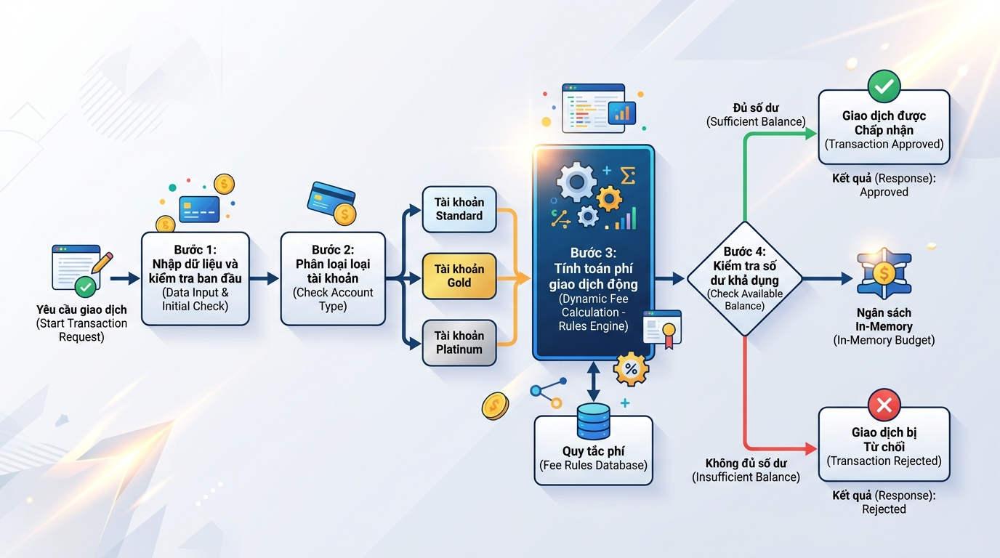

## <center>**1. Mục tiêu**</center>
*   Thiết lập và cấu hình hoàn chỉnh một dự án FastAPI cơ bản sử dụng môi trường ảo (`.venv`).
*   Vận dụng các kiến thức cốt lõi về toán tử số học, toán tử logic, cấu trúc rẽ nhánh `if-elif-else` và cấu trúc `match-case` để giải quyết bài toán nghiệp vụ tài chính.
*   Hiện thực hóa các API endpoint cơ bản tác động lên bộ nhớ tạm (In-memory storage) phục vụ cho một phân hệ Fintech.

### **2. Bối cảnh & Vấn đề**
Trong phân hệ thanh toán của một ví điện tử doanh nghiệp (Fintech Wallet), mọi giao dịch rút tiền hoặc thanh toán đều phải đi qua hệ thống kiểm duyệt và tính phí tự động. Hệ thống cần đánh giá phân hạng tài khoản của người dùng (`standard`, `gold`, `platinum`), tính toán phí giao dịch tương ứng theo các công thức số học và kiểm tra xem số dư tài khoản hiện tại có đủ để chi trả cho cả số tiền giao dịch lẫn phí phát sinh hay không. 

Để kiểm thử nhanh tính năng này, bộ phận sản phẩm yêu cầu triển khai một Transaction Processing Engine dạng RESTful API đơn giản, quản lý trạng thái số dư và danh sách giao dịch trực tiếp trên RAM (In-memory).


<p align="center">
  
</p>


### **3. Quy tắc nghiệp vụ**
Hệ thống giả định bắt đầu với một tài khoản nguồn có số dư ban đầu cố định trong bộ nhớ RAM là: **100,000,000 VND**.

#### **A. Phân loại phí giao dịch theo loại tài khoản**
Khi người dùng tạo một giao dịch với số tiền (`amount`), phí giao dịch (`fee`) phải được tính toán dựa trên loại tài khoản (`account_type`) theo các cấu trúc điều kiện như sau:
1.  **Tài khoản `standard`**:
    *   Tỷ lệ phí là **1.5%** trên số tiền giao dịch.
    *   Tuy nhiên, mức phí tối thiểu cho mỗi giao dịch phải từ **10,000 VND** trở lên (Nếu tính toán ra dưới 10,000 VND thì phí vẫn là 10,000 VND).
2.  **Tài khoản `gold`**:
    *   Tỷ lệ phí là **1.0%** trên số tiền giao dịch.
    *   Mức phí tối thiểu cho mỗi giao dịch phải từ **5,000 VND** trở lên.
3.  **Tài khoản `platinum`**:
    *   Nếu số tiền giao dịch dưới **50,000,000 VND**, tài khoản được **miễn phí hoàn toàn** (phí bằng 0).
    *   Nếu số tiền giao dịch từ **50,000,000 VND** trở lên, phí giao dịch cố định là **20,000 VND**.

#### **B. Quy tắc phê duyệt giao dịch**
Một giao dịch được hệ thống ghi nhận là thành công (`APPROVED`) khi và chỉ khi:
*   Số tiền giao dịch (`amount`) nhập vào phải lớn hơn **0**.
*   Tổng chi phí phát sinh (`amount` + `fee`) phải **nhỏ hơn hoặc bằng** số dư hiện tại trong tài khoản.

Nếu một trong hai điều kiện trên không thỏa mãn, giao dịch sẽ được ghi nhận là thất bại (`REJECTED`) và không được trừ tiền trong tài khoản nguồn. Nếu giao dịch thành công (`APPROVED`), số dư tài khoản nguồn phải bị trừ đi một lượng bằng đúng tổng chi phí (`amount` + `fee`).

### **4. Yêu cầu đầu ra**

#### **A. Cấu trúc dữ liệu & Biến In-memory**
*   Tự thiết kế biến in-memory lưu trữ số dư tài khoản ban đầu (`100,000,000`).
*   Tự thiết kế cấu trúc danh sách trong RAM để lưu lại lịch sử các giao dịch được tạo. Mỗi giao dịch cần có: `transaction_id` (chuỗi tăng dần tự động hoặc chuỗi ngẫu nhiên), `account_type`, `amount`, `fee`, `total_deducted` (tổng tiền bị trừ), `status` (`APPROVED` hoặc `REJECTED`), `created_at` (thời điểm giao dịch).

#### **B. Yêu cầu thiết kế API Endpoints**

<table style="width: 100%; min-width: 100%; display: table; border-collapse: collapse;" width="100%">
  <thead>
    <tr style="background-color: #f2f2f2;">
      <th style="border: 1px solid #dddddd; text-align: left; padding: 8px;">Phương thức</th>
      <th style="border: 1px solid #dddddd; text-align: left; padding: 8px;">Đường dẫn (Endpoint)</th>
      <th style="border: 1px solid #dddddd; text-align: left; padding: 8px;">Mô tả nghiệp vụ</th>
    </tr>
  </thead>
  <tbody>
    <tr>
      <td style="border: 1px solid #dddddd; padding: 8px;"><b>GET</b></td>
      <td style="border: 1px solid #dddddd; padding: 8px;"><code>/balance</code></td>
      <td style="border: 1px solid #dddddd; padding: 8px;">Lấy thông tin số dư hiện tại của tài khoản hệ thống.</td>
    </tr>
    <tr>
      <td style="border: 1px solid #dddddd; padding: 8px;"><b>POST</b></td>
      <td style="border: 1px solid #dddddd; padding: 8px;"><code>/transactions</code></td>
      <td style="border: 1px solid #dddddd; padding: 8px;">Tiếp nhận và thực thi giao dịch mới. Hệ thống tính phí, kiểm tra số dư và cập nhật trạng thái nếu thành công.</td>
    </tr>
    <tr>
      <td style="border: 1px solid #dddddd; padding: 8px;"><b>GET</b></td>
      <td style="border: 1px solid #dddddd; padding: 8px;"><code>/transactions</code></td>
      <td style="border: 1px solid #dddddd; padding: 8px;">Lấy toàn bộ lịch sử các giao dịch đã thực hiện (bao gồm cả giao dịch thành công và thất bại).</td>
    </tr>
    <tr>
      <td style="border: 1px solid #dddddd; padding: 8px;"><b>DELETE</b></td>
      <td style="border: 1px solid #dddddd; padding: 8px;"><code>/transactions/{transaction_id}</code></td>
      <td style="border: 1px solid #dddddd; padding: 8px;">Xóa một bản ghi giao dịch trong lịch sử lưu trữ RAM theo ID.</td>
    </tr>
  </tbody>
</table>

#### **C. Ví dụ mô hình dữ liệu (JSON format)**

*   **POST `/transactions` Request Body:**
    ```json
    {
      "account_type": "standard",
      "amount": 2000000
    }
    ```

*   **POST `/transactions` Response Body (Thành công - Status 201):**
    ```json
    {
      "transaction_id": "TXN-1",
      "account_type": "standard",
      "amount": 2000000,
      "fee": 30000,
      "total_deducted": 2030000,
      "status": "APPROVED"
    }
    ```

*   **POST `/transactions` Response Body (Thất bại do vượt quá số dư - Status 400 Bad Request):**
    ```json
    {
      "detail": "Giao dich bi tu choi: So du tai khoan khong du de thuc hien."
    }
    ```

### **5. Yêu cầu nộp bài**
Để hoàn thành bài tập tổng hợp, học viên cần:
*   Hiện thực hóa toàn bộ các API yêu cầu và chạy thử nghiệm thành công.
*   Đẩy mã nguồn lên GitHub theo định dạng thư mục: `[Tên Lớp]_[Môn Học]_Session02_Tong_hop`.
    Ví dụ: `HNKS25CNTT1_FastAPI_Session02_Tong_hop`
*   Dán link của repository lên phần nộp bài trên hệ thống.