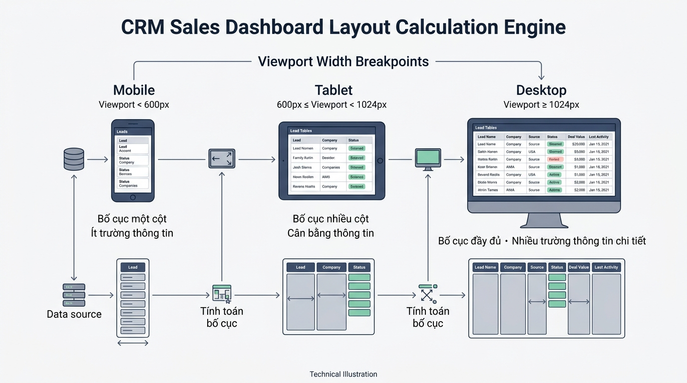

## <center>[Vận dụng cơ bản 1] Sửa lỗi tính toán hiển thị danh sách Lead CRM</center>

### **1. Mục tiêu**
*   Phát hiện và báo cáo các trường hợp kiểm thử (test cases) bị lỗi do sai sót ranh giới trong mã nguồn phân loại thiết bị hiển thị danh sách Lead/Khách hàng trên hệ thống CRM.
*   Khắc phục lỗi logic điều kiện ranh giới (breakpoint limits) và triển khai kiểm soát ngoại lệ dữ liệu đầu vào không hợp lệ bằng ngôn ngữ Python.

### **2. Bối cảnh & Vấn đề**
Phân hệ quản trị quan hệ khách hàng (CRM Subsystem) đang triển khai tính năng tự động tùy biến giao diện hiển thị danh sách khách hàng tiềm năng (Lead) cho nhân viên tư vấn dựa trên kích thước màn hình (viewport width).

Quy chuẩn phân loại hiển thị của doanh nghiệp được quy định như sau:
*   **Màn hình Mobile**: Chiều rộng dưới `768px` (tức `< 768`). Hiển thị tối đa 4 Lead/trang, 1 cột.
*   **Màn hình Tablet**: Chiều rộng từ `768px` đến dưới `1024px` (tức `>= 768` và `< 1024`). Hiển thị tối đa 8 Lead/trang, 2 cột.
*   **Màn hình Desktop**: Chiều rộng từ `1024px` trở lên (tức `>= 1024`). Hiển thị tối đa 12 Lead/trang, 4 cột.

Tuy nhiên, mã nguồn Python hiện tại do nhân viên tiền nhiệm để lại đang gặp lỗi logic nghiêm trọng tại các giá trị ranh giới (breakpoint) và chưa xử lý các trường hợp dữ liệu đầu vào không hợp lệ (như kích thước âm hoặc bằng 0). Dẫn đến việc nhân viên truy cập bằng máy tính bảng có độ phân giải `768px` lại bị hiển thị sai thành giao diện Desktop.


<p align="center">
  
</p>


### **3. Mã nguồn hiện tại**
Dưới đây là đoạn mã nguồn Python đang bị lỗi logic nghiệp vụ:

```python
def calculate_crm_layout(viewport_width: int) -> dict[str, int | str]:
    """Tính toán cấu hình hiển thị danh sách Lead trên giao diện CRM theo chiều rộng màn hình."""
    mobile_limit = 768
    tablet_limit = 1024

    # Lỗi logic ranh giới: Bỏ sót trường hợp viewport_width == 768
    # và không kiểm tra dữ liệu đầu vào âm hoặc bằng 0
    if viewport_width < mobile_limit:
        category = "MOBILE"
        max_leads = 4
        columns = 1
    elif viewport_width > mobile_limit and viewport_width < tablet_limit:
        category = "TABLET"
        max_leads = 8
        columns = 2
    else:
        category = "DESKTOP"
        max_leads = 12
        columns = 4

    return {
        "device_category": category,
        "max_leads_per_page": max_leads,
        "layout_columns": columns,
    }


# Chạy thử nghiệm các trường hợp kiểm thử
if __name__ == "__main__":
    print("Màn hình Mobile (375px):", calculate_crm_layout(375))
    print("Màn hình Tablet Ranh giới (768px):", calculate_crm_layout(768))
    print("Màn hình Lỗi âm (-100px):", calculate_crm_layout(-100))
```

### **4. Yêu cầu đầu ra**

#### **Phần 1: Lập báo cáo kiểm thử (Test Case Report)**
Học viên tạo bảng báo cáo kiểm thử theo định dạng HTML (tối thiểu 3 test cases) để chứng minh mã nguồn hiện tại hoạt động sai logic. Bảng cần tuân thủ cấu trúc sau:

<table style="width: 100%; min-width: 100%; display: table; border-collapse: collapse;" width="100%" border="1">
  <thead>
    <tr style="background-color: #f2f2f2;">
      <th style="padding: 8px; text-align: left;">STT</th>
      <th style="padding: 8px; text-align: left;">Đầu vào (viewport_width)</th>
      <th style="padding: 8px; text-align: left;">Kết quả thực tế (Buggy Output)</th>
      <th style="padding: 8px; text-align: left;">Kết quả kỳ vọng (Expected Output)</th>
      <th style="padding: 8px; text-align: left;">Phân tích nguyên nhân lỗi</th>
    </tr>
  </thead>
  <tbody>
    <tr>
      <td style="padding: 8px;">1</td>
      <td style="padding: 8px;">768</td>
      <td style="padding: 8px;">{'device_category': 'DESKTOP', 'max_leads_per_page': 12, 'layout_columns': 4}</td>
      <td style="padding: 8px;">{'device_category': 'TABLET', 'max_leads_per_page': 8, 'layout_columns': 2}</td>
      <td style="padding: 8px;">Biểu thức elif bỏ sót trường hợp viewport_width == 768 làm chương trình rơi vào nhánh else.</td>
    </tr>
    <tr>
      <td style="padding: 8px;">2</td>
      <td style="padding: 8px;">-100</td>
      <td style="padding: 8px;">...</td>
      <td style="padding: 8px;">Ngoại lệ ValueError</td>
      <td style="padding: 8px;">...</td>
    </tr>
    <tr>
      <td style="padding: 8px;">3</td>
      <td style="padding: 8px;">...</td>
      <td style="padding: 8px;">...</td>
      <td style="padding: 8px;">...</td>
      <td style="padding: 8px;">...</td>
    </tr>
  </tbody>
</table>

#### **Phần 2: Sửa lỗi và tối ưu mã nguồn (Refactoring)**
1.  Viết lại hàm `calculate_crm_layout(viewport_width: int) -> dict[str, int | str]` tuân thủ chuẩn PEP 8 và Type Hints của Python.
2.  Khắc phục hoàn toàn lỗi logic ranh giới: `768px` phải thuộc phân loại `TABLET`.
3.  Bổ sung kiểm soát ngoại lệ: Nếu `viewport_width` không phải là số nguyên dương (`viewport_width <= 0`), bắn ra ngoại lệ `ValueError` với thông điệp: `"Chiều rộng màn hình phải là số nguyên dương lớn hơn 0."`.
4.  Nếu kiểu dữ liệu truyền vào không phải `int` (ví dụ `str`, `None`), bắn ra ngoại lệ `TypeError` với thông điệp: `"Kích thước màn hình phải là số nguyên (int)."`.

### **5. Yêu cầu nộp bài**
Học viên cần nộp:
*   Phần phân tích/báo cáo và mã nguồn triển khai.
*   Đẩy mã nguồn lên GitHub theo định dạng thư mục: `[Tên Lớp]_[Môn Học]_Session01_Ex01`.
    Ví dụ: `HNKS25CNTT1_Core_Session01_Ex01`