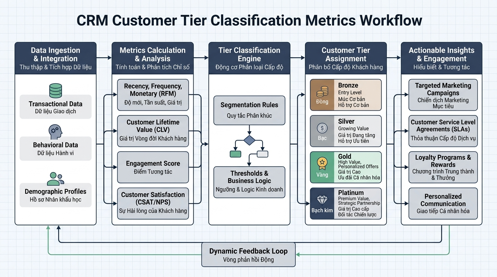

## <center>[Vận dụng cơ bản 2] Phân tích và sửa lỗi hệ thống phân cấp khách hàng CRM</center>

### **1. Mục tiêu**
*   Phát hiện và phân tích các lỗi logic nghiệp vụ cùng lỗi kiểm chuẩn dữ liệu trong mã nguồn legacy tính toán phân cấp khách hàng CRM.
*   Xây dựng bảng báo cáo kiểm thử (Test Case Report) mô tả chi tiết dữ liệu đầu vào, kết quả lỗi thực tế và kết quả kỳ vọng.
*   Áp dụng các chuẩn lập trình Python hiện đại (PEP 8, Type Hints `int | float`, bắt ngoại lệ minh bạch `ValueError`, `TypeError`) để tái cấu trúc mã nguồn hoạt động an toàn và chính xác.

### **2. Vấn đề**
Trong phân hệ quản trị quan hệ khách hàng (CRM Domain) của một doanh nghiệp thương mại điện tử, hệ thống cần tự động tính toán cấp độ khách hàng (Customer Tier), thời gian cam kết phản hồi hỗ trợ (SLA Response Time) và số lượng nhân viên hỗ trợ tối đa (Support Reps Limit) dựa trên tổng số tiền khách hàng đã chi tiêu.

Lập trình viên tiền nhiệm đã cài đặt hàm `calculate_customer_tier_metrics` nhưng mã nguồn hiện tại đang gặp các lỗi nghiêm trọng về logic giá trị biên và thiếu kiểm định dữ liệu đầu vào, dẫn đến việc phân cấp sai cho khách hàng tiềm năng và có thể làm sụp đổ chương trình chăm sóc khách hàng.


<p align="center">
  
</p>


### **3. Mã nguồn hiện tại**
Dưới đây là mã nguồn Python đang bị lỗi logic cần được xem xét và xử lý:

```python
def calculate_customer_tier_metrics(total_spent: float) -> dict[str, str | int]:
    # Logic phân cấp bị lỗi biên và thiếu kiểm định dữ liệu
    if total_spent < 1000:
        tier = "BRONZE"
        sla_hours = 48
        support_reps = 1
    elif total_spent > 1000 and total_spent < 5000:
        tier = "SILVER"
        sla_hours = 24
        support_reps = 2
    else:
        tier = "GOLD"
        sla_hours = 4
        support_reps = 5

    return {
        "tier": tier,
        "sla_hours": sla_hours,
        "support_reps": support_reps
    }


# Mô phỏng kiểm thử các trường hợp thực tế
print("Test 1 (Chi tiêu 1000 USD):", calculate_customer_tier_metrics(1000))
print("Test 2 (Chi tiêu -500 USD):", calculate_customer_tier_metrics(-500))
print("Test 3 (Chi tiêu 5000 USD):", calculate_customer_tier_metrics(5000))
```

### **4. Yêu cầu bài toán**

#### **Phần 1: Lập báo cáo kiểm thử (Test Case Report)**
Học viên phân tích mã nguồn hiện tại và lập bảng báo cáo tối thiểu 3 trường hợp kiểm thử (Test Cases) thể hiện rõ sai sót của chương trình. Sử dụng bảng HTML theo mẫu sau:

<table style="width: 100%; min-width: 100%; display: table; border-collapse: collapse;" width="100%" border="1">
  <thead>
    <tr>
      <th style="padding: 8px; text-align: left;">STT</th>
      <th style="padding: 8px; text-align: left;">Mô tả trường hợp</th>
      <th style="padding: 8px; text-align: left;">Dữ liệu đầu vào (Input)</th>
      <th style="padding: 8px; text-align: left;">Kết quả thực tế từ mã lỗi (Buggy Output)</th>
      <th style="padding: 8px; text-align: left;">Kết quả kỳ vọng đúng (Expected Output)</th>
    </tr>
  </thead>
  <tbody>
    <tr>
      <td style="padding: 8px;">1</td>
      <td style="padding: 8px;">Khách hàng đạt đúng mốc 1000 USD</td>
      <td style="padding: 8px;"><code>total_spent = 1000</code></td>
      <td style="padding: 8px;">Tier: "GOLD" (Do lọt vào nhánh else)</td>
      <td style="padding: 8px;">Tier: "SILVER", SLA: 24, Reps: 2</td>
    </tr>
    <tr>
      <td style="padding: 8px;">2</td>
      <td style="padding: 8px;">...</td>
      <td style="padding: 8px;">...</td>
      <td style="padding: 8px;">...</td>
      <td style="padding: 8px;">...</td>
    </tr>
    <tr>
      <td style="padding: 8px;">3</td>
      <td style="padding: 8px;">...</td>
      <td style="padding: 8px;">...</td>
      <td style="padding: 8px;">...</td>
      <td style="padding: 8px;">...</td>
    </tr>
  </tbody>
</table>

#### **Phần 2: Sửa mã nguồn nghiệp vụ**
Viết lại hàm `calculate_customer_tier_metrics(total_spent: int | float) -> dict[str, str | int]` tuân thủ chính xác các quy tắc nghiệp vụ sau:
1. **Kiểm tra kiểu dữ liệu:** Nếu `total_spent` không phải là `int` hoặc `float` (ví dụ: truyền vào chuỗi chữ, danh sách), kích hoạt ngoại lệ `TypeError("Tổng chi tiêu phải là số")`.
2. **Kiểm tra giá trị âm:** Nếu `total_spent < 0`, kích hoạt ngoại lệ `ValueError("Tổng chi tiêu không thể là số âm")`.
3. **Quy tắc phân cấp chuẩn:**
   * `0 <= total_spent < 1000`: Hạng `"BRONZE"`, SLA response: `48` giờ, hỗ trợ tối đa `1` nhân viên.
   * `1000 <= total_spent < 5000`: Hạng `"SILVER"`, SLA response: `24` giờ, hỗ trợ tối đa `2` nhân viên.
   * `total_spent >= 5000`: Hạng `"GOLD"`, SLA response: `4` giờ, hỗ trợ tối đa `5` nhân viên.
4. **Quy chuẩn mã nguồn:** Tuân thủ PEP 8, sử dụng Type Hints đầy đủ, tên biến rõ ràng bằng tiếng Anh, chú thích giải thích logic bằng tiếng Việt có dấu.

### **5. Yêu cầu nộp bài**
Học viên cần nộp:
*   Phần phân tích/báo cáo và mã nguồn triển khai.
*   Đẩy mã nguồn lên GitHub theo định dạng thư mục: `[Tên Lớp]_[Môn Học]_Session01_Ex02`.
    Ví dụ: `HNKS25CNTT1_Core_Session01_Ex02`