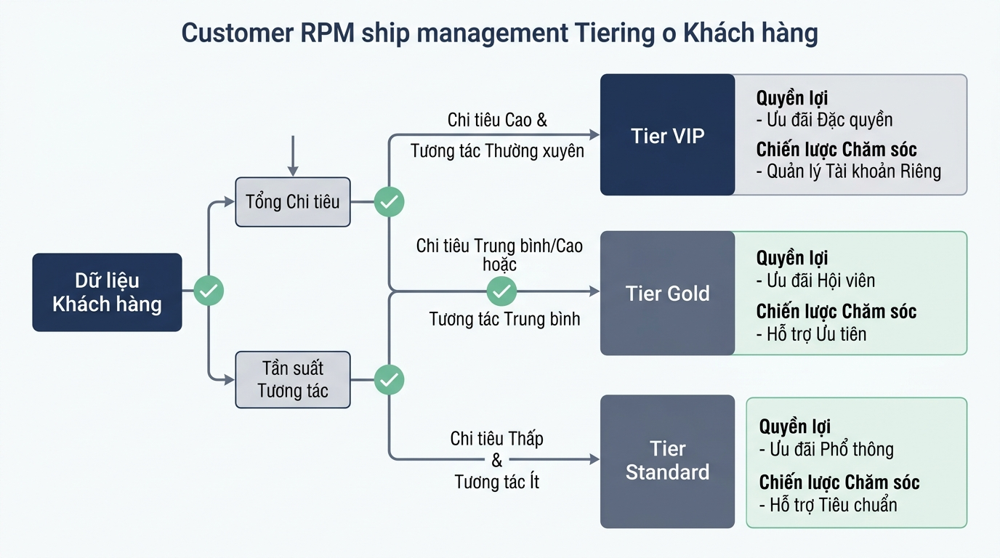

## <center>[Vận dụng chuyên sâu] Phân hạng và Phân bổ Chăm sóc Khách hàng CRM</center>

### **1. Mục tiêu**
*   **Tư duy giải thuật và Cấu trúc dữ liệu:** Vận dụng tư duy thiết kế giải thuật và cấu trúc dữ liệu bản địa (in-memory data structures như `dict`, `list`) trong Python để giải quyết bài toán quản trị khách hàng trong phân hệ CRM doanh nghiệp.
*   **Kiểm chuẩn dữ liệu và Xử lý ngoại lệ:** Triển khai quy trình kiểm chuẩn dữ liệu đầu vào (Data Validation), xử lý các bẫy biên (Edge Cases) chuyên sâu và phân loại hạng khách hàng tự động.
*   **Quy chuẩn lập trình Doanh nghiệp:** Áp dụng nghiêm ngặt chuẩn PEP 8, Type Hints modern Python (Python 3.10+ syntax `int | float | str`) và cơ chế xử lý ngoại lệ nguyên bản (`raise ValueError`, `raise KeyError`).

### **2. Bối cảnh & Vấn đề**
Phân hệ Quản trị Quan hệ Khách hàng (CRM) của một doanh nghiệp bán lẻ đa kênh cần xây dựng một bộ xử lý trung tâm để tự động hóa quy trình phân hạng khách hàng dựa trên tổng chi tiêu tích lũy và điểm tương tác. Hệ thống đòi hỏi kiểm soát chặt chẽ dữ liệu đầu vào, phát hiện hồ sơ trùng lặp, lọc các chỉ số bất thường và phân bổ chiến lược chăm sóc (Account Manager Allocation) phù hợp với năng lực hệ thống.


<p align="center">
  
</p>


### **3. Quy tắc nghiệp vụ**

#### **A. Quy tắc kiểm chuẩn dữ liệu đầu vào (Input Validation)**
Mỗi hồ sơ khách hàng đầu vào cần thỏa mãn đầy đủ các điều kiện định dạng sau:
1. `customer_id`: Chuỗi ký tự không rỗng, bắt đầu bằng tiền tố `"CUST_"` (Ví dụ: `"CUST_001"`).
2. `email`: Chuỗi ký tự phải chứa ít nhất một ký tự `@` và một dấu chấm `.` sau ký tự `@`.
3. `phone`: Chuỗi ký tự đúng 10 chữ số và phải bắt đầu bằng chữ số `0`.
4. `total_spending`: Số thực hoặc số nguyên lớn hơn hoặc bằng `0`.
5. `interaction_score`: Số nguyên nằm trong khoảng từ `0` đến `100` (bao gồm cả 0 và 100).

Nếu bất kỳ dữ liệu nào không tuân thủ quy tắc trên, hệ thống phải kích hoạt ngoại lệ `ValueError` kèm thông điệp giải thích rõ ràng.

#### **B. Quy tắc Phân hạng và Phân bổ Chăm sóc (Tier Allocation Rules)**
Dựa trên thông số hợp lệ, hệ thống tiến hành gán hạng thành viên và chỉ định cấp độ xử lý:

<table style="width: 100%; min-width: 100%; display: table; border-collapse: collapse;" width="100%" border="1">
  <thead>
    <tr style="background-color: #f2f2f2;">
      <th style="padding: 8px; text-align: left;">Hạng thành viên (Tier)</th>
      <th style="padding: 8px; text-align: left;">Điều kiện áp dụng</th>
      <th style="padding: 8px; text-align: left;">Cấp độ chăm sóc (CSM Level)</th>
      <th style="padding: 8px; text-align: left;">Cam kết phản hồi (SLA)</th>
    </tr>
  </thead>
  <tbody>
    <tr>
      <td style="padding: 8px;"><strong>VIP</strong></td>
      <td style="padding: 8px;"><code>total_spending >= 100,000,000</code> VÀ <code>interaction_score >= 80</code></td>
      <td style="padding: 8px;">Senior Account Manager</td>
      <td style="padding: 8px;">Dưới 2 giờ (&lt; 2h)</td>
    </tr>
    <tr>
      <td style="padding: 8px;"><strong>GOLD</strong></td>
      <td style="padding: 8px;"><code>total_spending >= 50,000,000</code> HOẶC (<code>total_spending >= 20,000,000</code> VÀ <code>interaction_score >= 70</code>)</td>
      <td style="padding: 8px;">Account Executive</td>
      <td style="padding: 8px;">Dưới 6 giờ (&lt; 6h)</td>
    </tr>
    <tr>
      <td style="padding: 8px;"><strong>STANDARD</strong></td>
      <td style="padding: 8px;">Các trường hợp hợp lệ còn lại</td>
      <td style="padding: 8px;">Automated Bot & Helpdesk</td>
      <td style="padding: 8px;">Dưới 24 giờ (&lt; 24h)</td>
    </tr>
  </tbody>
</table>

#### **C. Quy tắc bẫy biên và Giới hạn tài nguyên (Edge Cases & Capacity Constraints)**
1. **Kiểm tra trùng lặp (Duplicate Detection):** Danh sách khách hàng xử lý không được trùng `customer_id` hoặc `email` với các khách hàng đã lưu trong hệ thống. Nếu phát hiện trùng lặp, bỏ qua hồ sơ bị trùng và ghi nhận vào danh sách lỗi (`error_logs`).
2. **Hạn mức tài nguyên VIP (VIP Capacity Limit):** Nhóm Chăm sóc Khách hàng Senior chỉ có khả năng quản lý tối đa **3 khách hàng VIP** trong một đợt phân bổ. Nếu số lượng khách hàng đạt chuẩn VIP vượt quá 3, khách hàng thứ 4 trở đi sẽ bị hạ tạm thời xuống danh sách chờ VIP (`vip_overflow_queue`) với cấp độ chăm sóc `"Dedicated Queue"` và thông báo phản hồi `"< 4h"`.

### **4. Yêu cầu bài toán**

Học viên thực hiện bài tập theo 2 phần độc lập:

#### **Phần 1: Báo cáo phân tích & Thiết kế giải pháp (Solution Design Report)**
1. Mô tả chi tiết cấu trúc dữ liệu đầu vào (Input Schema) và đầu ra (Output Schema) dưới dạng Type Annotations của Python.
2. Vẽ sơ đồ luồng (Flowchart) hoặc viết mã giả (Pseudocode) thể hiện toàn bộ quá trình kiểm chuẩn, phân hạng, kiểm tra trùng lặp và xử lý vượt hạn mức VIP.

#### **Phần 2: Triển khai mã nguồn Python (Implementation)**
1. Viết toàn bộ mã nguồn từ đầu (không sử dụng khung mã cho trước) để giải quyết bài toán theo đúng các quy tắc nghiệp vụ nêu tại **Mục 3**.
2. Sử dụng thuần túy các tính năng nguyên bản của Python 3.10+ (List, Dict, Functions, Exception Handling).
3. Đảm bảo 100% tên biến, tên hàm, thuộc tính bằng tiếng Anh; các comment giải thích thuật toán bằng tiếng Việt có dấu.
4. Chạy kịch bản thử nghiệm với dữ liệu mẫu dưới đây và in kết quả ra màn hình CLI.

[MẪU DỮ LIỆU THỬ NGHIỆM ĐẦU VÀO]
```python
raw_customer_payloads = [
    {
        "customer_id": "CUST_001",
        "full_name": "Nguyen Van A",
        "email": "a.nguyen@example.com",
        "phone": "0912345678",
        "total_spending": 120000000,
        "interaction_score": 85
    },
    {
        "customer_id": "CUST_002",
        "full_name": "Tran Thi B",
        "email": "b.tran@example.com",
        "phone": "0987654321",
        "total_spending": 150000000,
        "interaction_score": 90
    },
    {
        "customer_id": "CUST_003",
        "full_name": "Le Van C",
        "email": "c.le@example.com",
        "phone": "0901234567",
        "total_spending": 110000000,
        "interaction_score": 95
    },
    {
        "customer_id": "CUST_004",
        "full_name": "Pham Minh D",
        "email": "d.pham@example.com",
        "phone": "0934567890",
        "total_spending": 130000000,
        "interaction_score": 88
    },
    {
        "customer_id": "CUST_005",
        "full_name": "Hoang Anh E",
        "email": "e.hoang@example.com",
        "phone": "0945678901",
        "total_spending": 60000000,
        "interaction_score": 60
    },
    {
        "customer_id": "INVALID_01",
        "full_name": "Doan Van F",
        "email": "invalid-email-format",
        "phone": "12345",
        "total_spending": -5000,
        "interaction_score": 150
    },
    {
        "customer_id": "CUST_001",
        "full_name": "Nguyen Van A Trung",
        "email": "a.nguyen@example.com",
        "phone": "0912345678",
        "total_spending": 20000000,
        "interaction_score": 50
    }
]
```

### **5. Yêu cầu nộp bài**
Học viên cần nộp:
*   Phần phân tích/báo cáo và mã nguồn triển khai.
*   Đẩy mã nguồn lên GitHub theo định dạng thư mục: `[Tên Lớp]_[Môn Học]_Session01_Ex03`.
    Ví dụ: `HNKS25CNTT1_Core_Session01_Ex03`