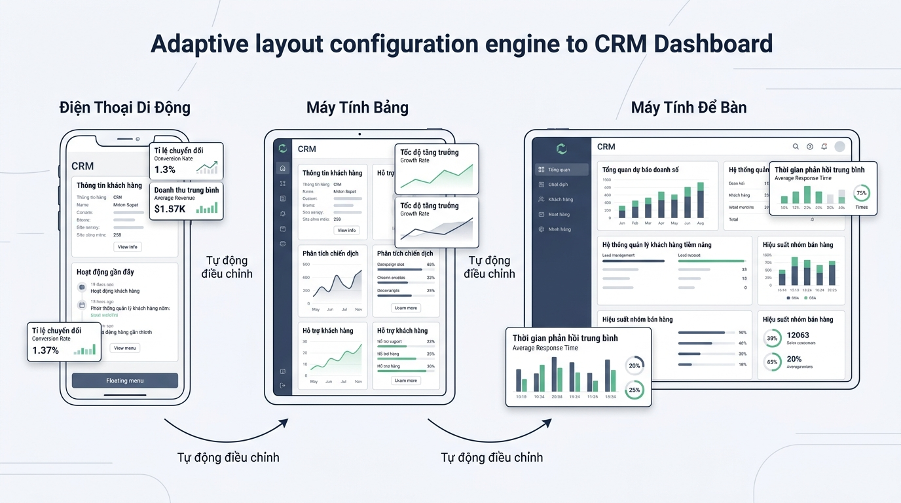

## 
[Phân tích] Phân tích và Triển khai Bộ tính toán Cấu hình Giao diện CRM theo Kích thước Màn hình

### **1. Mục tiêu**
*   **Kỹ năng Phân tích & Đánh giá (Analysis):** Đề xuất và so sánh chuyên sâu 2 giải pháp kỹ thuật khác nhau nhằm giải quyết bài toán phân bố bố cục giao diện (Responsive Layout Metrics) cho hệ thống Quản lý Quan hệ Khách hàng (CRM).
*   **Tư duy Thiết kế Kiến trúc:** Xây dựng bảng so sánh Đánh đổi (Trade-off Report), lý giải khoa học về việc chọn lựa phương án tối ưu, và thiết kế mã giả (Pseudocode) hoặc sơ đồ luồng (Flowchart) cho quy trình tính toán.
*   **Triển khai Mã nguồn Chuẩn Doanh nghiệp:** Hiện thực hóa phương án tối ưu bằng ngôn ngữ Python tuân thủ nghiêm ngặt chuẩn PEP 8, Type Hints, xử lý ngoại lệ minh thị và kiểm soát dữ liệu đầu vào.

---

### **2. Bối cảnh & Vấn đề**
Trong phân hệ bảng điều khiển (Dashboard) của hệ thống CRM doanh nghiệp, nhân viên kinh doanh và tư vấn viên truy cập danh mục hồ sơ khách hàng tiềm năng (Customer Leads) từ nhiều thiết bị khác nhau: điện thoại di động (Mobile), máy tính bảng (Tablet), và máy tính để bàn (Desktop). 

Để tối ưu hóa diện tích hiển thị và tốc độ tải dữ liệu, hệ thống CRM cần tự động tính toán thông số hiển thị bao gồm: Phân loại thiết bị (`device_category`), Số lượng thẻ thông tin khách hàng tối đa trên một trang (`max_cards_per_page`), và Số cột layout (`layout_columns`) dựa trên độ rộng màn hình thực tế tính bằng pixel (`viewport_width`).

  

[NOTE] **Bài toán đặt ra:** Với vai trò là Lập trình viên Python Senior phụ trách lõi xử lý CRM, bạn cần nghiên cứu 2 phương án lập trình khác nhau để giải quyết bài toán tính toán giao diện linh hoạt này, lập báo cáo phân tích ưu/nhược điểm, sau đó hiện thực hóa phương án tối ưu nhất bằng Python.

---

### **3. Quy tắc nghiệp vụ**

1.  **Phân loại thiết bị và Cấu hình Layout theo Breakpoint:**
    *   Nếu `viewport_width < 768`: Nhóm thiết bị là `"MOBILE"`, số thẻ khách hàng tối đa = `4`, số cột giao diện = `1`.
    *   Nếu `768 <= viewport_width < 1024`: Nhóm thiết bị là `"TABLET"`, số thẻ khách hàng tối đa = `8`, số cột giao diện = `2`.
    *   Nếu `viewport_width >= 1024`: Nhóm thiết bị là `"DESKTOP"`, số thẻ khách hàng tối đa = `12`, số cột giao diện = `4`.

2.  **Kiểm soát Dữ liệu Đầu vào (Validation Rules):**
    *   Tham số `viewport_width` phải là kiểu số nguyên dương (`int > 0`).
    *   Nếu `viewport_width` không thuộc kiểu dữ liệu số hợp lệ hoặc có giá trị `<= 0`, hàm xử lý phải ngắt luồng bằng cách bắn ngoại lệ `ValueError` với thông điệp lỗi rõ ràng bằng tiếng Anh.

3.  **Cấu trúc Dữ liệu Đầu ra (Output Data Structure):**
    *   Trả về một `dict` đại diện cho thông số layout chứa đủ 3 khóa chuẩn:
        *   `device_category` (kiểu `str`): `"MOBILE"` | `"TABLET"` | `"DESKTOP"`
        *   `max_cards_per_page` (kiểu `int`): `4` | `8` | `12`
        *   `layout_columns` (kiểu `int`): `1` | `2` | `4`

---

### **4. Yêu cầu bài toán**

#### **Phần 1: Báo cáo Phân tích & So sánh Đánh giá (Trade-off Report)**
Học viên cần đề xuất 2 giải pháp kỹ thuật khác nhau cho bài toán trên:
*   **Giải pháp A:** Sử dụng rẽ nhánh điều kiện trực tiếp (Hardcoded Conditional `if-elif-else`).
*   **Giải pháp B:** Sử dụng Bảng cấu hình dữ liệu tĩnh (Data-driven Mapping Structure / Configuration Dictionary/List) kết hợp vòng lặp duyệt ngưỡng Breakpoint.

Lập bảng so sánh Trade-off chi tiết giữa 2 giải pháp theo đúng định dạng sau:

<table style="width: 100%; min-width: 100%; display: table; border-collapse: collapse;" width="100%">
  <thead>
    <tr>
      <th style="border: 1px solid #dddddd; padding: 8px; background-color: #f2f2f2; text-align: left;">Tiêu chí đánh giá</th>
      <th style="border: 1px solid #dddddd; padding: 8px; background-color: #f2f2f2; text-align: left;">Giải pháp A (If-Elif-Else Hardcoded)</th>
      <th style="border: 1px solid #dddddd; padding: 8px; background-color: #f2f2f2; text-align: left;">Giải pháp B (Data-driven Mapping)</th>
    </tr>
  </thead>
  <tbody>
    <tr>
      <td style="border: 1px solid #dddddd; padding: 8px;">Độ phức tạp Thời gian & Bộ nhớ</td>
      <td style="border: 1px solid #dddddd; padding: 8px;">...</td>
      <td style="border: 1px solid #dddddd; padding: 8px;">...</td>
    </tr>
    <tr>
      <td style="border: 1px solid #dddddd; padding: 8px;">Khả năng đọc mã (Readability)</td>
      <td style="border: 1px solid #dddddd; padding: 8px;">...</td>
      <td style="border: 1px solid #dddddd; padding: 8px;">...</td>
    </tr>
    <tr>
      <td style="border: 1px solid #dddddd; padding: 8px;">Khả năng bảo trì & Mở rộng (Maintainability)</td>
      <td style="border: 1px solid #dddddd; padding: 8px;">...</td>
      <td style="border: 1px solid #dddddd; padding: 8px;">...</td>
    </tr>
    <tr>
      <td style="border: 1px solid #dddddd; padding: 8px;">Độ linh hoạt khi thay đổi Quy tắc (Flexibility)</td>
      <td style="border: 1px solid #dddddd; padding: 8px;">...</td>
      <td style="border: 1px solid #dddddd; padding: 8px;">...</td>
    </tr>
    <tr>
      <td style="border: 1px solid #dddddd; padding: 8px;">Bối cảnh Doanh nghiệp phù hợp</td>
      <td style="border: 1px solid #dddddd; padding: 8px;">...</td>
      <td style="border: 1px solid #dddddd; padding: 8px;">...</td>
    </tr>
  </tbody>
</table>

#### **Phần 2: Lựa chọn Phương án & Thiết kế Mã giả**
*   Lý giải nguyên do chọn 1 trong 2 phương án trên làm giải pháp tối ưu cho sản phẩm CRM doanh nghiệp dài hạn.
*   Viết mã giả (Pseudocode) hoặc vẽ sơ đồ luồng (Flowchart) minh họa thuật toán xử lý của phương án được chọn, thể hiện đầy đủ từ bước kiểm tra dữ liệu đầu vào đến bước trả về kết quả.

#### **Phần 3: Triển khai Mã nguồn Python**
*   Hiện thực hóa phương án tối ưu bằng Python 3.10+.
*   **Yêu cầu kỹ thuật mã nguồn:**
    *   Tên định danh (Hàm, Biến, Module) viết bằng Tiếng Anh chuẩn (ví dụ: `calculate_crm_layout_metrics`, `viewport_width`).
    *   Sử dụng đầy đủ Type Hints (`viewport_width: int -> dict[str, str | int]`).
    *   Bắt lỗi ngoại lệ minh thị với `raise ValueError` cho dữ liệu đầu vào không hợp lệ.
    *   Chú thích giải thích bằng Tiếng Việt có dấu.
    *   Viết khối thử nghiệm thực thi kiểm thử 3 kịch bản màn hình chuẩn (375px, 800px, 1440px) và 2 kịch bản lỗi (0px, dữ liệu sai kiểu).

---

### **5. Yêu cầu nộp bài**
Học viên cần nộp:
*   Phần phân tích/báo cáo và mã nguồn triển khai.
*   Đẩy mã nguồn lên GitHub theo định dạng thư mục: `[Tên Lớp]_[Môn Học]_Session01_Ex04`.
    Ví dụ: `HNKS25CNTT1_Core_Session01_Ex04`