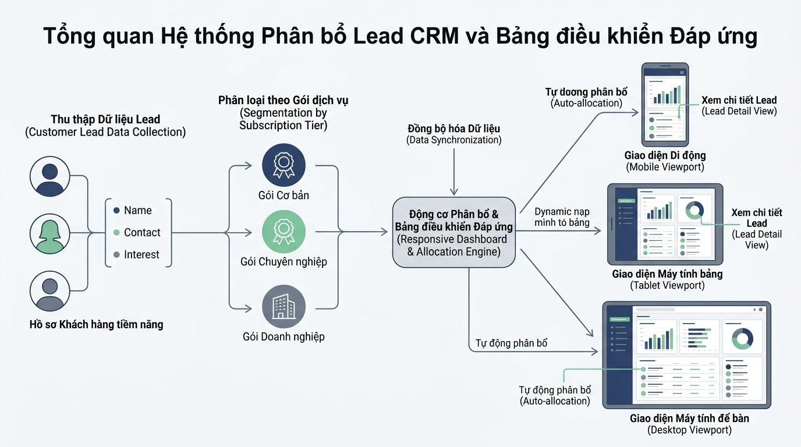

## 
[Sáng tạo] Thiết kế Hệ thống Phân bổ và Hiển thị Hồ sơ Khách hàng CRM trên Đa Thiết bị

### **1. Mục tiêu**
*   **Phân tích và thiết kế dữ liệu**: Tự chủ động xác định và định nghĩa cấu trúc dữ liệu đầu vào và đầu ra (I/O Schema) cho một phân hệ CRM thực tế mà không cần dữ liệu mẫu có sẵn.
*   **Phát hiện bẫy dữ liệu & Trường hợp biên**: Độc lập tìm kiếm các điểm xung đột nghiệp vụ, điều kiện ranh giới (Edge Cases) trong quá trình tính toán phân bổ danh sách khách hàng tiềm năng (Leads) theo thiết bị truy cập.
*   **Mô hình hóa quy trình**: Biểu diễn kiến trúc xử lý và luồng dữ liệu bằng sơ đồ Mermaid (Data Flow Diagram) chuẩn doanh nghiệp.
*   **Triển khai mã nguồn Python**: Hiện thực hóa giải pháp bằng Python thuần tuân thủ các quy chuẩn PEP 8, Type Hints, và cơ chế xử lý ngoại lệ chủ động.

---

### **2. Vấn đề**

Doanh nghiệp thương mại triển khai hệ thống Quản trị quan hệ khách hàng (CRM) nhằm hỗ trợ đội ngũ tư vấn bán hàng tiếp cận hồ sơ khách hàng tiềm năng (Leads). Đội ngũ nhân sự làm việc linh hoạt trên nhiều loại thiết bị khác nhau bao gồm điện thoại di động (Mobile), máy tính bảng (Tablet) và máy tính để bàn (Desktop). 

Do sự khác biệt về kích thước màn hình (Viewport Width), năng lực tải dữ liệu và vai trò vận hành, hệ thống đòi hỏi phải có một bộ máy (Engine) linh hoạt. Bộ máy này chịu trách nhiệm tự động phân hạng khách hàng, tính toán số lượng hồ sơ hiển thị tối đa trên mỗi trang, xác định số cột layout tương ứng, đồng thời đảm bảo cơ chế quản lý trạng thái hồ sơ (Soft Delete và khôi phục dữ liệu) an toàn.

  

---

### **3. Quy tắc nghiệp vụ**

Học viên nghiên cứu các định hướng nghiệp vụ mở rộng dưới đây để tự thiết kế chi tiết logic cho hệ thống:

1.  **Quy hoạch hiển thị responsive theo thiết bị (Viewport & Layout Config)**:
    *   Màn hình nhỏ (Mobile): Giới hạn số lượng Lead hiển thị tối đa trên một trang ở mức nhỏ để tránh hiện tượng giật lag màn hình; cấu hình layout dạng 1 cột đơn.
    *   Màn hình trung bình (Tablet): Hiển thị số lượng Lead ở mức vừa phải; cấu hình layout dạng 2 cột.
    *   Màn hình lớn (Desktop): Hiển thị đầy đủ danh sách Lead với số lượng tối đa trên một trang; cấu hình layout dạng 4 cột.
2.  **Phân hạng hồ sơ khách hàng (Customer Lead Tiering)**:
    *   Dựa trên các chỉ số tương tác (ví dụ: điểm tiềm năng, tổng giá trị đơn hàng dự kiến), hồ sơ khách hàng được xếp vào các phân hạng khác nhau (ví dụ: Bronze, Silver, Gold, Platinum).
    *   Thiết bị màn hình nhỏ chỉ hiển thị các trường thông tin cơ bản; thiết bị màn hình lớn hiển thị thêm các chỉ số phân tích chuyên sâu.
3.  **Quản lý trạng thái hồ sơ (Soft Delete & State Workflow)**:
    *   Hệ thống không xóa vĩnh viễn hồ sơ ra khỏi cơ sở dữ liệu khi nhân viên bấm xóa (Soft Delete), mà chuyển trạng thái hồ sơ sang lưu trữ (Archived / Suspended).
    *   Các truy vấn hiển thị mặc định phải lọc bỏ các hồ sơ đã bị xóa mềm, ngoại trừ khi có yêu cầu truy vấn quản trị đặc biệt.

---

### **4. Yêu cầu bài toán**

Học viên đóng vai trò Kiến trúc sư phần mềm (Software Architect), tự thực hiện toàn bộ 4 phần công việc sau:

#### **Phần 1: Thiết kế I/O Schema chuẩn doanh nghiệp (Self-Designed I/O Schema)**
*   Tự thiết kế cấu trúc dữ liệu đầu vào (Request) và đầu ra (Response) dưới dạng Dictionary hoặc Class trong Python đại diện cho thông tin thiết bị và danh sách khách hàng.
*   Tuyệt đối không sử dụng các tham số mẫu; học viên tự quy định các thuộc tính cần thiết (như `viewport_width`, `user_role`, `lead_score`, `is_active`, v.v.).

#### **Phần 2: Chủ động phát hiện kịch bản bẫy lỗi (Self-Discovered Edge Cases)**
*   Liệt kê và phân tích tối thiểu 3 trường hợp biên hoặc xung đột dữ liệu có thể phát sinh trong hệ thống CRM (Ví dụ: kích thước viewport hợp lệ nhưng nằm chính xác tại điểm ranh giới breakpoint; danh sách hồ sơ rỗng; hồ sơ bị ẩn/xóa mềm nhưng vẫn có yêu cầu cập nhật; giá trị phân hạng âm hoặc không hợp lệ).
*   Đề xuất phương án xử lý cụ thể cho từng trường hợp biên đã liệt kê.

#### **Phần 3: Vẽ sơ đồ luồng dữ liệu (Data Flow Diagram)**
*   Sử dụng cú pháp MermaidJS (`graph TD` hoặc `sequenceDiagram`) để vẽ sơ đồ thể hiện luồng dữ liệu từ khi tiếp nhận thông số thiết bị và danh sách Lead, qua bộ lọc phân hạng và responsive layout, đến khi xuất ra cấu hình hiển thị cuối cùng.

#### **Phần 4: Triển khai mã nguồn Python chuẩn Enterprise (Implementation)**
*   Xây dựng mã nguồn Python hoàn chỉnh thực thi logic đã thiết kế.
*   Yêu cầu kỹ thuật mã nguồn:
    *   Sử dụng cú pháp Python modern (Python 3.10+), bắt buộc có Type Hints cho tất cả hàm và phương thức (sử dụng cú pháp `int | str`).
    *   Tuân thủ nghiêm ngặt chuẩn PEP 8 (tên biến/hàm dùng `snake_case`, tên lớp dùng `PascalCase`, lùi lề 4 khoảng trắng).
    *   Tên biến, tên hàm, tên lớp bắt buộc viết 100% bằng TIẾNG ANH. Mã giải thích logic trong comment bắt buộc bằng TIẾNG VIỆT CÓ DẤU.
    *   Xử lý ngoại lệ chủ động bằng cách `raise Exception` phù hợp (`ValueError`, `KeyError`, v.v.) với thông điệp báo lỗi rõ ràng khi phát hiện dữ liệu vi phạm điều kiện biên.

---

### **5. Yêu cầu nộp bài**

Học viên cần nộp:
*   Phần phân tích/báo cáo và mã nguồn triển khai.
*   Đẩy mã nguồn lên GitHub theo định dạng thư mục: `[Tên Lớp]_[Môn Học]_Session01_Ex05`.
    Ví dụ: `HNKS25CNTT1_Core_Session01_Ex05`