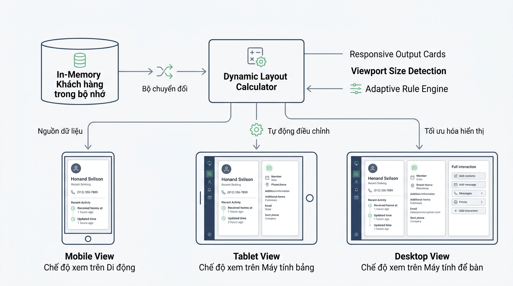

## 
[Bài tập tổng hợp] Triển khai Phân hệ Quản lý Khách hàng và Phân trang CRM Responsive

### **1. Mục tiêu**
*   **Tư duy lưu trữ dữ liệu:** Vận dụng cấu trúc dữ liệu trong bộ nhớ ngắn hạn (RAM) để tổ chức, quản lý danh sách khách hàng doanh nghiệp trong hệ thống CRM.
*   **Tính toán chuyển đổi hiển thị (Responsive Metrics):** Triển khai thuật toán xác định loại thiết bị và tính toán phân trang động dựa trên khung nhìn (viewport width) của thiết bị truy cập.
*   **Chuẩn hóa mã nguồn Enterprise:** Tuân thủ quy chuẩn mã nguồn Python hiện đại (PEP 8, Type Hints, xử lý ngoại lệ tường minh bằng `ValueError` và `KeyError`).

### **2. Bối cảnh & Vấn đề**
Doanh nghiệp dịch vụ phần mềm đang xây dựng phân hệ Quản lý Quan hệ Khách hàng (CRM Dashboard). Nhân viên kinh doanh truy cập hệ thống từ nhiều loại thiết bị khác nhau: Điện thoại di động (Mobile), Máy tính bảng (Tablet), và Máy tính để bàn (Desktop).

Để tối ưu trải nghiệm người dùng, hệ thống backend cần xử lý danh sách khách hàng lưu trữ trong bộ nhớ và trả về dữ liệu đã được tính toán phân trang tương ứng với kích thước màn hình của từng thiết bị, đồng thời đảm bảo tính toàn vẹn của dữ liệu khách hàng (không cho phép trùng mã khách hàng, giá trị hợp đồng không được âm).

  

### **3. Quy tắc nghiệp vụ**

#### **3.1. Quy chuẩn kích thước màn hình & Phân trang**
Hệ thống xác định cấu hình hiển thị dựa trên kích thước khung nhìn màn hình (`viewport_width` tính bằng pixel) theo bảng quy chuẩn sau:

<table style="width: 100%; min-width: 100%; display: table; border-collapse: collapse;" width="100%" border="1" cellpadding="8">
  <thead>
    <tr style="background-color: #f2f2f2;">
      <th>Loại thiết bị (device_category)</th>
      <th>Điều kiện khung nhìn (viewport_width)</th>
      <th>Số khách hàng tối đa/trang (max_customers_per_page)</th>
      <th>Số cột hiển thị (layout_columns)</th>
    </tr>
  </thead>
  <tbody>
    <tr>
      <td><code>MOBILE</code></td>
      <td>Nhỏ hơn 768px</td>
      <td>4</td>
      <td>1</td>
    </tr>
    <tr>
      <td><code>TABLET</code></td>
      <td>Từ 768px đến dưới 1024px</td>
      <td>8</td>
      <td>2</td>
    </tr>
    <tr>
      <td><code>DESKTOP</code></td>
      <td>Từ 1024px trở lên</td>
      <td>12</td>
      <td>4</td>
    </tr>
  </tbody>
</table>

#### **3.2. Quy tắc dữ liệu & Ràng buộc logic**
1.  **Cấu trúc dữ liệu khách hàng:** Mỗi khách hàng bao gồm các thuộc tính:
    *   `customer_id` (kiểu chuỗi `str`): Mã định danh duy nhất của khách hàng (ví dụ: `"CUST_001"`).
    *   `full_name` (kiểu chuỗi `str`): Tên đầy đủ của khách hàng/doanh nghiệp.
    *   `contract_value` (kiểu số thực `float` hoặc số nguyên `int`): Giá trị hợp đồng quản lý.
2.  **Thêm khách hàng mới:**
    *   Mã `customer_id` phải là duy nhất. Nếu thêm mã đã tồn tại, hệ thống phải kích hoạt ngoại lệ `ValueError` với thông điệp rõ ràng.
    *   Giá trị `contract_value` phải lớn hơn hoặc bằng 0. Nếu nhỏ hơn 0, hệ thống phải kích hoạt ngoại lệ `ValueError`.
3.  **Xóa khách hàng:**
    *   Khi xóa theo `customer_id`, nếu mã không tồn tại trong RAM, hệ thống phải kích hoạt ngoại lệ `KeyError`.
4.  **Phân trang dữ liệu:**
    *   Kết quả phân trang phải trả về dictionary/cấu trúc gồm: loại thiết bị (`device_category`), số cột (`layout_columns`), tổng số trang (`total_pages`), trang hiện tại (`current_page`), và danh sách khách hàng thuộc trang đó.

### **4. Yêu cầu bài toán**

[YÊU CẦU] Học viên tự thiết kế và cài đặt toàn bộ mã nguồn Python để giải quyết các chức năng sau mà không sử dụng khung ứng dụng (framework) bên ngoài:

1.  **Khởi tạo & Quản lý danh sách:** Cài đặt cấu trúc lưu trữ dữ liệu danh sách khách hàng trong bộ nhớ RAM.
2.  **Chức năng Thêm mới (`add_customer`):** Thêm khách hàng mới vào RAM với đầy đủ các kiểm tra ràng buộc nghiệp vụ (trùng mã, giá trị hợp đồng hợp lệ).
3.  **Chức năng Xóa (`remove_customer`):** Xóa khách hàng khỏi RAM theo mã định danh.
4.  **Chức năng Tính toán Layout & Phân trang (`get_responsive_paginated_customers`):**
    *   Đầu vào: Độ phân giải màn hình (`viewport_width`) và số trang cần xem (`page_number`).
    *   Xử lý: Xác định cấu hình hiển thị tương ứng và trích xuất đúng danh sách khách hàng thuộc trang yêu cầu.
5.  **Kịch bản kiểm thử (Main Execution):**
    *   Khởi tạo danh sách gồm ít nhất 10 khách hàng mẫu.
    *   Chạy thử nghiệm lấy dữ liệu hiển thị trên giao diện Mobile (`viewport_width = 375`).
    *   Chạy thử nghiệm lấy dữ liệu hiển thị trên giao diện Tablet (`viewport_width = 800`).
    *   Chạy thử nghiệm lấy dữ liệu hiển thị trên giao diện Desktop (`viewport_width = 1440`).
    *   Thực hiện bẫy lỗi và in thông báo khi cố tình thêm khách hàng trùng mã hoặc giá trị hợp đồng âm.

### **5. Yêu cầu nộp bài**
Học viên cần nộp:
*   Phần phân tích/báo cáo và mã nguồn triển khai.
*   Đẩy mã nguồn lên GitHub theo định dạng thư mục: `[Tên Lớp]_[Môn Học]_Session01_Ex06`.
    Ví dụ: `HNKS25CNTT1_Core_Session01_Ex06`