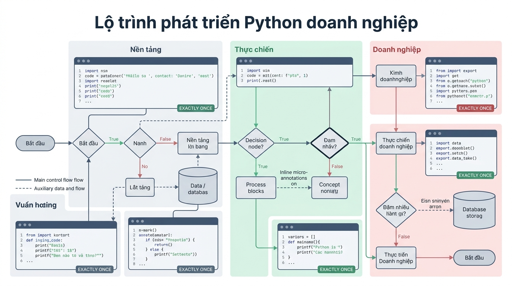
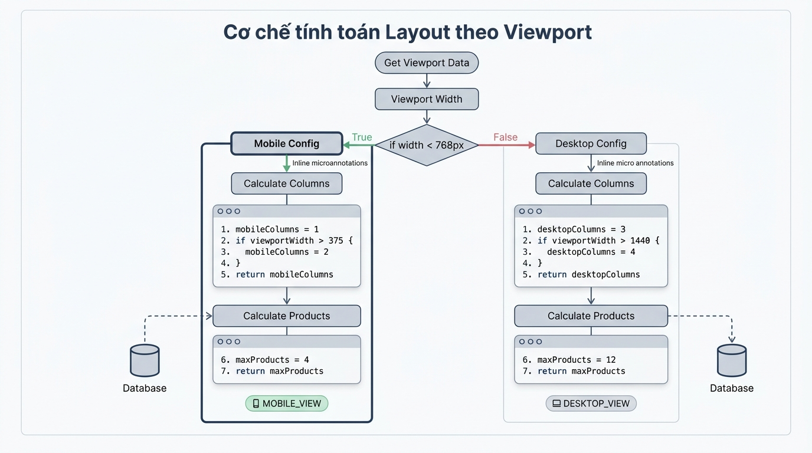

```markmap
# Tổng quan môn học & Định hướng lập trình Python

## Mục tiêu bài học
- Hiểu lộ trình phát triển và kỳ vọng đầu ra của khóa học
- Nắm vững vai trò của Python trong hệ thống ứng dụng thực tế
- Hiểu tư duy quy hoạch cấu hình và tính toán layout theo responsive
- Nắm rõ quy chuẩn viết mã nguồn doanh nghiệp và các bẫy lập trình thường gặp

## Đặt tình huống
- Xây dựng hệ thống thương mại điện tử cần hiển thị linh hoạt trên nhiều thiết bị
- Thiếu quy chuẩn mã nguồn dẫn đến lỗi hiển thị giao diện và khó bảo trì hệ thống

## Định hướng phát triển Python
### Ứng dụng thực tế
- Xây dựng web backend, xử lý dữ liệu và tự động hóa quy trình
### Đặc trưng ngôn ngữ
- Cú pháp ngắn gọn, hệ sinh thái thư viện phong phú, tối ưu năng suất
### Sơ đồ lộ trình


## Demo sản phẩm thực tế
### Tư duy thiết kế
- Phân tách độc lập giữa hằng số thiết bị và hàm xử lý layout
### Cú pháp
```python
# Phân tách số lượng sản phẩm hiển thị theo màn hình
max_products = 4 if viewport < 768 else (8 if viewport < 1024 else 12)
```
### Luồng xử lý Layout

### Kỳ vọng kết quả
- Đáp ứng chính xác cấu hình hiển thị theo từng kích thước Viewport

## Quy chuẩn mã nguồn doanh nghiệp
### Bẫy lập trình
- Viết giá trị tĩnh (hardcode) trực tiếp trong các câu lệnh điều kiện
### Quy chuẩn tối ưu
- Quản lý cấu hình bằng hằng số tập trung và chuẩn hóa dữ liệu trả về
### Lưu ý
- Kiểm thử đa dạng trường hợp biên để đảm bảo tính ổn định của mã nguồn
```