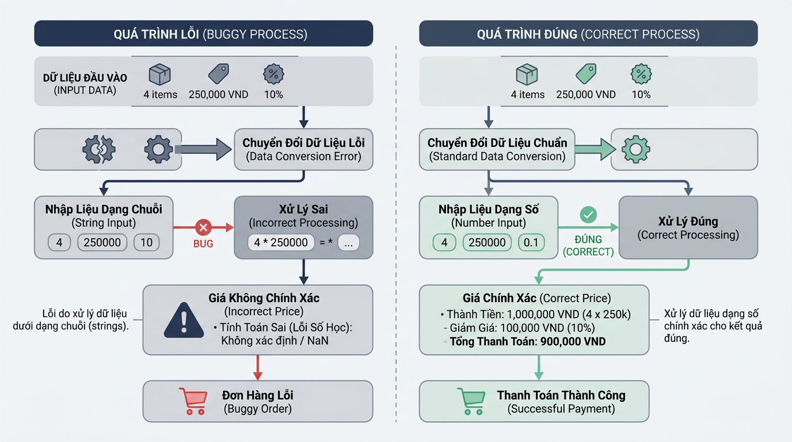

## <center>[Vận dụng cơ bản 1] Sửa lỗi tính toán hóa đơn đơn hàng E-Commerce</center>

### **1. Mục tiêu**
*   Hiểu và giải quyết triệt để lỗi logic phát sinh từ đặc tính trả về chuỗi ký tự của hàm `input()` trong Python 3.12.
*   Thực hành chuyển đổi kiểu dữ liệu (ép kiểu) tường minh từ `str` sang `float` và `int` để đảm bảo tính chính xác trong tính toán tài chính hệ thống thương mại điện tử.
*   Sử dụng thành thạo các tham số `sep` và `end` của hàm `print()` để định dạng dữ liệu xuất console theo chuẩn báo cáo thanh toán.

### **2. Bối cảnh & Vấn đề**
Hệ thống quản lý đơn hàng của một sàn thương mại điện tử (E-Commerce) đang gặp sự cố nghiêm trọng khi tính toán tổng thanh toán cho khách hàng trên giao diện dòng lệnh (CLI). Bộ phận kỹ thuật nhận được phản ánh rằng tổng tiền hiển thị trên hóa đơn bị nhân bản và nối chuỗi bất thường, khiến số tiền thanh toán lên tới hàng tỷ đồng dù khách hàng chỉ mua sản phẩm trị giá vài chục nghìn đồng.

Ví dụ: Đơn giá `15000.0`, số lượng `2`, phí vận chuyển `10000.0`. Kỳ vọng tổng tiền là `40000.0` VND, nhưng hệ thống lại xuất ra chuỗi `"15000.015000.010000.0"`.


<p align="center">
  
</p>


### **3. Mã nguồn hiện tại**
Dưới đây là đoạn mã nguồn kế thừa (legacy code) bị lỗi đang chạy trong hệ thống:

```python
# Hệ thống tính toán hóa đơn E-Commerce (Legacy Code)
# Lỗi nghiệp vụ: Dữ liệu nhập từ console không được ép kiểu số trước khi tính toán

product_name = input("Nhập tên sản phẩm: ")
raw_price = input("Nhập đơn giá sản phẩm (VND): ")
raw_quantity = input("Nhập số lượng mua: ")
raw_shipping_fee = input("Nhập phí giao hàng (VND): ")

# LỖI LOGIC: Nhân chuỗi với số và cộng chuỗi với chuỗi
total_goods_cost = raw_price * int(raw_quantity)
final_payment = total_goods_cost + raw_shipping_fee

print("HÓA ĐƠN THANH TOÁN", product_name)
print("Tổng tiền thanh toán:", final_payment)
```

### **4. Yêu cầu bài toán**
Học viên thực hiện bài tập gồm 2 phần:

**Phần 1: Báo cáo phân tích lỗi & Lập bảng Test Case (Viết vào báo cáo/README)**
1. Chỉ ra chính xác các vị trí dòng lệnh gây ra lỗi logic tính toán dữ liệu tài chính trong đoạn mã nguồn trên và giải thích nguyên nhân.
2. Lập bảng báo cáo kiểm thử (Test Case Report Table) gồm tối thiểu 3 kịch bản theo định dạng sau:

<table style="width: 100%; min-width: 100%; display: table; border-collapse: collapse;" width="100%" border="1">
  <thead>
    <tr>
      <th style="border: 1px solid #dddddd; padding: 8px; text-align: left;">STT</th>
      <th style="border: 1px solid #dddddd; padding: 8px; text-align: left;">Dữ liệu đầu vào (Input)</th>
      <th style="border: 1px solid #dddddd; padding: 8px; text-align: left;">Kết quả thực tế từ Legacy Code (Buggy Output)</th>
      <th style="border: 1px solid #dddddd; padding: 8px; text-align: left;">Kết quả kỳ vọng đúng (Expected Output)</th>
    </tr>
  </thead>
  <tbody>
    <tr>
      <td style="border: 1px solid #dddddd; padding: 8px;">1</td>
      <td style="border: 1px solid #dddddd; padding: 8px;">Áo sơ mi | Đơn giá: 100000 | Số lượng: 2 | Phí giao: 30000</td>
      <td style="border: 1px solid #dddddd; padding: 8px;">10000010000030000</td>
      <td style="border: 1px solid #dddddd; padding: 8px;">230000.0 VND</td>
    </tr>
    <tr>
      <td style="border: 1px solid #dddddd; padding: 8px;">2</td>
      <td style="border: 1px solid #dddddd; padding: 8px;">Giày thể thao | Đơn giá: 250000.5 | Số lượng: 1 | Phí giao: 15000</td>
      <td style="border: 1px solid #dddddd; padding: 8px;">250000.515000</td>
      <td style="border: 1px solid #dddddd; padding: 8px;">265000.5 VND</td>
    </tr>
    <tr>
      <td style="border: 1px solid #dddddd; padding: 8px;">3</td>
      <td style="border: 1px solid #dddddd; padding: 8px;">Tai nghe Bluetooth | Đơn giá: 500000 | Số lượng: 3 | Phí giao: 0</td>
      <td style="border: 1px solid #dddddd; padding: 8px;">5000005000005000000</td>
      <td style="border: 1px solid #dddddd; padding: 8px;">1500000.0 VND</td>
    </tr>
  </tbody>
</table>

**Phần 2: Sửa mã nguồn Python**
1. Viết lại mã nguồn Python đảm bảo ép kiểu `raw_price` và `raw_shipping_fee` sang kiểu số thực `float`, `raw_quantity` sang kiểu số nguyên `int`.
2. Phép tính tổng thanh toán phải tuân thủ công thức: `Tổng tiền = (Đơn giá * Số lượng) + Phí giao hàng`.
3. Định dạng đầu ra console chuyên nghiệp bằng cách sử dụng tham số `sep=" - "` cho dòng tiêu đề và `sep=": "`, `end=" VND\n"` cho dòng xuất kết quả tổng tiền.
4. Thêm kiểm tra đầu vào cơ bản (sử dụng khối `try - except ValueError`) để thông báo lỗi thân thiện nếu người dùng nhập dữ liệu không đúng định dạng số.

### **5. Yêu cầu nộp bài**
Học viên cần nộp:
*   Phần phân tích/báo cáo và mã nguồn triển khai.
*   Đẩy mã nguồn lên GitHub theo định dạng thư mục: `[Tên Lớp]_[Môn Học]_Session02_Ex01`.
    Ví dụ: `HNKS25CNTT1_Core_Session02_Ex01`