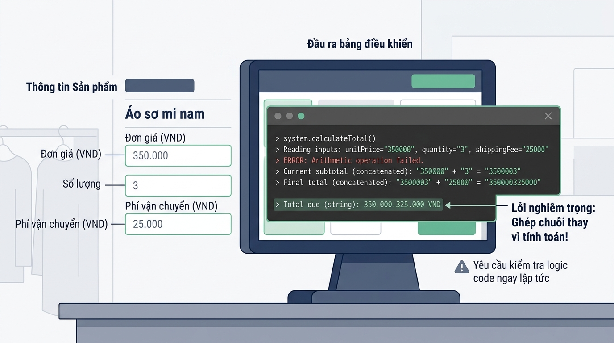

## <center>[Vận dụng cơ bản 2] Sửa Lỗi Tính Toán Tổng Giá Trị Đơn Hàng Trong Hệ Thống E-Commerce</center>

### **1. Mục tiêu**
*   **Kiến thức:** Củng cố cơ chế hoạt động của hàm `input()`, bản chất trả về dữ liệu kiểu chuỗi (`str`) trong Python 3.12 và phương pháp ép kiểu dữ liệu (`int()`, `float()`).
*   **Kỹ năng:** Nắm vững kỹ thuật định dạng đầu ra dòng lệnh với các tham số `sep` và `end` trong hàm `print()`; phát hiện và khắc phục sai lầm ghép chuỗi (string concatenation) trong các bài toán tính toán tài chính.
*   **Mức độ chủ động:** Phân tích mã nguồn cũ, lập báo cáo test case chứng minh sai sót logic và viết lại mã nguồn xử lý chính xác theo yêu cầu nghiệp vụ E-Commerce.

### **2. Bối cảnh & Vấn đề**
Bộ phận công nghệ của nền tảng thương mại điện tử **EcoMart** đang phát triển module xử lý hóa đơn tự động tại quầy thanh toán POS dòng lệnh. Khi thu ngân nhập thông tin gồm: **đơn giá sản phẩm**, **số lượng mua** và **phí giao hàng**, hệ thống cần tính toán chính xác tổng tiền hàng và tổng chi phí thanh toán thực tế của đơn hàng.

Tuy nhiên, lập trình viên tiền nhiệm đã trực tiếp thực hiện các phép toán trên dữ liệu nhận từ `input()` mà không chuyển đổi kiểu dữ liệu. Hậu quả là thay vì thực hiện phép cộng và phép nhân số học, Python đã thực hiện phép nối chuỗi văn bản, dẫn đến số tiền thanh toán hiển thị trên hóa đơn bị sai lệch hàng triệu đồng. Ngoài ra, giao diện hiển thị hóa đơn dòng lệnh chưa đạt chuẩn nhận diện thương hiệu của EcoMart.


<p align="center">
  
</p>


### **3. Mã nguồn hiện tại**
Dưới đây là mã nguồn Python đang gặp sự cố nghiệp vụ:

```python
# ==============================================================================
# HỆ THỐNG QUẢN LÝ ĐƠN HÀNG E-COMMERCE - ECOMART POS
# Mã nguồn hiện tại chứa lỗi sai kiểu dữ liệu và định dạng dòng lệnh
# ==============================================================================

# Bước 1: Nhập thông tin đơn hàng từ console
raw_item_price = input("Nhập đơn giá sản phẩm (VNĐ): ")
raw_quantity = input("Nhập số lượng sản phẩm: ")
raw_shipping_fee = input("Nhập phí giao hàng (VNĐ): ")

# Bước 2: Tính toán tiền hàng và tổng thanh toán (LỖI LOGIC NGHIỆP VỤ)
# Lỗi: Không ép kiểu dữ liệu từ chuỗi sang số thực/số nguyên
item_total = raw_item_price + raw_shipping_fee
grand_total = item_total + raw_quantity

# Bước 3: Xuất hóa đơn ra màn hình console (LỖI ĐỊNH DẠNG)
print("HÓA ĐƠN BÁN HÀNG", "E-COMMERCE SYSTEM")
print("Thành tiền thanh toán: " + grand_total + " VNĐ")
```

### **4. Yêu cầu bài toán**

#### **Phần 1: Lập báo cáo kiểm thử (Test Case Report)**
Học viên tiến hành chạy thử mã nguồn cũ với dữ liệu thực tế và lập bảng báo cáo phân tích theo mẫu dưới đây (tối thiểu 3 trường hợp kiểm thử):

<table border="1" style="width: 100%; min-width: 100%; display: table; border-collapse: collapse;" width="100%">
  <thead>
    <tr style="background-color: #f2f2f2;">
      <th style="border: 1px solid #dddddd; padding: 8px; text-align: center; width: 8%;">STT</th>
      <th style="border: 1px solid #dddddd; padding: 8px; text-align: left; width: 32%;">Dữ liệu đầu vào (Input)</th>
      <th style="border: 1px solid #dddddd; padding: 8px; text-align: left; width: 30%;">Kết quả thực tế từ mã lỗi (Buggy Output)</th>
      <th style="border: 1px solid #dddddd; padding: 8px; text-align: left; width: 30%;">Kết quả mong đợi đúng (Expected Output)</th>
    </tr>
  </thead>
  <tbody>
    <tr>
      <td style="border: 1px solid #dddddd; padding: 8px; text-align: center;">1</td>
      <td style="border: 1px solid #dddddd; padding: 8px;">Đơn giá: 150000<br>Số lượng: 2<br>Phí ship: 30000</td>
      <td style="border: 1px solid #dddddd; padding: 8px;">Thành tiền: 150000300002 VNĐ</td>
      <td style="border: 1px solid #dddddd; padding: 8px;">Tổng tiền hàng: 300000.0 VNĐ<br>Tổng thanh toán: 330000.0 VNĐ</td>
    </tr>
    <tr>
      <td style="border: 1px solid #dddddd; padding: 8px; text-align: center;">2</td>
      <td style="border: 1px solid #dddddd; padding: 8px;">Đơn giá: 25000.5<br>Số lượng: 4<br>Phí ship: 15000</td>
      <td style="border: 1px solid #dddddd; padding: 8px;">...</td>
      <td style="border: 1px solid #dddddd; padding: 8px;">...</td>
    </tr>
    <tr>
      <td style="border: 1px solid #dddddd; padding: 8px; text-align: center;">3</td>
      <td style="border: 1px solid #dddddd; padding: 8px;">Đơn giá: 500000<br>Số lượng: 1<br>Phí ship: 0</td>
      <td style="border: 1px solid #dddddd; padding: 8px;">...</td>
      <td style="border: 1px solid #dddddd; padding: 8px;">...</td>
    </tr>
  </tbody>
</table>

#### **Phần 2: Sửa đổi và hoàn thiện mã nguồn Python**
Học viên viết lại đoạn mã Python đáp ứng các tiêu chuẩn nghiệp vụ sau:
1.  **Chuyển đổi kiểu dữ liệu:**
    *   `unit_price` (Đơn giá): Ép kiểu sang số thực (`float`).
    *   `quantity` (Số lượng): Ép kiểu sang số nguyên (`int`).
    *   `shipping_fee` (Phí giao hàng): Ép kiểu sang số thực (`float`).
2.  **Công thức tính toán chuẩn số học:**
    *   `item_total` (Tổng tiền hàng) = `unit_price * quantity`
    *   `grand_total` (Tổng thanh toán) = `item_total + shipping_fee`
3.  **Định dạng xuất dòng lệnh console:**
    *   Dòng 1: Xuất tiêu đề với phân cách `sep=" | "`:
        `HÓA ĐƠN BÁN HÀNG | E-COMMERCE POS SYSTEM`
    *   Dòng 2: Xuất chi tiết số lượng và tiền hàng dùng `sep=" - "`:
        `Số lượng: <quantity> - Tiền hàng: <item_total> VNĐ`
    *   Dòng 3: Xuất tổng thanh toán dùng `sep=": "` và kết thúc bằng `end=" VNĐ\n"`:
        `Tổng thanh toán: <grand_total> VNĐ`
    *   Dòng 4: In lời cảm ơn: `"Cảm ơn quý khách đã mua sắm tại EcoMart!"`.
4.  **Chuẩn mã nguồn:** Tuân thủ quy tắc đặt tên `snake_case`, comment Tiếng Việt có dấu rõ ràng.

### **5. Yêu cầu nộp bài**
Học viên cần nộp:
*   Phần phân tích/báo cáo và mã nguồn triển khai.
*   Đẩy mã nguồn lên GitHub theo định dạng thư mục: `[Tên Lớp]_[Môn Học]_Session02_Ex02`.
    Ví dụ: `HNKS25CNTT1_Core_Session02_Ex02`