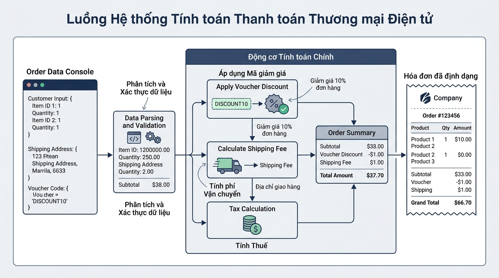

## <center>[Vận dụng chuyên sâu] Thiết kế hệ thống tính toán chiết khấu và hóa đơn thương mại điện tử</center>

### **1. Mục tiêu**
*   **Chuyển đổi kiểu dữ liệu an toàn:** Nắm vững và thực hành chuyển đổi chuẩn xác dữ liệu thô nhập từ console (`input()`) sang các kiểu số thực (`float`) và số nguyên (`int`).
*   **Xây dựng logic tính toán tài chính e-commerce:** Áp dụng các thuật toán tính toán giá trị đơn hàng, giá trị chiết khấu voucher theo tỷ lệ %, phí vận chuyển và tổng giá trị thanh toán cuối cùng.
*   **Kiểm soát định dạng hiển thị Console:** Làm chủ các tham số `sep` và `end` trong hàm `print()` để tạo giao diện dòng lệnh chuyên nghiệp, rõ ràng.
*   **Phân tích và kiểm chuẩn bẫy biên (Validation & Exceptions):** Xây dựng tư duy phân tích hệ thống, xác định luồng dữ liệu I/O và chặn bẫy các trường hợp nhập sai định dạng hoặc số liệu tài chính không hợp lệ bằng ngoại lệ Python native (`ValueError`).

### **2. Bối cảnh & Vấn đề**
Trong phân hệ thanh toán (Checkout Subsystem) của một nền tảng thương mại điện tử (E-Commerce Platform), khi khách hàng hoàn tất giỏ hàng, hệ thống cần xử lý thông tin tính hóa đơn từ màn hình nhập liệu dòng lệnh (CLI).

Dữ liệu nhận được từ người dùng thông qua hàm `input()` luôn ở dạng chuỗi văn bản (`str`). Nếu chương trình không kiểm tra và chuyển đổi kiểu dữ liệu một cách nghiêm ngặt, phép tính tài chính sẽ bị sai lệch nghiêm trọng do lỗi dính chuỗi (ví dụ: phép cộng chuỗi `"500000" + "30000"` cho ra `"50000030000"` thay vì số tiền đúng là `530000`). Ngoài ra, nếu người dùng nhập đơn giá âm, số lượng bằng 0 hoặc tỷ lệ giảm giá vượt quá 100%, hệ thống có nguy cơ phát sinh tổn thất tài chính hoặc gây sập chương trình.

Hệ thống yêu cầu bạn thiết kế một giải pháp xử lý nhập/xuất dữ liệu hóa đơn thanh toán hoàn chỉnh: nhận thông tin sản phẩm, đơn giá, số lượng, tỷ lệ voucher chiết khấu và phí giao hàng; thực hiện kiểm tra tính hợp lệ của dữ liệu; tính toán chính xác tổng chi phí và in hóa đơn đẹp mắt ra console.


<p align="center">
  
</p>


### **3. Quy tắc nghiệp vụ**
Hệ thống tính toán hóa đơn phải tuân thủ nghiêm ngặt 4 quy tắc nghiệp vụ sau:

1.  **Quy tắc 1: Đầu vào dữ liệu thô (Raw Inputs)**
    *   Tên sản phẩm: Chuỗi ký tự (không được để trống).
    *   Đơn giá sản phẩm: Nhập dạng chuỗi, ép kiểu sang `float`.
    *   Số lượng mua: Nhập dạng chuỗi, ép kiểu sang `int`.
    *   Tỷ lệ giảm giá (Voucher Discount Rate): Nhập dạng chuỗi theo phần trăm (từ 0.0% đến 100.0%), ép kiểu sang `float`.
    *   Phí vận chuyển (Shipping Fee): Nhập dạng chuỗi, ép kiểu sang `float`.

2.  **Quy tắc 2: Kiểm chuẩn dữ liệu và Bẫy biên (Validation Rules)**
    *   Đơn giá sản phẩm (`unit_price`) phải lớn hơn 0.
    *   Số lượng sản phẩm (`quantity`) phải lớn hơn 0.
    *   Tỷ lệ giảm giá (`discount_rate`) phải nằm trong khoảng từ `0.0` đến `100.0`.
    *   Phí vận chuyển (`shipping_fee`) phải lớn hơn hoặc bằng `0.0`.
    *   Nếu dữ liệu vi phạm bất kỳ điều kiện nào ở trên, hệ thống phải dừng xử lý và đưa ra thông điệp lỗi phù hợp bằng ngoại lệ `ValueError`.

3.  **Quy tắc 3: Công thức tính toán tài chính**
    *   `Subtotal` (Tổng tiền hàng chưa giảm) = `unit_price` * `quantity`
    *   `Discount Amount` (Số tiền được giảm) = `subtotal` * (`discount_rate` / 100.0)
    *   `Total Payment` (Tổng thanh toán thực tế) = `subtotal` - `discount_amount` + `shipping_fee`

4.  **Quy tắc 4: Chuẩn định dạng hiển thị Console**
    *   Hóa đơn hiển thị phải phân tách rõ ràng các phân đoạn (Tiêu đề, Chi tiết đơn hàng, Tổng thanh toán).
    *   Phải sử dụng tham số `sep` để căn chỉnh khoảng cách hoặc dấu phân cách giữa các trường thông tin.
    *   Phải sử dụng tham số `end` để kiểm soát xuống dòng và đính kèm đơn vị tiền tệ (`VND`).

### **4. Yêu cầu đầu ra**

Học viên thực hiện bài tập theo 2 phần bắt buộc:

#### **Phần 1: Báo cáo phân tích & Thiết kế giải pháp**
*   **Bảng quy chuẩn dữ liệu I/O (Data Schema Specification Table):** Lập bảng mô tả tất cả các biến đầu vào và đầu ra bao gồm: Tên biến (English identifier), Kiểu dữ liệu gốc (`str`), Kiểu dữ liệu sau ép kiểu (`int`/`float`), Ràng buộc nghiệp vụ.
*   **Mô tả giải thuật (Flowchart / Pseudocode):** Trình bày mã giả hoặc sơ đồ luồng chi tiết thể hiện từng bước: Nhận dữ liệu -> Chuyển đổi kiểu -> Kiểm tra bẫy biên -> Tính toán công thức -> Xuất hóa đơn định dạng.

#### **Phần 2: Triển khai mã nguồn Python 3.12 từ đầu (From Scratch)**
*   Viết chương trình Python hoàn chỉnh xử lý luồng nhập/xuất dữ liệu hóa đơn thương mại điện tử.
*   Đặt tên biến hoàn toàn bằng tiếng Anh theo chuẩn PEP 8 (`snake_case`). Chú thích giải thích logic bằng Tiếng Việt có dấu.
*   Sử dụng Type Hints thích hợp cho các biến/hàm (nếu triển khai dạng hàm).
*   Chương trình phải bắt được ngoại lệ khi người dùng nhập dữ liệu không phải là số (như nhập chữ vào trường đơn giá/số lượng).

#### **Ví dụ dữ liệu thử nghiệm (Sample Test Cases)**

**Trường hợp 1: Nhập dữ liệu hợp lệ**
*   Dữ liệu đầu vào từ Console:
    ```text
    Tên sản phẩm: Điện thoại Samsung Galaxy S24
    Đơn giá sản phẩm: 20000000.0
    Số lượng mua: 2
    Tỷ lệ giảm giá (%): 10.0
    Phí vận chuyển: 45000.0
    ```
*   Kết quả hiển thị trên Console:
    ```text
    === HÓA ĐƠN THANH TOÁN E-COMMERCE ===
    Sản phẩm: Điện thoại Samsung Galaxy S24
    Số lượng: 2 | Đơn giá: 20000000.0 VND
    ---------------------------------------------
    Tổng tiền hàng: 40000000.0 VND
    Tiền chiết khấu (10.0%): 4000000.0 VND
    Phí giao hàng: 45000.0 VND
    ---------------------------------------------
    TỔNG TỀN THANH TOÁN => 36045000.0 VND
    Cảm ơn quý khách đã mua sắm tại E-Shop!
    ```

**Trường hợp 2: Dữ liệu vi phạm quy tắc nghiệp vụ (Bẫy biên)**
*   Dữ liệu đầu vào từ Console:
    ```text
    Tên sản phẩm: Tai nghe Bluetooth
    Đơn giá sản phẩm: 500000.0
    Số lượng mua: -1
    Tỷ lệ giảm giá (%): 5.0
    Phí vận chuyển: 15000.0
    ```
*   Kết quả hiển thị trên Console:
    ```text
    [ERROR] Lỗi dữ liệu: Số lượng sản phẩm phải lớn hơn 0!
    ```

### **5. Yêu cầu nộp bài**
Học viên cần nộp:
*   Phần phân tích/báo cáo và mã nguồn triển khai.
*   Đẩy mã nguồn lên GitHub theo định dạng thư mục: `[Tên Lớp]_[Môn Học]_Session02_Ex03`.
    Ví dụ: `HNKS25CNTT1_Core_Session02_Ex03`