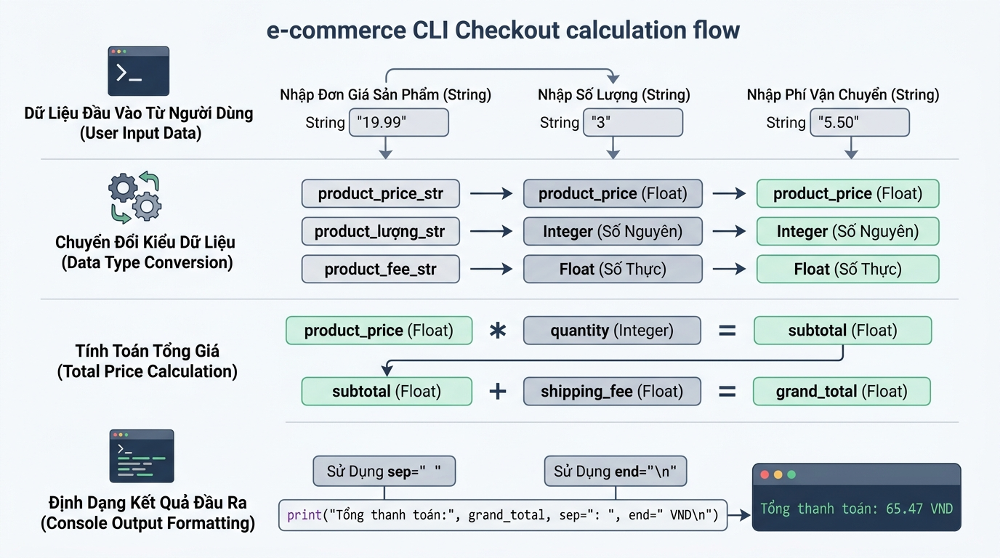

## 
[Phân tích] Thiết kế module tính toán và định dạng hóa đơn thanh toán E-Commerce

### **1. Mục tiêu**
*   **Phân tích & Đánh giá**: Phân tích sâu sắc hai giải pháp kiến trúc xử lý nhập dữ liệu dòng lệnh (Console CLI Input), chuyển đổi kiểu dữ liệu (Data Type Casting) và tính toán giá trị hóa đơn trong hệ thống thanh toán E-Commerce.
*   **Đánh giá Trade-off**: Xây dựng bảng so sánh đa chiều giữa phương pháp ép kiểu tách biệt theo giai đoạn (Staged Type Casting) và phương pháp ép kiểu / tính toán trực tiếp trên dòng lệnh xuất (Inline Casting & Direct Evaluation) dựa trên các tiêu chí: bộ nhớ, tính rõ ràng, khả năng bảo trì, khả năng phát hiện lỗi và độ an toàn tài chính.
*   **Triển khai mã nguồn tối ưu**: Áp dụng thành thạo ngôn ngữ Python 3.12 để xây dựng chương trình nhận dữ liệu từ bàn phím, thực hiện phép tính số học tài chính chính xác và định dạng hiển thị kết quả console bằng các tham số `sep` và `end`.

### **2. Bối cảnh & Vấn đề**
Trong phân hệ thanh toán (Checkout Subsystem) của một nền tảng thương mại điện tử (E-Commerce Platform), dữ liệu nhập vào từ khách hàng qua giao diện dòng lệnh hoặc các trường văn bản mặc định luôn ở dạng chuỗi ký tự (`str`). Module tính toán hóa đơn có nhiệm vụ thu thập đơn giá sản phẩm, số lượng đặt mua, phí vận chuyển và số tiền giảm giá từ voucher để tính tổng chi phí thanh toán cuối cùng.

Nếu lập trình viên thực hiện phép toán số học trực tiếp trên dữ liệu chuỗi mà không qua ép kiểu, Python sẽ thực hiện phép ghép chuỗi (string concatenation) hoặc nhân chuỗi (string repetition), dẫn đến sai lệch nghiêm trọng về số liệu tài chính của cửa hàng. Đội ngũ phát triển đang cân nhắc hai hướng tiếp cận triển khai cho module này và cần một báo cáo phân tích chi tiết trước khi chốt phương án lập trình.

  

### **3. Quy tắc nghiệp vụ**
1.  **Dữ liệu đầu vào (Console Inputs)**:
    *   Đơn giá sản phẩm (`unit_price`): Nhập từ bàn phím, chuyển đổi thành số thực (`float`).
    *   Số lượng mua (`quantity`): Nhập từ bàn phím, chuyển đổi thành số nguyên (`int`).
    *   Phí vận chuyển (`shipping_fee`): Nhập từ bàn phím, chuyển đổi thành số thực (`float`).
    *   Số tiền giảm giá Voucher (`discount_amount`): Nhập từ bàn phím, chuyển đổi thành số thực (`float`).
2.  **Công thức tính toán (Financial Business Rules)**:
    *   Tạm tính tiền hàng (Subtotal) = Đơn giá sản phẩm * Số lượng mua.
    *   Tổng chi phí thanh toán (Grand Total) = Tạm tính tiền hàng + Phí vận chuyển - Số tiền giảm giá.
3.  **Quy chuẩn định dạng đầu ra (Console Output Format)**:
    *   Dòng tiêu đề hóa đơn phải sử dụng hàm `print()` với tham số `sep=" - "` để phân tách giữa tên cửa hàng và tên chứng từ.
    *   Dòng chi tiết kết quả phải hiển thị rõ ràng số lượng, tạm tính, tổng tiền và kết thúc bằng đơn vị tiền tệ `" VNĐ\n"` thông qua tham số `end`.

### **4. Yêu cầu bài toán**

#### **Phần 1: Báo cáo phân tích và So sánh Trade-off**
Học viên nghiên cứu 2 giải pháp kỹ thuật sau:
*   **Giải pháp A (Staged Variable Casting & Intermediate Calculation)**: Lưu dữ liệu chuỗi ban đầu vào các biến thô, sau đó thực hiện ép kiểu rõ ràng thành các biến số học độc lập, thực hiện tính toán qua biến trung gian (`subtotal`, `grand_total`), cuối cùng truyền các biến kết quả vào hàm `print()`.
*   **Giải pháp B (Inline Casting & Direct Print Evaluation)**: Ép kiểu trực tiếp ngay khi gọi `input()` hoặc lồng biểu thức tính toán và ép kiểu trực tiếp bên trong tham số của hàm `print()` mà không khai báo biến trung gian.

Tạo bảng so sánh Trade-off giữa 2 giải pháp theo chuẩn HTML bên dưới:

<table style="width: 100%; min-width: 100%; display: table; border-collapse: collapse;" width="100%" border="1">
  <thead>
    <tr style="background-color: #f2f2f2;">
      <th style="padding: 8px; text-align: left;">Tiêu chí phân tích</th>
      <th style="padding: 8px; text-align: left;">Giải pháp A (Staged Variable Casting)</th>
      <th style="padding: 8px; text-align: left;">Giải pháp B (Inline Direct Evaluation)</th>
    </tr>
  </thead>
  <tbody>
    <tr>
      <td style="padding: 8px;"><strong>Hiệu năng & Bộ nhớ (Memory & Speed)</strong></td>
      <td style="padding: 8px;">...</td>
      <td style="padding: 8px;">...</td>
    </tr>
    <tr>
      <td style="padding: 8px;"><strong>Tính dễ đọc & Rõ ràng (Readability)</strong></td>
      <td style="padding: 8px;">...</td>
      <td style="padding: 8px;">...</td>
    </tr>
    <tr>
      <td style="padding: 8px;"><strong>Khả năng bảo trì & Mở rộng (Maintainability)</strong></td>
      <td style="padding: 8px;">...</td>
      <td style="padding: 8px;">...</td>
    </tr>
    <tr>
      <td style="padding: 8px;"><strong>Khả năng kiểm vết lỗi (Debuggability)</strong></td>
      <td style="padding: 8px;">...</td>
      <td style="padding: 8px;">...</td>
    </tr>
    <tr>
      <td style="padding: 8px;"><strong>Độ an toàn logic tài chính (Financial Safety)</strong></td>
      <td style="padding: 8px;">...</td>
      <td style="padding: 8px;">...</td>
    </tr>
  </tbody>
</table>

#### **Phần 2: Giải trình Lựa chọn & Mã giả (Pseudocode)**
*   Đưa ra lý giải kỹ thuật ngắn gọn về việc chọn Giải pháp A hay Giải pháp B cho hệ thống hóa đơn E-Commerce.
*   Viết mã giả (Pseudocode) thể hiện từng bước xử lý dữ liệu từ lúc nhận `input()`, ép kiểu, tính toán đến khi hiển thị kết quả bằng `print()`.

#### **Phần 3: Triển khai Mã nguồn Python**
*   Viết mã nguồn Python 3.12 hoàn chỉnh thực thi giải pháp tối ưu đã chọn.
*   Tuân thủ tiêu chuẩn PEP 8: Đặt tên biến dạng `snake_case`, ghi chú code bằng tiếng Việt có dấu.
*   Đảm bảo sử dụng đầy đủ các tham số `sep` và `end` trong hàm `print()`.

### **5. Yêu cầu nộp bài**
Học viên cần nộp:
*   Phần phân tích/báo cáo và mã nguồn triển khai.
*   Đẩy mã nguồn lên GitHub theo định dạng thư mục: `[Tên Lớp]_[Môn Học]_Session02_Ex04`.
    Ví dụ: `HNKS25CNTT1_Core_Session02_Ex04`