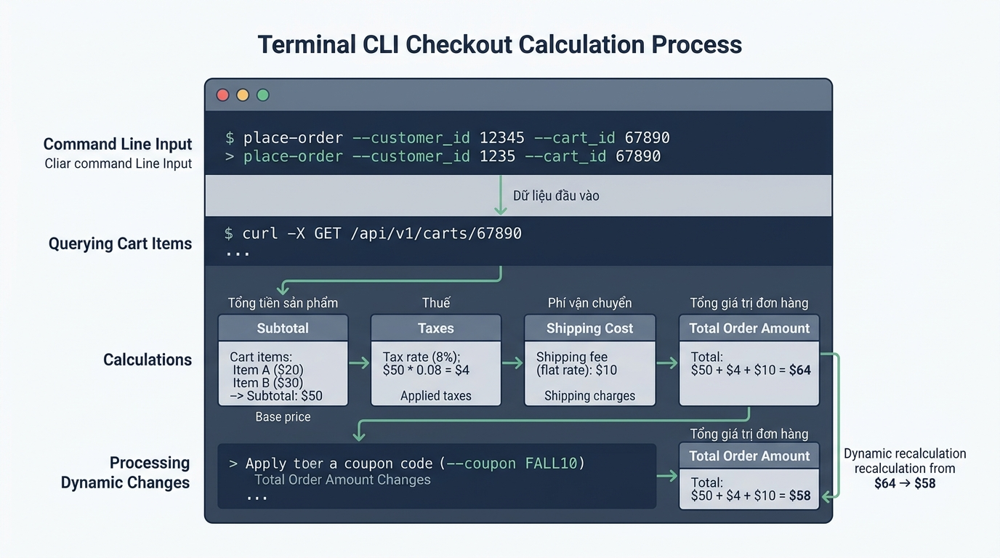

## 
[Sáng tạo] Thiết kế mô-đun tính toán và xuất hóa đơn thương mại điện tử

### **1. Mục tiêu**
*   **Tự thiết kế schema nhập/xuất dữ liệu (I/O Schema):** Định nghĩa cấu trúc dữ liệu đầu vào và biểu mẫu hiển thị kết quả cho hệ thống tính toán đơn hàng e-commerce thông qua giao diện console.
*   **Thao tác chuẩn xác với ép kiểu và tham số console:** Áp dụng thành thạo các hàm `input()`, `int()`, `float()` để nhận dữ liệu từ người dùng và tính toán tài chính; khai thác các tham số `sep` và `end` của hàm `print()` để trình bày hóa đơn đẹp mắt.
*   **Phân tích bẫy dữ liệu và vẽ sơ đồ luồng:** Chủ động phát hiện các kịch bản dữ liệu ngoại lệ khi ép kiểu và biểu diễn luồng xử lý bằng sơ đồ Mermaid.
*   **Rèn luyện tư duy thiết kế phần mềm độc lập:** Tự xây dựng toàn bộ mã nguồn từ con số 0 mà không dựa vào mã khung (skeleton code) hay dữ liệu mẫu có sẵn.

### **2. Vấn đề**
Hệ thống quản lý đơn hàng của một nền tảng thương mại điện tử (E-commerce Order Subsystem) đang cần phát triển một mô-đun công cụ dòng lệnh (CLI tool) dành cho nhân viên tư vấn bán hàng. Công cụ này cho phép nhân viên nhập nhanh các thông số của giao dịch (đơn giá sản phẩm, số lượng, tỷ lệ chiết khấu voucher, phí vận chuyển) từ bàn phím, tự động thực hiện phép tính tài chính chính xác và in ra hóa đơn bán hàng cho khách xem trước (Invoice Preview).

Hiện tại, việc thiếu chuẩn hóa cấu trúc dữ liệu nhập vào khiến giao dịch hay gặp lỗi (như dính chuỗi khi tính tổng tiền thay vì thực hiện phép cộng/nhân số học), đồng thời giao diện hiển thị thông tin hóa đơn trên console còn rời rạc, chưa đạt quy chuẩn thẩm mỹ của doanh nghiệp.

Với vai trò là Kỹ sư Phần mềm Python, bạn được giao nhiệm vụ tự thiết kế và cài đặt hoàn chỉnh mô-đun này.

  

### **3. Quy tắc nghiệp vụ**
Hệ thống tính toán hóa đơn thương mại điện tử cần tuân thủ các quy tắc tài chính sau:
1.  **Thu thập dữ liệu đầu vào:** Nhận các trường dữ liệu bắt buộc từ giao diện dòng lệnh bao gồm: tên sản phẩm, đơn giá niêm yết, số lượng sản phẩm mua, phần trăm giảm giá từ voucher, và chi phí vận chuyển.
2.  **Chuyển đổi kiểu dữ liệu bắt buộc:** Tất cả dữ liệu nhận về từ hàm `input()` ban đầu ở dạng chuỗi (`str`), hệ thống phải chủ động ép kiểu sang số nguyên (`int`) hoặc số thực (`float`) thích hợp trước khi thực hiện phép tính số học.
3.  **Công thức tính toán tài chính:**
    *   Tiền hàng chưa giảm = `Đơn giá * Số lượng`
    *   Số tiền được giảm từ Voucher = `Tiền hàng chưa giảm * (Tỷ lệ giảm giá / 100)`
    *   Tổng tiền thanh toán cuối cùng = `Tiền hàng chưa giảm - Số tiền được giảm + Phí vận chuyển`
4.  **Định dạng đầu ra trên Console:** Sử dụng các tham số `sep` (ký tự phân cách giữa các tham số) và `end` (ký tự kết thúc dòng) của hàm `print()` để tạo giao diện dòng kẻ phân cách, căn chỉnh cột và định dạng hóa đơn chuyên nghiệp.

### **4. Yêu cầu bài toán**
Học viên hoàn thành bài tập thông qua 4 phần nội dung trong báo cáo và mã nguồn:

*   **Phần 1 - Tự thiết kế I/O Schema:**
    *   Tự định nghĩa danh sách các biến nhận vào từ người dùng (tên biến, kiểu dữ liệu mục tiêu, mô tả ý nghĩa).
    *   Tự phác thảo mẫu giao diện hóa đơn xuất ra console (cấu trúc dòng, các tham số `sep` và `end` dự kiến sử dụng).

*   **Phần 2 - Chủ động phát hiện bẫy dữ liệu (Edge Cases):**
    *   Liệt kê ít nhất 3 kịch bản lỗi phát sinh khi người dùng nhập dữ liệu sai quy cách hoặc sai kiểu dữ liệu từ bàn phím (ví dụ: nhập chữ vào trường số lượng, nhập số tiền âm, nhập số thực cho số lượng mua...).

*   **Phần 3 - Thiết kế Sơ đồ luồng dữ liệu (Data Flow Diagram):**
    *   Vẽ sơ đồ Mermaid biểu diễn chi tiết dòng chảy dữ liệu từ bước `input()` dòng lệnh, qua các bước ép kiểu `float()` / `int()`, tính toán trung gian, cho đến bước xuất kết quả ra `print()`.

*   **Phần 4 - Lập trình triển khai (Implementation):**
    *   Viết mã nguồn Python 3.12 từ con số 0 để hoàn thành tính năng.
    *   Mã nguồn phải tuân thủ chuẩn PEP 8: tên biến đặt bằng tiếng Anh theo chuẩn `snake_case`, các dòng chú thích (comment) giải thích tư duy logic viết bằng tiếng Việt có dấu.

### **5. Yêu cầu nộp bài**
Học viên cần nộp:
*   Phần phân tích/báo cáo và mã nguồn triển khai.
*   Đẩy mã nguồn lên GitHub theo định dạng thư mục: `[Tên Lớp]_[Môn Học]_Session02_Ex05`.
    Ví dụ: `HNKS25CNTT1_Core_Session02_Ex05`