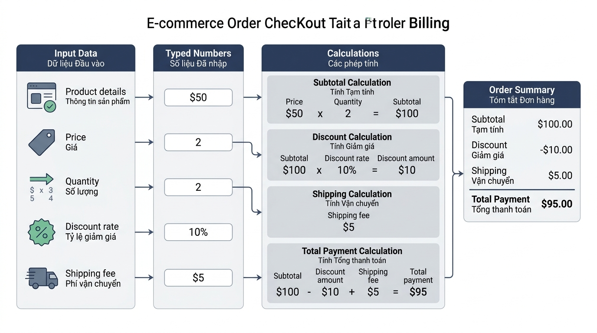

## <center>[Bài tập tổng hợp] Xây dựng module tính toán hóa đơn thanh toán E-commerce</center>

### **1. Mục tiêu**
*   Thuần thục thao tác thu thập dữ liệu người dùng từ dòng lệnh bằng hàm `input()`.
*   Thực hiện ép kiểu dữ liệu linh hoạt từ chuỗi văn bản sang số thực (`float`) và số nguyên (`int`).
*   Áp dụng các phép tính số học cơ bản để tính tổng tiền hàng, số tiền giảm giá chiết khấu, phí vận chuyển và tổng tiền thanh toán.
*   Sử dụng thành thạo các tham số `sep` và `end` trong hàm `print()` để định dạng bảng hóa đơn chuyên nghiệp trên màn hình console.

### **2. Bối cảnh & Vấn đề**
Trong phân hệ thanh toán (Checkout Subsystem) của một nền tảng thương mại điện tử, sau khi người dùng xác nhận giỏ hàng, hệ thống cần nhận các thông tin đầu vào bao gồm: tên sản phẩm, đơn giá niêm yết, số lượng đặt mua, phần trăm giảm giá khuyến mãi và phí giao hàng. 

Do dữ liệu nhận được từ giao diện dòng lệnh luôn có kiểu chuỗi văn bản (`str`), nếu không thực hiện chuyển đổi kiểu dữ liệu số học chính xác, hệ thống sẽ gặp lỗi nghiêm trọng (như phép nhân chuỗi hoặc phép cộng chuỗi làm sai lệch tổng số tiền khách hàng phải trả). Nhiệm vụ của bạn là viết một chương trình Python 3.12 để tiếp nhận thông tin, thực hiện tính toán tài chính chính xác và in ra hóa đơn thanh toán hoàn chỉnh.


<p align="center">
  
</p>


### **3. Quy tắc nghiệp vụ**
1.  **Thu thập dữ liệu đầu vào:**
    *   `product_name`: Tên sản phẩm (kiểu chuỗi `str`).
    *   `unit_price`: Đơn giá sản phẩm (kiểu số thực `float`).
    *   `quantity`: Số lượng đặt mua (kiểu số nguyên `int`).
    *   `discount_rate`: Tỷ lệ giảm giá theo phần trăm (kiểu số thực `float`, ví dụ: nhập `5` tương ứng 5%).
    *   `shipping_fee`: Phí vận chuyển (kiểu số thực `float`).

2.  **Công thức tính toán:**
    *   Tổng tiền hàng gốc (`subtotal`) = `unit_price * quantity`
    *   Số tiền được giảm (`discount_amount`) = `subtotal * (discount_rate / 100)`
    *   Tiền hàng sau giảm giá (`discounted_subtotal`) = `subtotal - discount_amount`
    *   Tổng tiền thanh toán cuối cùng (`total_payment`) = `discounted_subtotal + shipping_fee`

3.  **Quy chuẩn lập trình & Đặt tên:**
    *   Toàn bộ tên biến phải viết bằng tiếng Anh, tuân thủ chuẩn PEP 8 (dạng `snake_case`).
    *   Hiển thị thông tin hóa đơn ra console rõ ràng, có phân cách bằng các tham số `sep` và `end`, ghi rõ đơn vị tiền tệ `VND`.

### **4. Yêu cầu đầu ra**
Học viên viết toàn bộ mã nguồn xử lý trong file `main.py`. Khi chạy chương trình, người dùng sẽ nhập lần lượt các thông tin và nhận được hóa đơn hiển thị chuẩn xác.

**Ví dụ minh họa luồng thực thi:**

```text
=== NHẬP THÔNG TIN ĐƠN HÀNG ===
Nhập tên sản phẩm: Laptop Dell XPS
Nhập đơn giá (VND): 25000000
Nhập số lượng: 2
Nhập phần trăm giảm giá (%): 5
Nhập phí vận chuyển (VND): 50000

=== HÓA ĐƠN THANH TOÁN ===
Sản phẩm: Laptop Dell XPS
Số lượng: 2 | Đơn giá: 25000000.0 VND
Tổng tiền hàng: 50000000.0 VND
Giảm giá (5.0%): 2500000.0 VND
Phí vận chuyển: 50000.0 VND
----------------------------------------
TỔNG THANH TOÁN: 47550000.0 VND
Cảm ơn quý khách đã mua hàng!
```

### **5. Yêu cầu nộp bài**
Học viên cần nộp:
*   Phần phân tích/báo cáo và mã nguồn triển khai.
*   Đẩy mã nguồn lên GitHub theo định dạng thư mục: `[Tên Lớp]_[Môn Học]_Session02_Ex06`.
    Ví dụ: `HNKS25CNTT1_Core_Session02_Ex06`