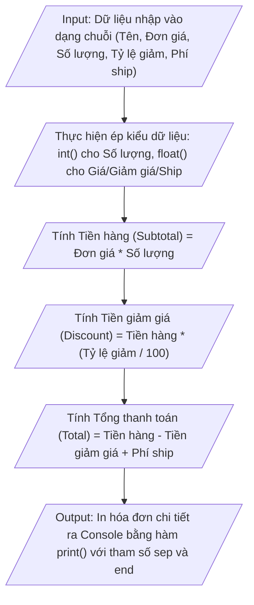

## <center>Xây dựng Module Tính Hóa Đơn Đơn Hàng Thương Mại Điện Tử</center>

### **1. Mục tiêu**
- Khởi tạo và quản lý môi trường ảo Virtual Environment (`.venv`) cho dự án Python 3.12.
- Thực hành khai báo biến và đặt tên chuẩn chuẩn hoá PEP 8 (`snake_case`).
- Sử dụng thành thạo hàm `input()` để thu thập dữ liệu người dùng nhập vào từ màn hình điều khiển (Console/CLI).
- Thực hiện ép kiểu dữ liệu tường minh (Explicit Type Casting) từ chuỗi kí tự (`str`) sang các kiểu dữ liệu số (`int`, `float`).
- Áp dụng các toán tử số học cơ bản để tính toán các chỉ số tài chính của hóa đơn đơn hàng E-commerce.
- Định dạng xuất dữ liệu chuyên nghiệp ra Console thông qua hàm `print()` và các tham số điều hướng `sep`, `end`.

### **2. Vấn đề**
Trong phân hệ Quản lý Thương mại điện tử (Ecommerce Management Subsystem), khi khách hàng thực hiện đặt hàng trực tuyến, hệ thống cần xử lý thông tin đầu vào do người dùng nhập từ giao diện CLI (tên khách hàng, sản phẩm, giá tiền, số lượng, tỷ lệ giảm giá và phí giao hàng). 

Do mọi dữ liệu nhận từ `input()` đều ở dạng chuỗi (`str`), chương trình phải tiến hành ép kiểu số chính xác trước khi tính toán các khoản chi phí. Cuối cùng, hệ thống in báo cáo hóa đơn hoàn chỉnh ra màn hình theo khung chuẩn format để hiển thị cho nhân viên bán hàng hoặc người dùng kiểm tra.

Dưới đây là sơ đồ luồng xử lý dữ liệu của chương trình:



### **3. Yêu cầu bài toán**

#### **3.1 Môi trường và Cấu trúc Dự án**
1. Tạo thư mục làm việc tên là `ecommerce_order`.
2. Tạo và kích hoạt môi trường ảo Virtual Environment (`.venv`).
3. Tạo file mã nguồn Python tên là `calculate_order.py`.

#### **3.2 Biến số và Kiểu dữ liệu**
Chương trình cần thu thập các tham số sau từ người dùng thông qua Console và thực hiện ép kiểu tương ứng:

<table>
  <thead>
    <tr>
      <th>Tên biến (snake_case)</th>
      <th>Kiểu dữ liệu gốc</th>
      <th>Kiểu ép chuyển đổi</th>
      <th>Mô tả chức năng</th>
    </tr>
  </thead>
  <tbody>
    <tr>
      <td><code>customer_name</code></td>
      <td><code>str</code></td>
      <td><code>str</code></td>
      <td>Họ và tên của khách hàng purchasing sản phẩm</td>
    </tr>
    <tr>
      <td><code>product_name</code></td>
      <td><code>str</code></td>
      <td><code>str</code></td>
      <td>Tên mặt hàng/sản phẩm được mua</td>
    </tr>
    <tr>
      <td><code>unit_price</code></td>
      <td><code>str</code></td>
      <td><code>float</code></td>
      <td>Đơn giá niêm yết của một sản phẩm (VNĐ)</td>
    </tr>
    <tr>
      <td><code>quantity</code></td>
      <td><code>str</code></td>
      <td><code>int</code></td>
      <td>Số lượng sản phẩm khách đặt mua</td>
    </tr>
    <tr>
      <td><code>discount_rate</code></td>
      <td><code>str</code></td>
      <td><code>float</code></td>
      <td>Tỷ lệ phần trăm giảm giá áp dụng (0.0 đến 100.0)</td>
    </tr>
    <tr>
      <td><code>shipping_fee</code></td>
      <td><code>str</code></td>
      <td><code>float</code></td>
      <td>Cước phí vận chuyển giao hàng (VNĐ)</td>
    </tr>
  </tbody>
</table>

#### **3.3 Ví dụ kịch bản Chạy Chương trình (Console Input/Output)**

**Dữ liệu nhập mẫu (Console Input):**
```text
=== NHẬP THÔNG TIN ĐƠN HÀNG E-COMMERCE ===
Nhập tên khách hàng: Nguyễn Văn A
Nhập tên sản phẩm: Bàn phím cơ Cơ học Wireless
Nhập đơn giá sản phẩm (VND): 1200000
Nhập số lượng mua: 2
Nhập tỷ lệ giảm giá (%): 15
Nhập phí giao hàng (VND): 30000
```

**Kết quả hiển thị mẫu (Console Output):**
```text
==================================================
HÓA ĐƠN THANH TOÁN ĐƠN HÀNG E-COMMERCE
==================================================
Tên khách hàng : Nguyễn Văn A
Tên sản phẩm   : Bàn phím cơ Cơ học Wireless
Đơn giá niêm yết: 1200000.0 VND | Số lượng: 2
--------------------------------------------------
Tổng tiền hàng (Subtotal)    : 2400000.0 VND
Chiết khấu giảm giá (15.0%)  : 360000.0 VND
Phí vận chuyển (Shipping)    : 30000.0 VND
--------------------------------------------------
TỔNG TIỀN THANH TOÁN (TOTAL) : 2070000.0 VND
==================================================
Cảm ơn quý khách đã mua hàng tại hệ thống!
```

### **4. Quy tắc xử lý**

Yêu cầu 1: File script Python `calculate_order.py` phải chứa docstring ở ngay đầu file mô tả ngắn gọn mục đích bài tập, tác giả và ngày tạo.

Yêu cầu 2: Tất cả biến phải tuân thủ nghiêm ngặt quy tắc đặt tên `snake_case` của chuẩn PEP 8. Không sử dụng tên biến một ký tự không rõ nghĩa (như `a`, `b`, `x`).

Yêu cầu 3: Mọi dữ liệu thu thập qua hàm `input()` phải được lưu trữ và ép kiểu tường minh ngay trước hoặc trong quá trình thực hiện tính toán.

Yêu cầu 4: Đảm bảo các công thức tính toán tài chính như sau:
- Tiền hàng chưa giảm giá: `subtotal = unit_price * quantity`
- Giá trị tiền giảm giá: `discount_amount = subtotal * (discount_rate / 100)`
- Tổng số tiền thực tế phải thanh toán: `total_payment = subtotal - discount_amount + shipping_fee`

Yêu cầu 5: Màn hình kết quả in ra phải phân rõ từng khu vực bằng các đường kẻ ngang `=` hoặc `-`. Phải sử dụng tham số `sep` hoặc `end` trong hàm `print()` ít nhất một lần để điều khiển định dạng dòng in.

[NOTE] Không cần sử dụng các cấu trúc điều khiển nâng cao như mệnh đề điều kiện `if/else` hay vòng lặp `for/while` trong bài tập này.

### **5. Yêu cầu nộp bài**

1. Mã nguồn Python được hoàn thiện trong file `calculate_order.py`.
2. Kiểm tra mã nguồn bằng công cụ Formatter (như Black hoặc AutoPEP8 tích hợp trong IDE) để đảm bảo chuẩn thụt lề PEP 8.
3. Đóng gói thư mục mã nguồn và đẩy lên repository GitHub theo cấu trúc chuẩn:

```text
ecommerce_order/
├── .venv/
├── .gitignore
└── calculate_order.py
```

4. Thực hiện lệnh Git commit và push:
```bash
git add calculate_order.py .gitignore
git commit -m "feat: complete ecommerce order calculation script for session 03"
git push origin main
```