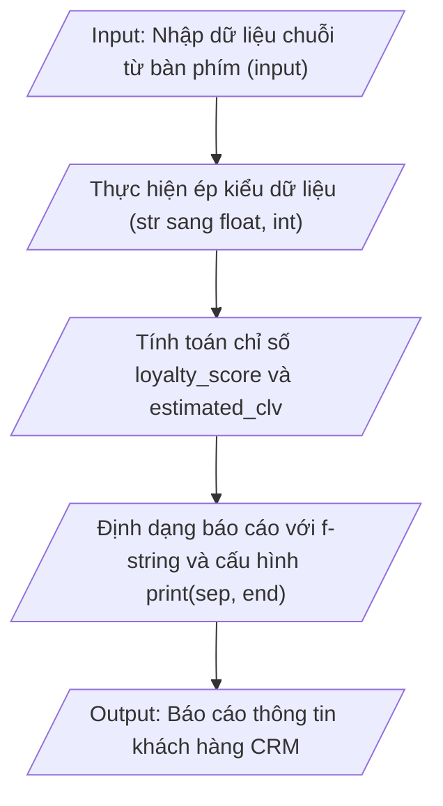

## <center>Xây dựng Module Tiếp nhận và Phân tích Dữ liệu Khách hàng CRM</center>

### **1. Mục tiêu**
- **Khởi tạo và cấu hình môi trường**: Thiết lập môi trường ảo (`venv`) chuẩn Python 3.12 và cấu trúc tập tin mã nguồn `.py` đúng quy chuẩn.
- **Thao tác Nhập/Xuất Console**: Sử dụng thành thạo hàm `input()` để tiếp nhận dữ liệu từ bàn phím và hàm `print()` kết hợp tham số `sep`, `end` cùng cú pháp `f-string`.
- **Quản lý biến và Ép kiểu dữ liệu**: Đặt tên biến theo chuẩn PEP 8 (`snake_case`), thực hiện ép kiểu dữ liệu bắt buộc (Explicit Type Casting) từ `str` sang `int` và `float`.
- **Tính toán chỉ số CRM cơ bản**: Đóng gói công thức toán học/tài chính để tính điểm chỉ số thân thiết (Loyalty Score) và Giá trị vòng đời khách hàng ước tính (CLV).

---

### **2. Vấn đề**
Trong phân hệ Quản lý Quan hệ Khách hàng (CRM Subsystem), bộ phận Tiếp thị và Chăm sóc khách hàng cần một công cụ dòng lệnh (CLI tool) nhẹ để chuyên viên nhập nhanh thông tin định danh và chỉ số giao dịch của khách hàng mới.

Hệ thống phải chịu trách nhiệm tiếp nhận thông tin dạng chuỗi từ console, chuyển đổi chính xác sang kiểu dữ liệu số thích hợp, thực hiện tính toán các chỉ số kinh doanh nghiệp vụ và xuất báo cáo tổng hợp có định dạng căn chỉnh rõ ràng.



---

### **3. Yêu cầu bài toán**

Tạo tập tin `crm_intake.py` và viết mã nguồn thực hiện chuỗi thao tác sau:

1. Thông báo khởi chạy hệ thống và yêu cầu người dùng nhập lần lượt các trường thông tin:
   - Họ và tên khách hàng (`customer_name`)
   - Địa chỉ email (`customer_email`)
   - Tổng chi tiêu tích lũy tính theo VNĐ (`annual_spending`)
   - Số lượng yêu cầu hỗ trợ kỹ thuật đã mở (`support_ticket_count`)

2. Thực hiện ép kiểu dữ liệu:
   - Chuyển `annual_spending` thành kiểu `float`.
   - Chuyển `support_ticket_count` thành kiểu `int`.

3. Thực hiện tính toán 2 chỉ số nghiệp vụ theo công thức:
   - **Điểm thân thiết (Loyalty Score)**:
     `loyalty_score = (annual_spending / 1000000) * 1.5 - (support_ticket_count * 2.5)`
   - **Giá trị vòng đời ước tính (Estimated CLV)**:
     `estimated_clv = annual_spending * 3.5`

4. Xuất báo cáo kết quả ra màn hình Console tuân thủ đúng định dạng bảng phân cách, có sử dụng các tham số `sep` và `end` trong hàm `print()`.

<table border="1" style="width: 100%; border-collapse: collapse; text-align: left;">
  <thead>
    <tr style="background-color: #f2f2f2;">
      <th style="padding: 8px;">Tên biến (PEP 8)</th>
      <th style="padding: 8px;">Kiểu ban đầu</th>
      <th style="padding: 8px;">Kiểu ép sang</th>
      <th style="padding: 8px;">Mô tả nghiệp vụ</th>
    </tr>
  </thead>
  <tbody>
    <tr>
      <td style="padding: 8px;"><code>customer_name</code></td>
      <td style="padding: 8px;"><code>str</code></td>
      <td style="padding: 8px;"><code>str</code></td>
      <td style="padding: 8px;">Họ và tên khách hàng</td>
    </tr>
    <tr>
      <td style="padding: 8px;"><code>customer_email</code></td>
      <td style="padding: 8px;"><code>str</code></td>
      <td style="padding: 8px;"><code>str</code></td>
      <td style="padding: 8px;">Email liên hệ khách hàng</td>
    </tr>
    <tr>
      <td style="padding: 8px;"><code>annual_spending</code></td>
      <td style="padding: 8px;"><code>str</code></td>
      <td style="padding: 8px;"><code>float</code></td>
      <td style="padding: 8px;">Tổng doanh số tích lũy (VNĐ)</td>
    </tr>
    <tr>
      <td style="padding: 8px;"><code>support_ticket_count</code></td>
      <td style="padding: 8px;"><code>str</code></td>
      <td style="padding: 8px;"><code>int</code></td>
      <td style="padding: 8px;">Số lượt gửi ticket hỗ trợ kỹ thuật</td>
    </tr>
  </tbody>
</table>

---

### **4. Quy tắc xử lý**

- Yêu cầu 1: Tất cả các biến phải đặt tên theo quy tắc `snake_case` chuẩn PEP 8 (Ví dụ: `customer_name`, `annual_spending`). Tuyệt đối không dùng biến 1 ký tự (`a`, `b`, `x`).
- Yêu cầu 2: Sử dụng ép kiểu dữ liệu tường minh `float()` và `int()`. Không để xảy ra lỗi ghép chuỗi ngầm định khi tính toán.
- Yêu cầu 3: Phần xuất kết quả báo cáo phải dùng `f-string` kết hợp làm tròn 2 chữ số phần thập phân cho `loyalty_score` và `estimated_clv`.
- Yêu cầu 4: Phải khai báo Docstring giải thích mục đích của script ở đầu file và thêm ghi chú dòng (comment `#`) giải thích từng bước logic.
- Yêu cầu 5: Khi in dòng phân cách báo cáo, phải tận dụng tính năng nhân chuỗi của Python và tham số `end` hoặc `sep` trong hàm `print()`.

#### **Ví dụ minh họa Dữ liệu Đầu vào & Đầu ra**

**Input mẫu (Console):**
```text
=== TIẾP NHẬN THÔNG TIN KHÁCH HÀNG CRM ===
Nhập họ và tên khách hàng: Nguyễn Văn An
Nhập địa chỉ email: an.nguyen@example.com
Nhập tổng chi tiêu tích lũy (VNĐ): 25000000.5
Nhập số lượng yêu cầu hỗ trợ (tickets): 3
```

**Output mẫu (Console):**
```text
==================================================
BÁO CÁO PHÂN TÍCH KHÁCH HÀNG CRM
==================================================
Khách hàng          : Nguyễn Văn An
Email               : an.nguyen@example.com
Tổng chi tiêu (VNĐ) : 25000000.50
Số vé hỗ trợ        : 3
--------------------------------------------------
Điểm thân thiết     : 30.00
CLV ước tính (VNĐ)  : 87500001.75
==================================================
[LƯU TRỮ]: Đã ghi nhận hồ sơ thành công!
```

---

### **5. Yêu cầu nộp bài**
- Tạo thư mục dự án đặt tên là `crm_intake_lab`.
- Khởi tạo môi trường ảo `venv` bên trong thư mục dự án và kích hoạt môi trường.
- Đẩy toàn bộ mã nguồn `crm_intake.py` và tập tin `.gitignore` lên một Repository cá nhân trên GitHub.
- Nộp liên kết (URL) GitHub Repository lên hệ thống quản lý học tập.