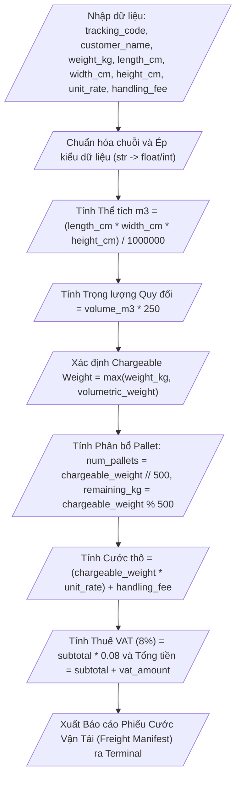

## <center>Xây dựng Module Tính Cước Vận Chuyển và Phân Sổ Pallet Kho Vận Logistics</center>

### **1. Mục tiêu**
- **Khởi tạo và cấu hình môi trường**: Thiết lập file script Python 3.12 tuân thủ tiêu chuẩn PEP 8 về quy tắc đặt tên biến `snake_case` và chú thích mã nguồn (`comments`, `docstrings`).
- **Nhập/Xuất dữ liệu trên Console (CLI)**: Sử dụng thành thạo hàm `input()` để thu thập dữ liệu và hàm `print()` kết hợp các tham số `sep`, `end` và f-string formatting để xuất báo cáo.
- **Thực hiện Ép kiểu dữ liệu (Explicit Type Casting)**: Chuyển đổi dữ liệu chuỗi (`str`) thu nhận từ người dùng sang dạng số thực (`float`) và số nguyên (`int`).
- **Ứng dụng toán tử số học cơ bản**: Vận dụng các toán tử số học (`*`, `/`, `//`, `%`, `**`) để giải quyết bài toán quy đổi thể tích kiện hàng, xác định trọng lượng tính cước, tính số lượng Pallet lưu kho và tổng chi phí vận tải.

### **2. Vấn đề**
Trong phân hệ quản lý kho vận (Logistics Management Subsystem), bộ phận tiếp nhận hàng hóa (Inbound Clerk) cần một công cụ dòng lệnh (CLI) hỗ trợ tính toán nhanh cước phí vận chuyển đường bộ (Road Freight) và lập kế hoạch phân bổ không gian lưu kho.

Khi kiện hàng được đưa đến kho trung chuyển, nhân viên sẽ cân trọng lượng thực tế và đo kích thước 3 chiều (Chiều dài, Chiều rộng, Chiều cao). Cước phí vận tải không chỉ dựa trên cân nặng thực tế mà còn phụ thuộc vào **Trọng lượng Quy đổi** (Volumetric/Dimensional Weight) dựa trên không gian chiếm dụng của kiện hàng. Bên cạnh đó, hệ thống cần tính toán số lượng Pallet tiêu chuẩn (sức chứa tối đa 500 kg/pallet) cần chuẩn bị để xếp dỡ kiện hàng, cộng phụ phí xếp dỡ và thuế giá trị gia tăng VAT (8%).

Dưới đây là sơ đồ luồng xử lý dữ liệu của chương trình:



### **3. Yêu cầu bài toán**
Tạo một file script Python có tên `logistics_calc.py` thực hiện các nhiệm vụ sau:

1. Thu thập dữ liệu từ người dùng thông qua giao diện Console theo đúng trình tự:
   - **Mã vận đơn** (`tracking_code`): Chuỗi ký tự.
   - **Tên khách hàng** (`customer_name`): Chuỗi ký tự.
   - **Trọng lượng cân thực tế** (`weight_kg`): Số thực (đơn vị: kg).
   - **Chiều dài kiện hàng** (`length_cm`): Số thực (đơn vị: cm).
   - **Chiều rộng kiện hàng** (`width_cm`): Số thực (đơn vị: cm).
   - **Chiều cao kiện hàng** (`height_cm`): Số thực (đơn vị: cm).
   - **Đơn giá vận chuyển cơ bản** (`unit_rate`): Số thực (đơn vị: VNĐ/kg).
   - **Phí cố định bốc xếp kho** (`handling_fee`): Số thực (đơn vị: VNĐ).

2. Xử lý chuẩn hóa và ép kiểu dữ liệu:
   - Xóa khoảng trắng thừa hai đầu và viết hoa toàn bộ Mã vận đơn (`.strip().upper()`).
   - Xóa khoảng trắng thừa hai đầu và viết hoa chữ cái đầu mỗi từ đối với Tên khách hàng (`.strip().title()`).
   - Ép kiểu dữ liệu các thông số kích thước và chi phí sang dạng số (`float`).

3. Tính toán các chỉ số nghiệp vụ logistics:
   - Thể tích m³ của kiện hàng.
   - Trọng lượng quy đổi (Volumetric Weight).
   - Trọng lượng tính cước (Chargeable Weight).
   - Số lượng Pallet tiêu chuẩn cần dùng và trọng lượng lẻ còn lại.
   - Chi phí trước thuế, tiền thuế VAT (8%) và Tổng chi phí thanh toán cuối cùng.

4. Hiển thị báo cáo kết quả dạng Phiếu Cước Vận Tải (Freight Manifest) lên màn hình Console với định dạng căn chỉnh chuyên nghiệp.

### **4. Quy tắc xử lý**

- `Yêu cầu 1:` **Công thức tính Thể tích kiện hàng (m³)**:
  - `volume_m3 = (length_cm * width_cm * height_cm) / 1000000`

- `Yêu cầu 2:` **Công thức tính Trọng lượng Quy đổi (Volumetric Weight)**:
  - Theo chuẩn kho vận đường bộ, hệ số quy đổi không gian là `250 kg/m³`.
  - `volumetric_weight = volume_m3 * 250`

- `Yêu cầu 3:` **Xác định Trọng lượng Tính cước (Chargeable Weight)**:
  - Trọng lượng tính cước là giá trị lớn nhất giữa trọng lượng thực tế và trọng lượng quy đổi.
  - `chargeable_weight = max(weight_kg, volumetric_weight)`

- `Yêu cầu 4:` **Phân bổ Pallet lưu kho (Mỗi Pallet tiêu chuẩn chịu tải 500 kg)**:
  - Số lượng Pallet nguyên cần dùng: `num_pallets = int(chargeable_weight // 500)`
  - Khối lượng dư lẻ không xếp đủ 1 Pallet nguyên: `remaining_kg = chargeable_weight % 500`

- `Yêu cầu 5:` **Công thức tính Cước phí và Thuế**:
  - Cước trước thuế (Subtotal): `subtotal = (chargeable_weight * unit_rate) + handling_fee`
  - Tiền thuế VAT (8%): `vat_amount = subtotal * 0.08`
  - Tổng chi phí thanh toán: `total_payable = subtotal + vat_amount`

- `Yêu cầu 6:` **Định dạng hiển thị đầu ra (Console Output)**:
  - Thể tích hiển thị 3 chữ số thập phân (`.3f`).
  - Trọng lượng hiển thị 2 chữ số thập phân (`.2f`).
  - Tiền cước và phí hiển thị kèm phân cách hàng nghìn (sử dụng định dạng `,` trong f-string, ví dụ: `{total_payable:,.2f}`).
  - Sử dụng tham số `sep` và `end` trong hàm `print()` ít nhất 1 lần để tạo đường phân cách giao diện CLI.

---

### **Ví dụ minh họa Input / Output**

#### **Dữ liệu đầu vào (Console Input):**
```text
  log-2024-8899  
  cong ty tnhh phong nam  
1250.5
150
120
100
15000
250000
```

#### **Kết quả hiển thị mong đợi (Console Output):**
```text
============================================================
              PHIẾU CƯỚC VẬN TẢI (FREIGHT MANIFEST)
============================================================
MÃ VẬN ĐƠN         : LOG-2024-8899
KHÁCH HÀNG         : Cong Ty Tnhh Phong Nam
------------------------------------------------------------
[THÔNG SỐ KĨ THUẬT KIỆN HÀNG]
- Thể tích tổng    : 1.800 m3
- Trọng lượng cân  : 1,250.50 kg
- Trọng lượng quy đổi: 450.00 kg
- Trọng lượng tính cước: 1,250.50 kg
------------------------------------------------------------
[PHÂN BỔ LƯU KHO]
- Quy cách Pallet  : 2 Pallet tiêu chuẩn (500kg/pallet)
- Tải trọng dư     : 250.50 kg
------------------------------------------------------------
[CHI TIẾT THANH TOÁN]
- Đơn giá vận chuyển: 15,000.00 VNĐ/kg
- Phí dịch vụ bốc xếp: 250,000.00 VNĐ
- Tiền cước trước thuế: 19,007,500.00 VNĐ
- Thuế VAT (8%)     : 1,520,600.00 VNĐ
------------------------------------------------------------
TỔNG CHI PHÍ THANH TOÁN: 20,528,100.00 VNĐ
============================================================
```

### **5. Yêu cầu nộp bài**
- Quản lý mã nguồn bằng Git và nộp link repository GitHub công khai.
- Cấu trúc thư mục repository:
  ```text
  python-logistics-env-io/
  └── logistics_calc.py
  ```
- **Tên Repository**: `python-logistics-env-io`
- **Nhánh chính**: `main`
- **Thông điệp commit chuẩn**: `feat(session03): implement logistics freight calculator script`