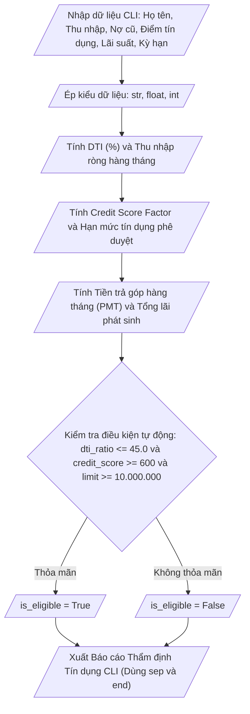

## <center>Xây Dựng Engine Thẩm Định Hạn Mức Tín Dụng Và Phê Duyệt Khoản Vay Tự Động Fintech</center>

### **1. Mục tiêu**
- **Cấu hình & Môi trường:** Cấu hình thành thục môi trường ảo Python 3.12 (`venv`), khởi tạo file script và chuẩn hóa cấu trúc mã nguồn theo chuẩn PEP 8.
- **Quản lý biến & Đặt tên:** Khai báo và xử lý biến thuộc các kiểu dữ liệu cơ sở (`str`, `int`, `float`, `bool`) tuân thủ quy tắc đặt tên `snake_case`.
- **Nhập/Xuất dữ liệu Console:** Sử dụng hàm `input()` để thu thập thông tin tài chính CLI và ép kiểu dữ liệu bắt buộc (`explicit type casting`).
- **Xử lý tính toán nghiệp vụ:** Triển khai các công thức tính toán tài chính phức tạp (Chỉ số DTI, Trả góp hàng tháng PMT, Tổng lãi vay, Hạn mức tín dụng tối đa).
- **Định dạng đầu ra nâng cao:** Thiết kế giao diện báo cáo thẩm định CLI chuyên nghiệp sử dụng hàm `print()` kết hợp linh hoạt với các tham số `sep`, `end` và định dạng số thực.

### **2. Vấn đề**
Trong phân hệ quản trị rủi ro tín dụng của các nền tảng Fintech (Fintech Management Subsystem), việc đánh giá năng lực tài chính và tự động đề xuất hạn mức tín dụng cho khách hàng cá nhân đóng vai trò then chốt nhằm giảm thiểu nợ xấu (NPL).

Khách hàng đăng ký vay sẽ nhập thông tin cá nhân và số liệu tài chính qua giao diện dòng lệnh (CLI). Hệ thống cần thu thập, chuyển đổi đúng kiểu dữ liệu, tính toán các chỉ số rủi ro nghiệp vụ và xuất Báo cáo Thẩm định Tín dụng chi tiết ra màn hình console.

Sơ đồ luồng xử lý dữ liệu của chương trình:



### **3. Yêu cầu bài toán**

Dưới đây là danh sách các tham số đầu vào cần thu thập từ giao diện CLI:

<table width="100%">
  <thead>
    <tr>
      <th width="20%">Tên biến (Python)</th>
      <th width="15%">Kiểu dữ liệu</th>
      <th width="25%">Định dạng nhập liệu</th>
      <th width="40%">Mô tả / Ràng buộc</th>
    </tr>
  </thead>
  <tbody>
    <tr>
      <td><code>customer_name</code></td>
      <td><code>str</code></td>
      <td>Chuỗi ký tự</td>
      <td>Họ và tên khách hàng đăng ký</td>
    </tr>
    <tr>
      <td><code>gross_monthly_income</code></td>
      <td><code>float</code></td>
      <td>Số thực (VND)</td>
      <td>Tổng thu nhập hàng tháng (trước thuế)</td>
    </tr>
    <tr>
      <td><code>monthly_tax_deduction</code></td>
      <td><code>float</code></td>
      <td>Số thực (VND)</td>
      <td>Tiền thuế và bảo hiểm khấu trừ hàng tháng</td>
    </tr>
    <tr>
      <td><code>existing_monthly_debt</code></td>
      <td><code>float</code></td>
      <td>Số thực (VND)</td>
      <td>Tổng tiền trả nợ hàng tháng hiện tại (nếu có)</td>
    </tr>
    <tr>
      <td><code>credit_score</code></td>
      <td><code>int</code></td>
      <td>Số nguyên (300 - 850)</td>
      <td>Điểm tín dụng CIC của khách hàng</td>
    </tr>
    <tr>
      <td><code>annual_interest_rate</code></td>
      <td><code>float</code></td>
      <td>Số thực (%/năm)</td>
      <td>Lãi suất vay ưu đãi năm áp dụng</td>
    </tr>
    <tr>
      <td><code>tenure_months</code></td>
      <td><code>int</code></td>
      <td>Số nguyên (tháng)</td>
      <td>Thời hạn đăng ký vay (ví dụ: 12, 24, 36)</td>
    </tr>
  </tbody>
</table>

### **4. Quy tắc xử lý**

Chương trình cần thực hiện chính xác các quy tắc nghiệp vụ theo thứ tự sau:

- **Yêu cầu 1 (Khởi tạo dự án & Môi trường):**
  - Khởi tạo môi trường ảo `venv` và kích hoạt trước khi chạy script.
  - Tạo file mã nguồn `fintech_credit_risk_engine.py`.
  - Thêm khối Docstring ở đầu file ghi rõ thông tin tác giả, ngày tạo, phiên bản Python (3.12) và mô tả ngắn gọn về module.

- **Yêu cầu 2 (Thu thập và ép kiểu dữ liệu):**
  - Sử dụng hàm `input()` với thông báo rõ ràng cho từng tham số đầu vào.
  - Thực hiện ép kiểu explicit: `float()` cho thu nhập, thuế, nợ cũ, lãi suất; `int()` cho điểm tín dụng và số tháng vay; `str()` cho họ tên.

- **Yêu cầu 3 (Tính toán chỉ số tài chính nghiệp vụ):**
  - Thu nhập ròng hàng tháng (`net_monthly_income`):
    `net_monthly_income = gross_monthly_income - monthly_tax_deduction - existing_monthly_debt`
  - Tỷ lệ nợ trên thu nhập (`dti_ratio`):
    `dti_ratio = (existing_monthly_debt / gross_monthly_income) * 100`
  - Trọng số điểm tín dụng (`credit_score_factor`):
    `credit_score_factor = (credit_score / 850) * 0.4 + (1 - (dti_ratio / 100)) * 0.6`
  - Hạn mức tín dụng được phê duyệt (`approved_credit_limit`):
    `approved_credit_limit = net_monthly_income * 12 * credit_score_factor`
  - Lãi suất tháng (`monthly_interest_rate`):
    `monthly_interest_rate = (annual_interest_rate / 100) / 12`
  - Số tiền trả góp định kỳ hàng tháng (`monthly_installment`):
    `monthly_installment = (approved_credit_limit * monthly_interest_rate * ((1 + monthly_interest_rate) ** tenure_months)) / (((1 + monthly_interest_rate) ** tenure_months) - 1)`
  - Tổng số tiền phải trả sau thời hạn vay (`total_payment`):
    `total_payment = monthly_installment * tenure_months`
  - Tổng tiền lãi phát sinh (`total_interest`):
    `total_interest = total_payment - approved_credit_limit`

- **Yêu cầu 4 (Đánh giá điều kiện phê duyệt tự động):**
  - Khai báo biến luận lý `is_eligible` (kiểu `bool`) dựa trên biểu thức điều kiện so sánh:
    `is_eligible = (dti_ratio <= 45.0) and (credit_score >= 600) and (approved_credit_limit >= 10000000.0)`

- **Yêu cầu 5 (Xuất báo cáo kết quả ra màn hình CLI):**
  - Sử dụng hàm `print()` để in khung báo cáo chuẩn hóa.
  - Sử dụng tham số `sep` để tùy chỉnh định dạng chia cột hoặc phân cách nội dung.
  - Sử dụng tham số `end` để kiểm soát hành vi xuống dòng trong từng phân đoạn báo cáo.
  - Định dạng số thực hiển thị 2 chữ số thập phân (`:.2f`).

#### Ví dụ dữ liệu đầu vào (Console Input):
```text
=== NHẬP THÔNG TIN TÀI CHÍNH KHÁCH HÀNG ===
Nhập họ và tên khách hàng: Nguyen Van A
Nhập tổng thu nhập hàng tháng (VND): 35000000.0
Nhập tiền thuế & bảo hiểm hàng tháng (VND): 5000000.0
Nhập tiền trả nợ hiện tại hàng tháng (VND): 7000000.0
Nhập điểm tín dụng CIC (300-850): 720
Nhập lãi suất vay hàng năm (%/năm): 12.0
Nhập thời hạn vay mong muốn (tháng): 24
```

#### Ví dụ dữ liệu đầu ra (Console Output):
```text
================================================================================
                    BÁO CÁO THẨM ĐỊNH TÍN DỤNG FINTECH
================================================================================
Tên khách hàng        : Nguyen Van A
Điểm tín dụng CIC     : 720 điểm
Tỷ lệ nợ / Thu nhập   : 20.00%
Thu nhập ròng hàng tháng: 23000000.00 VND
--------------------------------------------------------------------------------
Hạn mức tín dụng duyệt: 225995294.12 VND
Lãi suất năm áp dụng  : 12.00%
Thời hạn vay          : 24 tháng
--------------------------------------------------------------------------------
Gốc + Lãi trả hàng tháng: 10638382.72 VND
Tổng tiền lãi phát sinh : 29325891.20 VND
Tổng giá trị thanh toán : 255321185.32 VND
--------------------------------------------------------------------------------
TRẠNG THÁI PHÊ DUYỆT   : ELIGIBLE (Duyệt tự động)
Mã trạng thái Logic   : True
================================================================================
[NOTE]: Báo cáo được tự động khởi tạo từ Fintech Credit Risk Engine v1.0.
```

### **5. Yêu cầu nộp bài**
- Cấu trúc thư mục dự án nộp trên GitHub:
```text
fintech_credit_project/
│── venv/
│── fintech_credit_risk_engine.py
└── README.md
```
- Đăng tải mã nguồn lên kho lưu trữ GitHub cá nhân và gửi liên kết repository.
- File `README.md` cần chứa hướng dẫn kích hoạt `venv` và lệnh chạy chương trình từ Terminal (`python fintech_credit_risk_engine.py`).