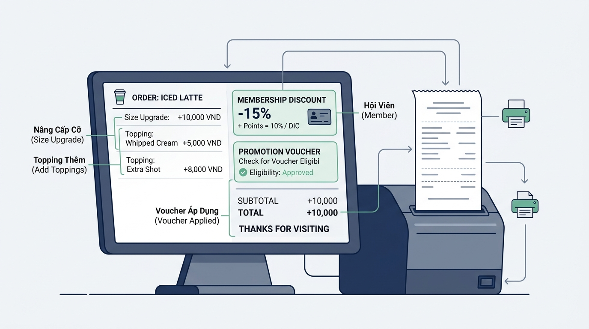

## 
[Phân tích 1] Phân tích logic tính tiền hóa đơn và kiểm tra điều kiện tặng voucher tại Highlands POS

### **1. Mục tiêu**
*   **Phân tích logic:** Đánh giá và thiết kế giải pháp tính toán tổng tiền hóa đơn mua hàng kèm điều kiện nhận khuyến mãi Voucher trong hệ thống POS quán trà sữa / cà phê mà KHÔNG sử dụng các cấu trúc rẽ nhánh `if/else` (giới hạn kiến thức tính đến Session 04).
*   **Sử dụng toán tử:** Làm chủ việc kết hợp toán tử số học (`+`, `-`, `*`, `/`), toán tử so sánh (`==`, `>=`, `<=`) và toán tử logic (`and`, `or`, `not`) cùng với tính chất chuyển đổi kiểu dữ liệu Boolean trong Python (`True` tương đương 1, `False` tương đương 0).
*   **Đánh giá Trade-off:** Phân tích sự đánh đổi giữa các phương án biểu diễn biểu thức logic (biểu thức gộp trực tiếp vs. tách biến trung gian số học) về mặt độ đọc, hiệu năng bộ nhớ và khả năng bảo trì.

### **2. Bối cảnh & Vấn đề**
Tại chuỗi Highlands POS, hệ thống máy tính tiền tại quầy xử lý hàng nghìn giao dịch mỗi ngày. Khi khách hàng đặt món, hệ thống ghi nhận giá ly gốc (Size S), mã nâng size, số lượng topping và trạng thái thành viên. Hệ thống cần tự động tính tổng tiền thanh toán sau giảm giá và xác định hóa đơn có đủ điều kiện nhận "Voucher Tri Ân 50.000 VNĐ" cho lần mua sau hay không.

Do module tính toán lõi hiện tại đang chạy trên vi xử lý nhúng siêu nhẹ (embedded POS kernel), các câu lệnh rẽ nhánh phức tạp (`if/else`) bị tạm khóa để tối ưu luồng thực thi tuyến tính (single-line execution optimization). Toàn bộ nghiệp vụ tính tiền và đánh giá điều kiện tặng Voucher phải được giải quyết triệt để thông qua **biểu thức toán tử số học và logic thuần túy**.

  

### **3. Quy tắc nghiệp vụ**
Hệ thống tiếp nhận các thông số đầu vào từ bàn phím thu ngân:
1. `base_price` (kiểu `float`): Giá ly trà sữa/cà phê cơ bản (Size S, VNĐ).
2. `size_code` (kiểu `int`): Mã kích cỡ ly (nhận giá trị `0`: Size S, `1`: Size M, `2`: Size L).
3. `topping_count` (kiểu `int`): Số lượng phần topping chọn thêm.
4. `is_gold_member_input` (kiểu `int`): Trạng thái thành viên Vàng (`1`: Là thành viên Vàng, `0`: Không phải).

Các quy tắc tính toán chi tiết:
*   **Quy tắc phụ thu Size:**
    *   Size S (`size_code == 0`): Phụ thu `0` VNĐ.
    *   Size M (`size_code == 1`): Phụ thu `6.000` VNĐ.
    *   Size L (`size_code == 2`): Phụ thu `10.000` VNĐ.
*   **Quy tắc phụ thu Topping:** Mỗi phần topping đồng giá `8.000` VNĐ.
*   **Quy tắc giảm giá:** Thành viên Vàng (`is_gold_member == True`) được giảm `10%` trên Tổng tiền tạm tính (`base_price + phụ thu size + phụ thu topping`). Khách hàng thường không được giảm giá (`0%`).
*   **Quy tắc tặng Voucher:** Hóa đơn đủ điều kiện nhận Voucher (`is_eligible_voucher` trả về `True`) khi thỏa mãn ĐỒNG THỜI:
    1. Tổng tiền thanh toán cuối cùng (sau giảm giá) đạt từ `100.000` VNĐ trở lên.
    2. Khách hàng là Thành viên Vàng **HOẶC** Gọi từ `3` phần topping trở lên.

[REQUIREMENT] PHẠM VI KIẾN THỨC CẤM SỬ DỤNG:
*   TUYỆT ĐỐI CẤM sử dụng cấu trúc rẽ nhánh `if / elif / else`.
*   TUYỆT ĐỐI CẤM sử dụng vòng lặp `for / while`.
*   TUYỆT ĐỐI CẤM sử dụng cấu trúc dữ liệu nâng cao: `list`, `dict`, `tuple`, `set`.
*   TUYỆT ĐỐI CẤM định nghĩa hàm `def` hoặc lớp `class`.
*   Chỉ sử dụng: Biến số, ép kiểu (`int()`, `float()`, `bool()`), toán tử số học, so sánh, logic, và hàm nhập/xuat `input()`, `print()`.

### **4. Yêu cầu bài toán**

Học viên phải hoàn thiện báo cáo phân tích và giải pháp lập trình theo 3 phần sau:

#### **Phần 1: Đề xuất đa giải pháp & Báo cáo so sánh Trade-off**
*   Tự nghiên cứu và đề xuất ít nhất **2 giải pháp kỹ thuật khác nhau** để giải quyết logic tính phụ thu size và giảm giá mà không dùng `if/else` (Gợi ý tư duy: Giải pháp 1 dựa trên phép nhân đại số với biểu thức so sánh ép kiểu Boolean; Giải pháp 2 dựa trên kết hợp toán tử logic và ép kiểu trực tiếp).
*   Lập bảng so sánh Trade-off giữa 2 giải pháp theo 5 tiêu chí bắt buộc dưới dạng bảng HTML:
    *   Tốc độ thực thi (Execution Speed).
    *   Dung lượng bộ nhớ / Số lượng biến tạm (Memory Usage).
    *   Khả năng bảo trì khi thêm Size mới (Maintainability).
    *   Độ dễ đọc / Khả năng hiểu mã nguồn (Readability).
    *   Mức độ phù hợp với hệ thống POS vi xử lý nhúng (Suitability).

#### **Phần 2: Giải trình lựa chọn & Thiết kế lưu đồ Mermaid**
*   Giải trình rõ lý do lựa chọn phương án tối ưu nhất dựa trên kết quả phân tích Trade-off.
*   Vẽ lưu đồ thuật toán (Flowchart) bằng định dạng Mermaid biểu diễn luồng xử lý dữ liệu từ dữ liệu vào đến kết quả tính toán.
*   Lưu đồ Mermaid phải tuân thủ nghiêm ngặt chuẩn 5 hình dạng:
    1. Terminator: `([Bắt đầu])` / `([Kết thúc])`
    2. Input/Output: `[/Đầu vào: .../]` / `[/Đầu ra: .../]`
    3. Process: `["Tính toán / Gán biến"]`
    4. Decision: `Kiểm tra điều kiện?`
    5. Flowline: Arrow `-->` hoặc `-->|Đúng|` / `-->|Sai|`

#### **Phần 3: Triển khai mã nguồn Python**
*   Viết chương trình Python hoàn chỉnh (`main.py`) nhận dữ liệu đầu vào từ bàn phím qua `input()`, thực thi logic tính toán và in kết quả ra màn hình.
*   Mã nguồn phải xử lý đúng các trường hợp dữ liệu biên (như số lượng topping bằng 0, đơn giá nhỏ, phân biệt đúng giảm giá 0% và 10%).

Đầu ra chương trình phải in đầy đủ:
*   Tổng tiền tạm tính (trước giảm giá).
*   Số tiền được giảm giá.
*   Tổng tiền thanh toán cuối cùng.
*   Trạng thái đủ điều kiện nhận Voucher (`True` hoặc `False`).

### **5. Yêu cầu nộp bài**
Học viên cần nộp:
*   Phần phân tích/báo cáo và mã nguồn triển khai.
*   Đẩy mã nguồn lên GitHub theo định dạng thư mục: `[Tên Lớp]_[Môn Học]_SessionSession 04_Ex10`.
    Ví dụ: `HNKS25CNTT1_Core_Session_Session 04_Ex10`