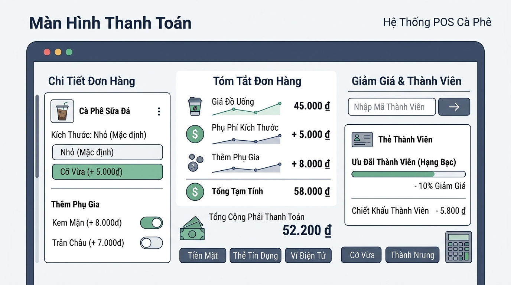

## 
[Phân tích 2] Phân tích và Thiết kế Module Tính Tiền Hóa Đơn Trà Sữa POS Không Dùng Câu Lệnh Rẽ Nhánh

### **1. Mục tiêu**
*   **Về kiến thức**: Củng cố và áp dụng nâng cao các toán tử số học (`+`, `-`, `*`, `/`, `//`, `%`), toán tử so sánh (`==`, `!=`, `>`, `<`, `>=`, `<=`), toán tử logic (`and`, `or`, `not`), ép kiểu dữ liệu và thứ tự ưu tiên toán tử trong Python.
*   **Về kỹ năng phân tích**: Rèn luyện tư duy lập trình biểu thức tuyến tính (branchless programming), giải quyết bài toán tính toán chiết khấu và phụ thu theo điều kiện nghiệp vụ mà **KHÔNG sử dụng** bất kỳ câu lệnh rẽ nhánh (`if/else`) hay vòng lặp nào.
*   **Về tư duy thiết kế**: Đánh giá trade-off giữa các phương án biểu diễn biểu thức số học - logic về mặt độ đọc (readability), hiệu năng tính toán và khả năng mở rộng.

### **2. Bối cảnh & Vấn đề**
Trong Hệ thống Quản lý Bán hàng Quán Cà phê / Trà sữa (Highlands POS), module xử lý tính toán hóa đơn tại quầy thu ngân yêu cầu tốc độ phản hồi cực nhanh. Để tối ưu hóa hiệu năng vi xử lý và tránh hiện tượng sai lệch dự đoán nhánh (branch misprediction) ở cấp độ phần cứng, bộ phận kiến trúc phần mềm muốn khảo sát phương án tính toán tổng số tiền thanh toán của hóa đơn (`PosReceipt`) hoàn toàn bằng biểu thức toán tử tuyến tính.

Nhiệm vụ của bạn là phân tích, thiết kế và hiện thực hóa thuật toán tính toán tiền hóa đơn order đồ uống bao gồm phụ thu chọn Size, phụ thu Topping, kiểm tra điều kiện hợp lệ của đơn hàng và áp dụng giảm giá cho thành viên Vàng (Gold Member) chỉ dựa trên tập hợp toán tử cơ bản của Session 04.

  

### **3. Quy tắc nghiệp vụ**
Hệ thống POS nhận các thông tin đầu vào từ giao diện thu ngân qua các dòng nhập liệu (`input()`):
1.  **Giá cơ bản (`base_price`)**: Giá niêm yết của đồ uống ở Size S (kiểu số nguyên `int`, đơn vị VNĐ, ví dụ: 35000).
2.  **Cờ chọn Size M (`is_size_m`)**: Nhận giá trị `1` nếu khách chọn Size M, ngược lại là `0`.
3.  **Cờ chọn Size L (`is_size_l`)**: Nhận giá trị `1` nếu khách chọn Size L, ngược lại là `0`. *(Lưu ý: Nếu cả 2 cờ đều là 0 nghĩa là khách chọn Size S)*.
4.  **Số lượng Topping (`topping_count`)**: Số lượng topping gọi thêm (kiểu số nguyên `int`, ví dụ: 2).
5.  **Cờ Thành viên Vàng (`is_gold_member`)**: Nhận giá trị `1` nếu là khách hàng Vàng, ngược lại là `0`.

**Các quy tắc tính toán nghiệp vụ (COFFEE_POS):**
*   **Phụ thu Size**:
    *   Size M: Tăng thêm **6.000 VNĐ** so với giá cơ bản Size S.
    *   Size L: Tăng thêm **10.000 VNĐ** so với giá cơ bản Size S.
*   **Phụ thu Topping**:
    *   Mỗi topping thêm tính đồng giá **8.000 VNĐ**.
*   **Giảm giá Thành viên Vàng**:
    *   Thành viên Vàng (`is_gold_member == 1`) được giảm **10%** trên tổng tiền trước giảm giá (bao gồm giá đồ uống + phụ thu size + phụ thu topping).
*   **Điều kiện đơn hàng hợp lệ (`is_valid_order`)**:
    *   Đơn hàng được coi là hợp lệ khi tổng tiền trước giảm giá đạt tối thiểu **30.000 VNĐ** VÀ số lượng topping **không vượt quá 5**.

[REQUIREMENT] PHẠM VI KẾT THỨC CẤM SỬ DỤNG: Tuyệt đối CẤM sử dụng câu lệnh rẽ nhánh (`if`, `else`, `elif`), vòng lặp (`for`, `while`), danh sách/tập hợp (`list`, `dict`, `set`, `tuple`), hàm tự định nghĩa (`def`), hoặc lớp (`class`). Toàn bộ logic phải được xử lý thông qua việc kết hợp toán tử số học, so sánh, logic và ép kiểu.

### **4. Yêu cầu bài toán**

Học viên thực hiện bài tập theo 3 phần bắt buộc sau:

#### **Phần 1: Báo cáo Đề xuất đa giải pháp & So sánh Trade-off**
*   Tự nghiên cứu và đề xuất ít nhất **2 giải pháp kỹ thuật khác nhau** để tính toán phụ thu size, giảm giá và kiểm tra cờ hợp lệ mà không dùng `if/else` (Ví dụ: nhóm giải pháp dựa trên chuyển đổi kiểu dữ liệu ép kiểu Boolean sang Integer, nhóm giải pháp dựa trên công thức toán tử logic / mask số học, v.v.).
*   Lập bảng so sánh Trade-off trực quan giữa 2 giải pháp dựa trên các tiêu chí: Tốc độ xử lý (Time Complexity), Tiêu tốn bộ nhớ (Memory), Độ dễ bảo trì (Maintainability), Độ dễ đọc (Readability), và Ngữ cảnh áp dụng phù hợp (Suitability).

#### **Phần 2: Giải trình Lựa chọn và Mã giả / Lưu đồ luồng**
*   Đưa ra lý giải kỹ thuật khoa học để chọn ra 1 giải pháp tối ưu nhất cho hệ thống POS Highlands.
*   Vẽ lưu đồ thuật toán (Flowchart) bằng định dạng Mermaid thể hiện chi tiết luồng xử lý tính toán tuyến tính từ khi nhập dữ liệu đầu vào cho đến khi xuất hóa đơn.
    *   [REQUIREMENT] Lưu đồ Mermaid phải tuân thủ nghiêm ngặt chuẩn 5 hình khối: Terminator `([ ])`, Input/Output `[/ /]`, Decision `?`, Process `[" "]`, Flowline `-->`.

#### **Phần 3: Triển khai mã nguồn & Chặn lỗi biên**
*   Viết chương trình Python triển khai giải pháp tối ưu đã chọn.
*   Chương trình cần thực hiện:
    1. Nhập liệu đầy đủ 5 tham số từ thu ngân (có ép kiểu dữ liệu phù hợp).
    2. Tính toán tiền đồ uống sau phụ thu size.
    3. Tính toán tổng phụ thu topping.
    4. Tính tổng tiền trước giảm giá (`subtotal`).
    5. Tính tiền giảm giá thành viên (`discount_amount`) và tổng tiền phải thanh toán cuối cùng (`final_total`).
    6. Kiểm tra tính hợp lệ của đơn hàng (`is_valid_order`) trả về giá trị kiểu `bool` (`True`/`False`).
    7. In ra màn hình hóa đơn bán hàng thanh lịch chuẩn định dạng POS.

### **5. Yêu cầu nộp bài**
Học viên cần nộp:
*   Phần phân tích/báo cáo và mã nguồn triển khai trong file bài làm.
*   Đẩy mã nguồn lên GitHub theo định dạng thư mục: `[Tên Lớp]_[Môn Học]_SessionSession 04_Ex11`.
    *   *Ví dụ*: `HNKS25CNTT1_Core_Session_Session 04_Ex11`