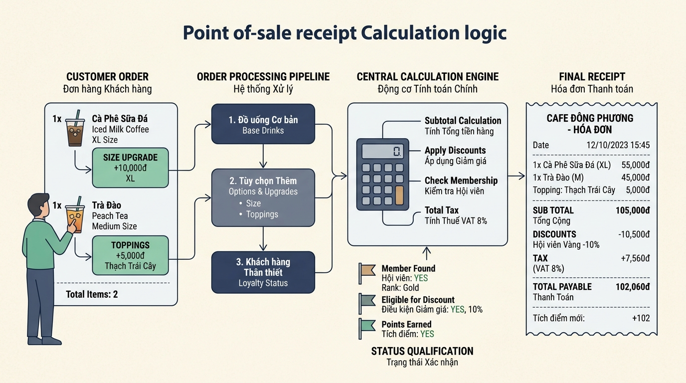

## 
[Phân tích 3] Phân Tích Logic Kiểm Tra Điều Kiện Đơn Hàng và Áp Dụng Ưu Đãi POS Highlands

### **1. Mục tiêu**
*   **Kiến thức**: Nắm vững cơ chế hoạt động, thứ tự ưu tiên và cách phối hợp giữa các toán tử số học (`+`, `-`, `*`, `/`, `//`), toán tử so sánh (`==`, `!=`, `>`, `<`, `>=`, `<=`) và toán tử logic (`and`, `or`, `not`) trong ngôn ngữ lập trình Python.
*   **Kỹ năng**: Xây dựng tư duy phân tích đa phương án để tính toán giá trị hóa đơn và đánh giá các điều kiện khuyến mãi nghiệp vụ mà **KHÔNG** sử dụng câu lệnh rẽ nhánh `if/else`.
*   **Năng lực đạt được**: Đánh giá ưu nhược điểm (Trade-off) của các biểu thức logic/số học phức tạp, vẽ lưu đồ quy trình nghiệp vụ chuẩn hóa (Mermaid) và triển khai chương trình xử lý hóa đơn tự động cho hệ thống bán hàng POS tại Highlands Coffee.

---

### **2. Bối cảnh & Vấn đề**
Trong hệ thống Quản lý Bán hàng tại quầy (Highlands POS), mỗi đơn hàng cần xử lý rất nhiều quy tắc tính toán: phụ thu kích thước đồ uống (Size M/L), phụ thu topping, giảm giá thẻ thành viên Vàng (Gold Membership), đồng thời đánh giá các cờ trạng thái (flags) để quyết định đơn hàng có đạt chuẩn "VIP" hoặc đủ điều kiện nhận "Voucher Free Ship" hay không.

Để tối ưu tốc độ xử lý hàng ngàn giao dịch mỗi phút ở mức giao diện đầu vào mà chưa cần tới logic rẽ nhánh phức tạp của backend, nhóm kiến trúc sư phần mềm yêu cầu lập trình viên xây dựng pipeline tính toán thuần túy dựa trên các biểu thức số học và biểu thức logic boolean. Học viên cần phân tích các phương án thiết kế để hiện thực hóa quy trình này.

  

---

### **3. Quy tắc nghiệp vụ**
Hệ thống Highlands POS áp dụng các công thức và quy tắc định giá cố định như sau:

1.  **Tính Phụ thu Size**:
    *   Size S: Phụ thu 0 VNĐ.
    *   Size M: Phụ thu 6.000 VNĐ.
    *   Size L: Phụ thu 10.000 VNĐ.
    *   Trạng thái chọn size được truyền vào dạng boolean: `is_size_m` (`True`/`False`) và `is_size_l` (`True`/`False`). (Khách hàng chỉ chọn 1 trong các size).
2.  **Tính Phụ thu Topping**:
    *   Mỗi loại Topping đi kèm có đơn giá cố định 8.000 VNĐ.
    *   Số lượng topping: `topping_count` (số nguyên `>= 0`).
3.  **Tính Tổng tiền Tạm tính (`subtotal`)**:
    *   `Đơn giá 1 ly = Giá nền Size S + Phụ thu Size + (Số topping * 8.000 VNĐ)`
    *   `Tạm tính = Đơn giá 1 ly * Số lượng ly (quantity)`
4.  **Chiết khấu Thành viên Vàng (`discount_amount`)**:
    *   Nếu là hội viên Vàng (`is_gold = True`), giảm 10% trên Tổng tiền Tạm tính (`subtotal`).
    *   Nếu không phải hội viên Vàng (`is_gold = False`), tiền giảm giá bằng 0 VNĐ.
5.  **Tổng tiền Thanh toán (`final_total`)**:
    *   `Tổng tiền thanh toán = Tạm tính - Tiền giảm giá`
6.  **Đánh giá Cờ Trạng thái Khuyến mãi (Boolean Flags)**:
    *   Cờ `is_vip_order` (`True`/`False`): Trả về `True` nếu Tạm tính (`subtotal`) từ 200.000 VNĐ trở lên **VÀ** số lượng ly (`quantity`) từ 3 trở lên.
    *   Cờ `is_eligible_free_ship` (`True`/`False`): Trả về `True` nếu Tổng tiền thanh toán (`final_total`) từ 150.000 VNĐ trở lên **HOẶC** (Khách hàng là hội viên Vàng `is_gold` **VÀ** số lượng ly (`quantity`) từ 2 trở lên).

---

### **4. Yêu cầu bài toán**

[REQUIREMENT] Học viên thực hiện đầy đủ 3 phần nội dung sau trong bài nộp:

#### **Phần 1: Báo cáo Phân tích & Đề xuất Giải pháp Kỹ thuật**
1.  **Đề xuất giải pháp**: Tự độc lập đề xuất ít nhất **2 phương án kỹ thuật** khác nhau để biểu diễn các công thức tính toán và đánh giá cờ boolean nêu trên mà **TUYỆT ĐỐI KHÔNG DÙNG** câu lệnh rẽ nhánh `if/else` (Ví dụ: Phương án sử dụng phép nhân trực tiếp biến Boolean với giá trị số vs. Phương án tách nhỏ thành các biểu thức logic trung gian).
2.  **Bảng so sánh Trade-off**: Xây dựng bảng so sánh chi tiết giữa các phương án đề xuất dựa trên 5 tiêu chí bắt buộc:
    *   Thời gian thực thi / Tốc độ tính toán (Execution Speed)
    *   Dung lượng bộ nhớ tiêu tốn (Memory Footprint)
    *   Khả năng bảo trì & Mở rộng (Maintainability)
    *   Độ rõ ràng & Dễ đọc của mã nguồn (Readability)
    *   Ngữ cảnh áp dụng phù hợp nhất (Suitability / Use Case)
    *(Lưu ý: Bảng HTML bắt buộc sử dụng thẻ `<table style="width: 100%; min-width: 100%; display: table; border-collapse: collapse;" width="100%">`)*

#### **Phần 2: Lựa chọn Phương án & Thiết kế Lưu đồ Thuật toán**
1.  **Lý giải lựa chọn**: Đưa ra lập luận khoa học giải thích tại sao chọn một trong các phương án làm giải pháp tối ưu cho hệ thống POS.
2.  **Thiết kế Lưu đồ Thuật toán (Mermaid Flowchart)**: Vẽ lưu đồ mô tả chi tiết dòng chảy dữ liệu từ khi nhận `input` đến khi tính toán ra kết quả cuối cùng.
    *   *Yêu cầu hình dạng Mermaid chuẩn*:
        *   Terminator (Bắt đầu / Kết thúc): Dùng shape Oval `([Bắt đầu quy trình])` / `([Kết thúc quy trình])`.
        *   Input / Output: Dùng shape Hình bình hành `[/Nhập dữ liệu đơn hàng/]` / `[/In hóa đơn POS/]`.
        *   Process (Tính toán / Gán giá trị): Dùng shape Hình chữ nhật `["Tính subtotal = ..."]`.
        *   Decision (Đánh giá biểu thức so sánh/logic): Dùng shape Hình thoi `Kiểm tra điều kiện?` kết hợp các nhánh `-->|Đúng|` hoặc `-->|Sai|`.

#### **Phần 3: Triển khai Mã nguồn Python (Core POS Pipeline)**
1.  Viết chương trình Python (chỉ sử dụng kiến thức thuộc Scope từ Session 01 đến Session 04).
2.  Nhập các thông số đầu vào từ bàn phím: `base_price` (float), `is_size_m` (0 hoặc 1), `is_size_l` (0 hoặc 1), `topping_count` (int), `quantity` (int), `is_gold` (0 hoặc 1).
3.  Ép kiểu dữ liệu phù hợp, thực hiện tính toán `subtotal`, `discount_amount`, `final_total` và xác định giá trị các cờ `is_vip_order`, `is_eligible_free_ship`.
4.  In kết quả hóa đơn POS ra màn hình đầy đủ các chỉ số nghiệp vụ.

[WARNING] **Phạm vi kiến thức nghiêm ngặt**:
*   Chỉ được phép dùng: Biến số, kiểu dữ liệu (`int`, `float`, `str`, `bool`), `input()`, `print()`, ép kiểu, các toán tử số học, gán, so sánh và logic (`and`, `or`, `not`).
*   **CẤM SỬ DỤNG**: Câu lệnh rẽ nhánh `if`, `else`, `elif`; vòng lặp `for`, `while`; các kiểu dữ liệu nâng cao `list`, `dict`, `set`, `tuple`; định nghĩa hàm `def`; lớp `class` OOP.

---

### **5. Yêu cầu nộp bài**
Học viên cần nộp:
*   Phần phân tích/báo cáo Trade-off, lý giải lựa chọn và mã Mermaid Flowchart.
*   Mã nguồn Python triển khai hoàn chỉnh (.py).
*   Đẩy mã nguồn lên GitHub theo định dạng thư mục: `[Tên Lớp]_[Môn Học]_Session04_Ex12`.
    *   *Ví dụ*: `HNKS25CNTT1_Core_Session04_Ex12`