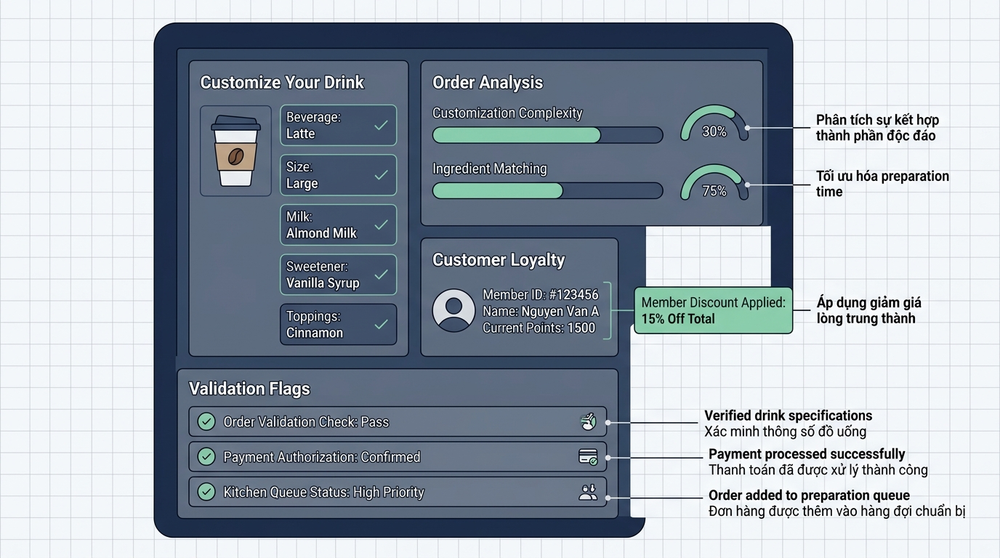

## 
[Sáng tạo 2] Thiết Kế Module Kiểm Định Và Tính Hóa Đơn Phức Hợp Cho Hệ Thống Highlands POS

### **1. Mục tiêu**
*   **Vận dụng tư duy sáng tạo:** Tự chủ thiết kế mô hình dữ liệu và giải pháp logic để giải quyết bài toán thực tế trong hệ thống POS quán trà sữa / cà phê mà không phụ thuộc vào mã khung có sẵn.
*   **Thao tác nâng cao với Toán tử & Biểu thức:** Kết hợp nhuần nhuyễn các toán tử số học, toán tử so sánh và toán tử logic (`and`, `or`, `not`) để tính toán hóa đơn phức hợp và tự động tạo các cờ kiểm định (validation flags).
*   **Chuẩn hóa quy trình thiết kế:** Rèn luyện kỹ năng xây dựng dữ liệu I/O Schema, phân tích bẫy dữ liệu (edge cases), và vẽ sơ đồ luồng dữ liệu (Mermaid Flowchart) theo đúng quy chuẩn công nghiệp.

### **2. Bối cảnh & Vấn đề**
Chuỗi cửa hàng Highlands POS đang gặp sự cố về việc thu ngân thao tác sai quy trình khi tính tiền hóa đơn tại quầy trong các giờ cao điểm: nhập sai mức phụ thu size, tính nhầm chiết khấu thành viên Vàng, hoặc vô tình áp dụng ưu đãi cho các đơn hàng chưa đạt giá trị tối thiểu.

Để khắc phục, ban công nghệ yêu cầu bạn thiết kế một **Module kiểm định & Tính toán hóa đơn tự động**. Module này nhận thông tin order chi tiết của 1 ly đồ uống (giá gốc, lựa chọn size, số lượng topping, trạng thái thẻ thành viên, số tiền khách đưa) và thực hiện:
1. Tính tổng chi phí đơn hàng chính xác sau khi áp dụng phụ thu và chiết khấu.
2. Kiểm tra tính hợp lệ của giao dịch và tính toán số tiền thừa cần trả lại khách.
3. Xuất ra các chỉ số cờ (boolean validation flags) cảnh báo nếu đơn hàng vi phạm quy tắc nghiệp vụ hoặc có nguy cơ gian lận.

[NOTE] Vì module đang trong giai đoạn thử nghiệm thuật toán lõi, bạn **TUYỆT ĐỐI KHÔNG DÙNG** cấu trúc rẽ nhánh `if/else` hay vòng lặp, mà phải tính toán hoàn toàn dựa trên bản chất số học của giá trị Boolean (`True` tương đương 1, `False` tương đương 0 trong các phép toán) và các biểu thức logic.

  

### **3. Quy tắc nghiệp vụ**
Hệ thống Highlands POS vận hành dựa trên các quy tắc niêm yết sau:
1. **Phụ thu Size đồ uống (so với Size S):**
   *   Size S: Phụ thu 0 VNĐ.
   *   Size M: Phụ thu 6.000 VNĐ.
   *   Size L: Phụ thu 10.000 VNĐ.
2. **Phụ thu Topping:**
   *   Mỗi phần topping đi kèm tính đồng giá 8.000 VNĐ/phần.
3. **Chiết khấu Thành viên Vàng (Gold Member):**
   *   Thành viên Vàng được giảm 10% trên tổng giá trị hóa đơn (bao gồm cả giá nước cơ sở, phụ thu size và topping) với điều kiện tổng giá trị đơn hàng trước giảm giá phải đạt từ 50.000 VNĐ trở lên.
4. **Phạm vi kiến thức cho phép:**
   *   Chỉ sử dụng: Biến số, kiểu dữ liệu cơ bản (`int`, `float`, `str`, `bool`), nhập/xuất (`input()`, `print()`), ép kiểu, các toán tử số học (`+`, `-`, `*`, `/`, `//`, `%`, `**`), toán tử gán, toán tử so sánh (`==`, `!=`, `>`, `<`, `>=`, `<=`), toán tử logic (`and`, `or`, `not`), thứ tự ưu tiên toán tử.
   *   [WARNING] PHẠM VI CẤM DÙNG: CẤM câu lệnh rẽ nhánh `if/else/elif`, vòng lặp `for/while`, các cấu trúc dữ liệu `list`, `dict`, `set`, `tuple`, định nghĩa hàm `def`, hoặc lớp `class`.

### **4. Yêu cầu bài toán**
Học viên đóng vai trò Kiến trúc sư phần mềm độc lập thực hiện đầy đủ 4 phần sau vào báo cáo và mã nguồn:

*   **Phần 1: Tự thiết kế I/O Schema**
    *   Tự xác định và liệt kê toàn bộ danh sách dữ liệu đầu vào (Input variables, kiểu dữ liệu, đơn vị) thu thập từ thu ngân.
    *   Tự xác định danh sách dữ liệu đầu ra (Output variables, kiểu dữ liệu) hiển thị trên màn hình POS.

*   **Phần 2: Tự phát hiện bẫy dữ liệu (Edge Cases)**
    *   Liệt kê ít nhất 3 kịch bản dữ liệu biên hoặc xung đột nghiệp vụ có thể xảy ra (Ví dụ: khách đưa thiếu tiền, nhập số lượng topping âm, khai báo mã size không tồn tại...).

*   **Phần 3: Vẽ sơ đồ luồng dữ liệu (Mermaid Flowchart)**
    *   Vẽ biểu đồ luồng dữ liệu thể hiện quá trình từ khi nhận Input -> Tính toán giá trị & Cờ logic -> Xuất Output.
    *   [REQUIREMENT] Phải sử dụng chính xác 5 dạng hình chuẩn sau:
        1. **Terminator (Bắt đầu/Kết thúc):** Hình Oval `([Bắt đầu quy trình])` / `([Kết thúc quy trình])`.
        2. **Input / Output:** Hình bình hành `[/Đầu vào: .../]` / `[/Đầu ra: .../]`.
        3. **Process (Tính toán / Xử lý):** Hình chữ nhật `["Thực hiện tính toán..."]`.
        4. **Decision (Kiểm tra điều kiện):** Hình thoi `Kiểm tra điều kiện?`.
        5. **Flowline:** Mũi tên `-->` hoặc `-->|Đúng|`.

*   **Phần 4: Triển khai mã nguồn Python**
    *   Viết chương trình Python hoàn chỉnh triển khai toàn bộ logic thiết kế trên.
    *   Mã nguồn phải tuân thủ Clean Code (đặt tên biến tiếng Anh dạng `snake_case`, ghi chú giải thích bằng tiếng Việt).
    *   Không sử dụng bất kỳ câu lệnh bị cấm nào.

### **5. Yêu cầu nộp bài**
Học viên cần nộp:
*   Phần phân tích/báo cáo và mã nguồn triển khai.
*   Đẩy mã nguồn lên GitHub theo định dạng thư mục: `[Tên Lớp]_[Môn Học]_SessionSession 04_Ex14`.
    Ví dụ: `HNKS25CNTT1_Core_Session_Session 04_Ex14`