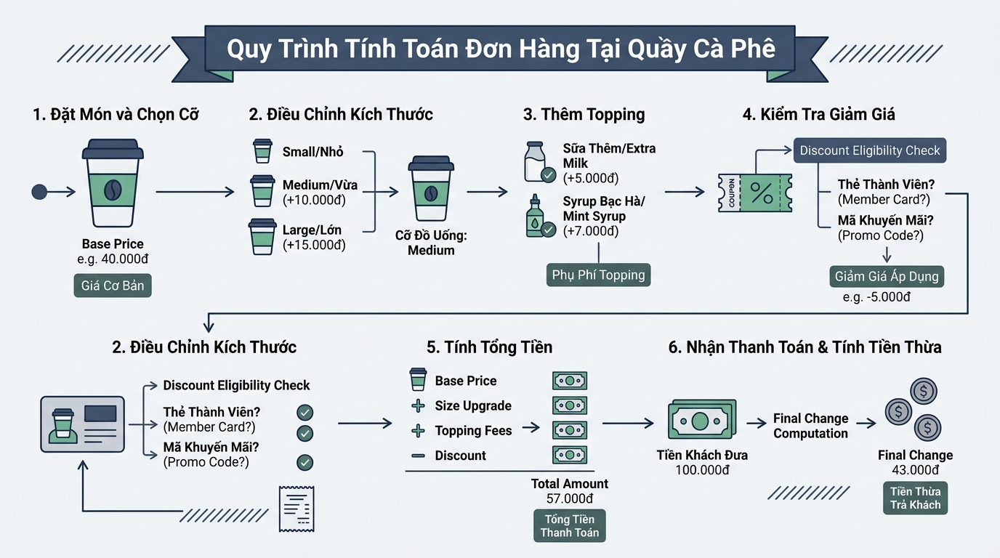

## 
[Sáng tạo 3] Thiết kế Mô đun Khai báo và Tính toán Hóa đơn Bán hàng Tự động trên Hệ thống POS

### **1. Mục tiêu**
*   **Vận dụng sáng tạo:** Phân tích nghiệp vụ thực tế, tự thiết kế cấu trúc dữ liệu và giải quyết bài toán tính hóa đơn phức tạp trong hệ thống quản lý bán hàng quầy thu ngân (Highlands POS).
*   **Tối ưu hóa biểu thức:** Sử dụng linh hoạt các biến, kiểu dữ liệu nguyên thủy (`int`, `float`, `str`, `bool`), các toán tử số học, toán tử so sánh và toán tử logic để xử lý các phép tính nghiệp vụ phức tạp mà không sử dụng câu lệnh rẽ nhánh `if/else`.
*   **Tư duy kiến trúc phần mềm:** Tự chủ động xác định bẫy dữ liệu (Edge Cases), thiết kế sơ đồ luồng dữ liệu (Data Flow Diagram) và viết mã nguồn Python chuẩn mực, dễ mở rộng.

---

### **2. Vấn đề**
Hệ thống quầy thu ngân Highlands POS đang trong giai đoạn nâng cấp mô đun tính toán hóa đơn tự động tại điểm bán. Quá trình tính tiền hiện tại phát sinh nhiều chi phí phụ thu (nâng size ly, số lượng topping), chiết khấu thành viên, thuế VAT và xác định tính hợp lệ của đơn hàng (tiền khách đưa, điều kiện áp dụng mã ưu đãi).

Để đảm bảo hiệu năng tối đa cho dòng máy POS cấu hình thấp, ban quản trị yêu cầu xây dựng một mô đun xử lý tính tiền đơn hàng thuần túy dựa trên các công thức số học và logic đại số Boolean (tệt đối không dùng các cấu trúc rẽ nhánh `if/else`, vòng lặp hay thư viện ngoài). Bạn được giao vai trò Kỹ sư Phần mềm Chính (Lead Engineer) để tự thiết kế kịch bản dữ liệu, xây dựng sơ đồ luồng dữ liệu và hiện thực hóa mã nguồn từ đầu.

  

---

### **3. Quy tắc nghiệp vụ**
Hệ thống tính tiền POS tuân thủ các quy tắc cố định của chuỗi như sau:
1.  **Phụ thu kích cỡ (Size Upgrade):**
    *   Size S: Không phụ thu (+0 VNĐ).
    *   Size M: Phụ thu thêm 6.000 VNĐ.
    *   Size L: Phụ thu thêm 10.000 VNĐ.
2.  **Topping đi kèm:** Mỗi đơn vị Topping gọi thêm có giá cố định là 8.000 VNĐ.
3.  **Chiết khấu thẻ thành viên (Membership Discount):**
    *   Khách hàng có Thẻ Vàng (Gold Member) được giảm 10% trên tổng giá trị tiền món (bao gồm tiền nước cơ bản, tiền phụ thu size và tiền topping).
4.  **Điều kiện áp dụng Mã giảm giá bổ sung (Mega Voucher):**
    *   Đơn hàng được giảm thêm 15.000 VNĐ trực tiếp nếu tổng tiền trước thuế từ 100.000 VNĐ trở lên VÀ có mua từ 2 topping trở lên.
5.  **Thuế VAT & Thanh toán:**
    *   Thuế VAT áp dụng 8% trên tổng tiền sau khi đã trừ tất cả các khoản chiết khấu.
    *   Tính toán tiền thừa cần trả lại cho khách và trả về trạng thái hợp lệ của giao dịch (đủ tiền trả hay thiếu tiền).

---

### **4. Yêu cầu bài toán**

Học viên đóng vai trò Kỹ sư Hệ thống và thực hiện 4 phần nhiệm vụ sau:

#### **Phần 1: Tự thiết kế I/O Schema (Đầu vào / Đầu ra)**
*   Tự xác định toàn bộ biến đầu vào cần nhập từ bàn phím thu ngân (ví dụ: tên đồ uống, giá gốc, cờ đánh dấu size, số lượng topping, trạng thái thành viên, tiền khách trả...).
*   Xác định rõ kiểu dữ liệu (`str`, `int`, `float`, `bool`) và đơn vị tính cho từng trường dữ liệu.
*   Trình bày dưới dạng bảng mô tả chi tiết I/O Schema.

#### **Phần 2: Tự phát hiện bẫy dữ liệu (Edge Cases)**
*   Liệt kê ít nhất 3 trường hợp biên hoặc xung đột logic có thể xảy ra trong thực tế (ví dụ: nhập số topping âm, tiền khách đưa nhỏ hơn tổng tiền hóa đơn, chọn đồng thời nhiều size ly...).
*   Đề xuất phương án dùng toán tử logic/số học để phát hiện hoặc xử lý các bẫy dữ liệu này mà không dùng câu lệnh `if/else`.

#### **Phần 3: Vẽ sơ đồ luồng dữ liệu (Data Flow Diagram)**
*   Sử dụng định dạng **Mermaid Flowchart** để mô tả luồng xử lý từ dữ liệu thô nhập vào đến kết quả xuất ra hóa đơn.
*   Tuân thủ nghiêm ngặt 5 hình dạng chuẩn technical flowchart:
    *   Oval `([Bắt đầu / Kết thúc])`
    *   Hình bình hành `[/Đầu vào / Đầu ra/]`
    *   Hình chữ nhật `["Tính toán / Xử lý"]`
    *   Hình thoi `Kiểm tra điều kiện?`
    *   Mũi tên luồng `-->`

#### **Phần 4: Viết mã nguồn triển khai (Implementation)**
*   Tạo file mã nguồn Python hoàn chỉnh xử lý toàn bộ logic nghiệp vụ tính hóa đơn Highlands POS dựa trên thiết kế của bạn.
*   [REQUIREMENT] Mã nguồn phải tuân thủ chuẩn PEP 8: tên biến bằng Tiếng Anh (`snake_case`), chú thích giải thích bằng Tiếng Việt có dấu.
*   [WARNING] CHẶN TUYỆT ĐỐI KHÔNG SỬ DỤNG: Cấu trúc rẽ nhánh `if/else/elif`, vòng lặp `for/while`, hàm `def`, lớp `class`, kiểu dữ liệu danh sách `list/dict/tuple/set`. Tất cả các điều kiện tính toán phải chuyển đổi thành công thức đại số Boolean và phép nhân toán tử logic (`True` = 1, `False` = 0).

---

### **5. Yêu cầu nộp bài**
Học viên cần nộp:
*   Phần phân tích/báo cáo (chứa I/O Schema, Edge Cases, Sơ đồ Mermaid) và mã nguồn triển khai.
*   Đẩy mã nguồn lên GitHub theo định dạng thư mục: `[Tên Lớp]_[Môn Học]_SessionSession 04_Ex15`.
    Ví dụ: `HNKS25CNTT1_Core_Session_Session 04_Ex15`