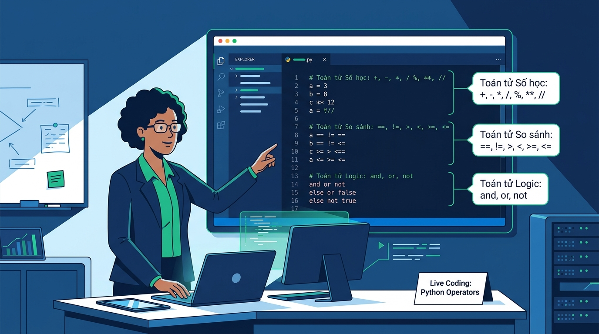

## 
[Tổng hợp Demo] Bài tập Tổng hợp Kiến thức Session Session 04 (Dành cho Giảng viên Demo trên lớp)

### **1. Mục tiêu**
* Tổng hợp toàn bộ kiến thức cốt lõi của Session 04 trong 1 bài toán thực tế thuộc hệ thống COFFEE_POS.
* Hướng dẫn Giảng viên thực hiện Live Coding demo trực tiếp trên lớp.

### **2. Bối cảnh & Vấn đề (Dành cho Demo trên lớp)**
Hệ thống COFFEE_POS yêu cầu triển khai một phân hệ tổng hợp tích hợp toàn bộ các quy tắc nghiệp vụ của bài học Toán tử Số học, Toán tử So sánh và Toán tử Logic trong Python.

  

### **3. Quy tắc nghiệp vụ & Luồng xử lý tích hợp**
Phạm vi kiến thức tích hợp: Biến số, kiểu dữ liệu nguyên thủy (int, float, str, bool), hàm nhập xuất print(), input(), ép kiểu dữ liệu (int(), float(), str()), các toán tử số học (+, -, *, /, //, %, **), toán tử gán (=, +=, -=, *=, /=), toán tử so sánh (==, !=, >, <, >=, <=), và toán tử logic (and, or, not), thứ tự ưu tiên toán tử..

### **4. Hướng dẫn Giảng viên Live-Demo & Mã nguồn Mẫu**
#### **Bước 1: Phân tích I/O & Sơ đồ luồng thuật toán**
Sơ đồ luồng thuật toán tích hợp.

#### **Bước 2: Mã nguồn Mẫu hoàn chỉnh (Master Demo Code)**
Mã nguồn mẫu hoàn chỉnh cho Giảng viên demo trên lớp.

### **5. Yêu cầu nộp bài**
Đẩy lên GitHub Repository: `[Tên Lớp]_[Môn Học]_Session04_Demo_Synthesis`.
