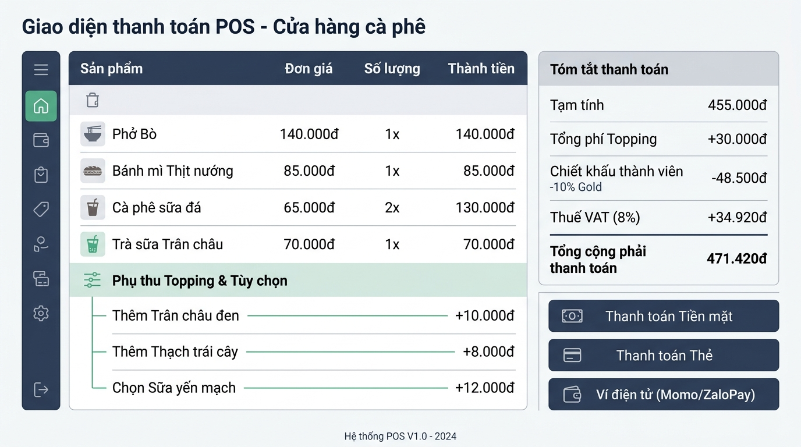

## <center>[Vận dụng cơ bản 2] Sửa lỗi logic tính hóa đơn giảm giá thẻ thành viên Highlands POS</center>

### **1. Mục tiêu**
*   Luyện tập kỹ năng phân vết mã nguồn (code tracing) đối với các biểu thức số học, toán tử so sánh và toán tử logic trong Python.
*   Phát hiện và sửa lỗi logic nghiệp vụ trong phân hệ tính tiền của hệ thống Highlands POS.
*   Củng cố tư duy tính toán điều kiện bằng toán tử đại số/logic mà không phụ thuộc vào câu lệnh rẽ nhánh `if/else`.

### **2. Bối cảnh & Vấn đề**
Bộ phận thu ngân tại các cửa hàng thuộc chuỗi Highlands POS đang sử dụng phân mềm để thực hiện tính tiền hóa đơn đơn lẻ tại quầy. Quy trình tính toán giá trị hóa đơn tuân theo các quy tắc nghiệp vụ sau:
1. Giá ly nước cơ bản (Size S) do thu ngân nhập trực tiếp vào hệ thống dựa theo món khách chọn.
2. Mỗi loại Topping chọn thêm có mức giá đồng giá là 8.000 VNĐ.
3. Tổng tiền trước giảm giá (`subtotal`) là tổng của giá ly nước cơ bản và chi phí toàn bộ Topping đi kèm.
4. Trường hợp khách hàng sở hữu thẻ Thành viên Vàng (`is_gold_member` có giá trị `True`), khách hàng sẽ được **giảm 10% trên tổng giá trị hóa đơn** (tức 10% của `subtotal`). Nếu không phải thành viên Vàng, số tiền giảm giá là 0 VNĐ.
5. Số tiền thanh toán cuối cùng (`final_price`) bằng tổng tiền trước giảm giá trừ đi số tiền được giảm.

**Vấn đề ghi nhận:**
Bộ phận Kế toán và Chăm sóc khách hàng nhận được phản ánh từ nhiều thu ngân: Khi khách hàng là thành viên Vàng mua món uống có kèm Topping, tổng số tiền thanh toán cuối cùng bị hệ thống tính chênh lệch cao hơn so với số tiền thực tế khách phải trả. Khách hàng phàn nàn rằng mức giảm giá 10% nhận được ít hơn so với ưu đãi niêm yết của hệ thống.

<p align="center">
  
</p>

### **3. Mã nguồn hiện tại**
Dưới đây là mã nguồn Python đang chạy tại thiết bị POS quầy tính tiền nhưng chứa lỗi logic tính toán:

```python
# Hệ thống Quản lý Bán hàng Quán Cà phê - Highlands POS
# Phân hệ: Tính tiền hóa đơn đơn lẻ tại quầy

# Nhập dữ liệu từ bàn phím
base_price_input = input("Nhập giá tiền ly nước cơ bản (VNĐ): ")
topping_count_input = input("Nhập số lượng topping gọi thêm: ")
is_gold_input = input("Khách hàng có thẻ Thành viên Vàng? (True/False): ")

# Chuyển đổi kiểu dữ liệu đầu vào
base_price = float(base_price_input)
topping_count = int(topping_count_input)
is_gold_member = is_gold_input == "True"

# Định giá topping cố định
topping_price = 8000

# Tính tổng tiền trước giảm giá
subtotal = base_price + topping_count * topping_price

# Tính tổng tiền thanh toán cuối cùng của hóa đơn
final_price = subtotal - base_price * 0.1 * is_gold_member

# Hiển thị thông tin hóa đơn cho thu ngân
print("--- HÓA ĐƠN HIGHLANDS POS ---")
print("Tổng tiền trước giảm giá:", subtotal, "VNĐ")
print("Thành viên Vàng:", is_gold_member)
print("Tổng tiền thanh toán cuối cùng:", final_price, "VNĐ")
```

### **4. Yêu cầu bài toán**

Học viên thực hiện nhiệm vụ theo 2 phần:

#### **Phần 1: Phân vết mã nguồn và Lập báo cáo kiểm thử (Test Case Report)**
1. Đọc mã nguồn legacy trên và chỉ ra chính xác số dòng mã lệnh bị sai logic nghiệp vụ.
2. Hoàn thiện bảng báo cáo kiểm thử với 3 trường hợp test case dưới đây vào bài làm (Trường hợp 1 đã được làm mẫu):

<table style="width: 100%; min-width: 100%; display: table; border-collapse: collapse;" width="100%" border="1" cellpadding="8">
  <thead>
    <tr style="background-color: #f2f2f2;">
      <th style="border: 1px solid #dddddd; text-align: center;">STT</th>
      <th style="border: 1px solid #dddddd; text-align: left;">Dữ liệu đầu vào (Input)</th>
      <th style="border: 1px solid #dddddd; text-align: left;">Kết quả hiện tại (Buggy Output)</th>
      <th style="border: 1px solid #dddddd; text-align: left;">Kết quả mong đợi (Expected Output)</th>
      <th style="border: 1px solid #dddddd; text-align: left;">Ghi chú phân tích lỗi (Logic Note)</th>
    </tr>
  </thead>
  <tbody>
    <tr>
      <td style="border: 1px solid #dddddd; text-align: center;">1</td>
      <td style="border: 1px solid #dddddd;">base_price = 50000<br>topping_count = 2<br>is_gold_input = "True"</td>
      <td style="border: 1px solid #dddddd;">subtotal = 66000.0<br>final_price = 61000.0</td>
      <td style="border: 1px solid #dddddd;">subtotal = 66000.0<br>final_price = 59400.0</td>
      <td style="border: 1px solid #dddddd;">Dòng 19 tính giảm giá dựa trên giá cơ bản base_price (50,000 VNĐ) thay vì trên tổng hóa đơn subtotal (66,000 VNĐ). Khách bị giảm thiếu 1,600 VNĐ.</td>
    </tr>
    <tr>
      <td style="border: 1px solid #dddddd; text-align: center;">2</td>
      <td style="border: 1px solid #dddddd;">base_price = 45000<br>topping_count = 3<br>is_gold_input = "True"</td>
      <td style="border: 1px solid #dddddd;">...</td>
      <td style="border: 1px solid #dddddd;">...</td>
      <td style="border: 1px solid #dddddd;">...</td>
    </tr>
    <tr>
      <td style="border: 1px solid #dddddd; text-align: center;">3</td>
      <td style="border: 1px solid #dddddd;">base_price = 40000<br>topping_count = 1<br>is_gold_input = "False"</td>
      <td style="border: 1px solid #dddddd;">...</td>
      <td style="border: 1px solid #dddddd;">...</td>
      <td style="border: 1px solid #dddddd;">...</td>
    </tr>
  </tbody>
</table>

#### **Phần 2: Sửa lỗi mã nguồn nghiệp vụ (Source Code Correction)**
*   Tiến hành chỉnh sửa mã nguồn Python để chương trình tính chính xác số tiền giảm giá và số tiền thanh toán cuối cùng của khách hàng.
*   [REQUIREMENT] TUYỆT ĐỐI CẤM SỬ DỤNG: Các câu lệnh rẽ nhánh `if`, `else`, `elif`, vòng lặp `for`, `while`, hàm `def` hoặc các cấu trúc dữ liệu nâng cao (`list`, `dict`).
*   Học viên phải áp dụng các toán tử số học, toán tử so sánh và toán tử logic đã học trong Session 04 để thực hiện việc tính toán giảm giá có điều kiện.

### **5. Yêu cầu nộp bài**
Học viên cần nộp:
*   Phần phân tích/báo cáo và mã nguồn triển khai.
*   Đẩy mã nguồn lên GitHub theo định dạng thư mục: `[Tên Lớp]_[Môn Học]_Session 04_Ex2`.
    Ví dụ: `HNKS25CNTT1_Core_Session 04_Ex2`