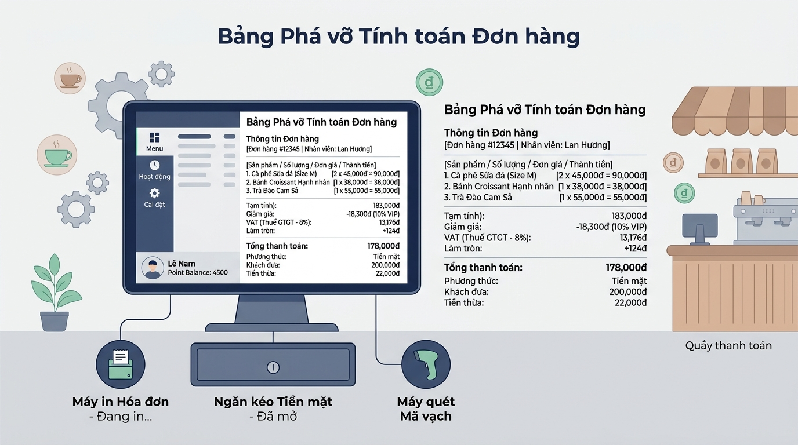
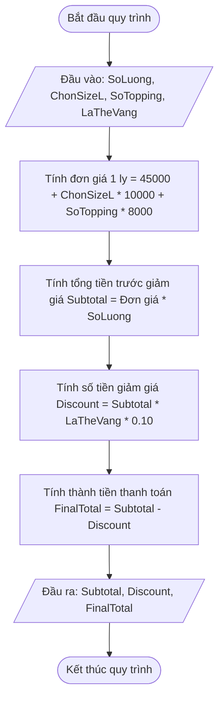

## <center>[Vận dụng cơ bản 3] Sửa lỗi tính tổng tiền hóa đơn POS Highlands Coffee</center>

### **1. Mục tiêu**
*   Vận dụng các toán tử số học (`+`, `-`, `*`, `/`), toán tử gán và quy tắc ưu tiên toán tử trong Python để tính toán giá trị hóa đơn.
*   Phát hiện và sửa chữa lỗi logic liên quan đến thứ tự thực hiện phép tính (operator precedence) trong biểu thức tính toán doanh thu order.
*   Thực hành truy vết mã nguồn (code tracing), xây dựng bảng Test Case đối chiếu và hoàn thiện mã nguồn xử lý tính tiền tại quầy POS.

### **2. Bối cảnh & Vấn đề**
Hệ thống phần mềm POS tại quầy bán hàng Highlands Coffee phụ trách tính tiền hóa đơn trực tiếp cho khách mua trà sữa và cà phê.

Quy tắc tính toán giá trị order đồ uống tại quầy được quy định như sau:
1. Giá đồ uống tiêu chuẩn (Size S): 45.000 VNĐ/ly.
2. Nâng cấp Size L: Cộng thêm 10.000 VNĐ/ly (Nhập `1` nếu chọn Size L, nhập `0` nếu giữ Size S).
3. Topping đi kèm: Mỗi topping thêm tính 8.000 VNĐ/topping.
4. Đơn giá 1 ly hoàn chỉnh = Giá Size S + (Lựa chọn Size L * 10.000) + (Số lượng topping * 8.000).
5. Tổng tiền trước giảm giá (Subtotal) = Đơn giá 1 ly hoàn chỉnh * Số lượng ly đặt mua.
6. Giảm giá Thẻ Vàng (Gold Member): Khách hàng sở hữu Thẻ Vàng (Nhập `1` nếu là Thẻ Vàng, `0` nếu không) được giảm 10% trên Tổng tiền trước giảm giá.
7. Thành tiền thanh toán (Final Total) = Tổng tiền trước giảm giá - Tiền giảm giá Thẻ Vàng.

**Sự cố ghi nhận:**
Nhân viên thu ngân phản ánh rằng khi khách hàng đặt số lượng từ 2 ly trở lên kèm theo topping và nâng size, tổng tiền hóa đơn hiển thị trên màn hình POS bị sai lệch hoàn toàn so với giá trị thực tế. Khách hàng khiếu nại hệ thống tính thiếu tiền gốc đồ uống của các ly tiếp theo.

<p align="center">
  
</p>



### **3. Mã nguồn hiện tại**
Dưới đây là mã nguồn Python xử lý tính tiền hóa đơn đang vận hành trên máy POS:

```python
# Hệ thống Highlands POS - Module tính tiền hóa đơn order
# File: pos_receipt.py

# Hằng số đơn giá niêm yết
BASE_PRICE_SIZE_S = 45000
SIZE_L_EXTRA = 10000
TOPPING_PRICE = 8000
DISCOUNT_RATE_GOLD = 0.10

# Nhập thông tin order từ thu ngân
quantity_input = input("Nhập số lượng ly đồ uống: ")
is_size_l_input = input("Chọn size L (1: Có, 0: Không): ")
topping_count_input = input("Nhập số lượng topping mỗi ly: ")
is_gold_input = input("Khách hàng Thẻ Vàng (1: Có, 0: Không): ")

# Ép kiểu dữ liệu đầu vào
quantity = int(quantity_input)
is_size_l = int(is_size_l_input)
topping_count = int(topping_count_input)
is_gold = int(is_gold_input)

# Tính toán tổng tiền trước giảm giá
subtotal = BASE_PRICE_SIZE_S + is_size_l * SIZE_L_EXTRA + topping_count * TOPPING_PRICE * quantity

# Tính tiền giảm giá cho khách hàng Thẻ Vàng
discount_amount = subtotal * is_gold * DISCOUNT_RATE_GOLD

# Tính tổng tiền thanh toán cuối cùng
final_total = subtotal - discount_amount

# Xuất kết quả hóa đơn
print("=== HÓA ĐƠN BÁN HÀNG HIGHLANDS POS ===")
print("Tổng tiền trước giảm giá:", subtotal, "VNĐ")
print("Tiền giảm giá Thẻ Vàng:", discount_amount, "VNĐ")
print("Tổng tiền thanh toán:", final_total, "VNĐ")
```

### **4. Yêu cầu bài toán**

Học viên thực hiện 2 phần nhiệm vụ sau:

#### **Phần 1: Phân tích & Truy vết lỗi logic (Test Case Report)**
Thực hiện chạy thử (trace code) chương trình hiện tại với các bộ dữ liệu, chỉ rõ dòng mã nguồn gây lỗi, giải thích nguyên nhân và hoàn thiện bảng Test Case sau vào báo cáo:

<table style="width: 100%; min-width: 100%; display: table; border-collapse: collapse;" width="100%" border="1">
  <thead>
    <tr style="background-color: #f2f2f2;">
      <th style="padding: 8px; text-align: center;">STT</th>
      <th style="padding: 8px; text-align: left;">Dữ liệu đầu vào (Input)</th>
      <th style="padding: 8px; text-align: left;">Kết quả hiện tại (Buggy Output)</th>
      <th style="padding: 8px; text-align: left;">Kết quả kỳ vọng (Expected Output)</th>
      <th style="padding: 8px; text-align: left;">Ghi chú phân tích nguyên nhân logic</th>
    </tr>
  </thead>
  <tbody>
    <tr>
      <td style="padding: 8px; text-align: center;">1</td>
      <td style="padding: 8px;">Số lượng: 2<br>Size L: 1<br>Topping: 1<br>Thẻ Vàng: 0</td>
      <td style="padding: 8px;">Subtotal: 71,000 VNĐ<br>Discount: 0 VNĐ<br>Final: 71,000 VNĐ</td>
      <td style="padding: 8px;">1 ly = 45k + 10k + 8k = 63,000 VNĐ<br>Subtotal: 63,000 * 2 = 126,000 VNĐ<br>Discount: 0 VNĐ<br>Final: 126,000 VNĐ</td>
      <td style="padding: 8px;">Do thiếu dấu ngoặc đóng mở nhóm đơn giá 1 ly, phép nhân <code>* quantity</code> chỉ tác dụng lên phần tiền topping, khiến giá nền 45.000 VNĐ và tiền nâng size 10.000 VNĐ chỉ được cộng 1 lần cho cả đơn hàng.</td>
    </tr>
    <tr>
      <td style="padding: 8px; text-align: center;">2</td>
      <td style="padding: 8px;">Số lượng: 3<br>Size L: 0<br>Topping: 2<br>Thẻ Vàng: 1</td>
      <td style="padding: 8px;">...</td>
      <td style="padding: 8px;">...</td>
      <td style="padding: 8px;">...</td>
    </tr>
    <tr>
      <td style="padding: 8px; text-align: center;">3</td>
      <td style="padding: 8px;">Số lượng: 5<br>Size L: 1<br>Topping: 0<br>Thẻ Vàng: 1</td>
      <td style="padding: 8px;">...</td>
      <td style="padding: 8px;">...</td>
      <td style="padding: 8px;">...</td>
    </tr>
  </tbody>
</table>

#### **Phần 2: Sửa lỗi mã nguồn (Source Code Correction)**
*   Tiến hành sửa lại đoạn mã tính `subtotal` trong file `pos_receipt.py` sao cho áp dụng đúng thứ tự toán tử và ưu tiên phép tính bằng ngoặc đơn `()`.
*   Đảm bảo mã nguồn chạy chính xác với mọi trường hợp đầu vào, không sử dụng các cấu trúc nâng cao bị cấm (`if/else`, vòng lặp, hàm, mảng/list).

### **5. Yêu cầu nộp bài**
Học viên cần nộp:
*   Phần phân tích/báo cáo và mã nguồn triển khai.
*   Đẩy mã nguồn lên GitHub theo định dạng thư mục: `[Tên Lớp]_[Môn Học]_Session04_Ex3`.
    Ví dụ: `HNKS25CNTT1_Core_Session04_Ex3`