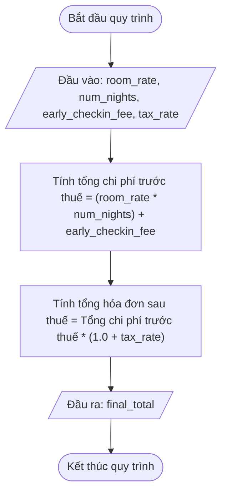

# <center>[Vận dụng cơ bản 3] Sửa lỗi ưu tiên tính toán tổng hóa đơn phòng khách sạn</center>

### **1. Mục tiêu**
*   **Về kiến thức:** Nắm vững thứ tự ưu tiên của toán tử số học (`*`, `/`, `+`, `-`) và tác dụng của cặp dấu ngoặc đơn `()` trong việc điều khiển thứ tự thực hiện biểu thức số học trong Python.
*   **Về kỹ năng:** Thực hiện kỹ thuật code tracing (theo dõi dòng mã nguồn), phát hiện lỗi tính toán do thiếu dấu ngoặc điều hướng biểu thức và sửa đổi mã nguồn theo đúng công thức nghiệp vụ tài chính.
*   **Về thái độ:** Tỉ mỉ, cẩn trọng trong việc xử lý các tính toán liên quan đến tiền tệ, thuế VAT và phụ phí hóa đơn.

### **2. Bối cảnh & Vấn đề**
Trong hệ thống đặt phòng trực tuyến **Agoda / Traveloka**, khi khách hàng thực hiện đặt phòng khách sạn và lựa chọn thêm dịch vụ "Check-in sớm" (Nhận phòng trước 12h trưa), hệ thống cần tính tổng giá trị hóa đơn bao gồm:
1.  **Tiền phòng cơ bản:** `= Giá phòng 1 đêm * Số đêm lưu trú`.
2.  **Phụ phí check-in sớm:** Số tiền phụ thu cố định phát sinh.
3.  **Thuế giá trị gia tăng (VAT):** Thuế VAT (ví dụ 10% hoặc 8%) được áp dụng trên **tổng chi phí dịch vụ** (bao gồm tiền phòng và phụ phí check-in sớm).

Bộ phận kế toán phản ánh rằng các hóa đơn có dịch vụ check-in sớm đang thu thiếu tiền của khách hàng. Số tiền báo cho khách thanh toán thấp hơn thực tế so với quy định tài chính. Bộ phận kiểm thử đã xác định có lỗi tính toán liên quan đến thứ tự ưu tiên toán tử trong hàm tính tổng tiền.

### **3. Mã nguồn hiện tại**
Dưới đây là đoạn mã nguồn hiện tại đang chạy trong module thanh toán của hệ thống:

```python
def calculate_booking_invoice(
    room_rate: float,
    num_nights: int,
    early_checkin_fee: float,
    tax_rate: float
) -> float:
    """
    Tính tổng hóa đơn thanh toán đặt phòng bao gồm giá phòng, phụ phí nhận phòng sớm
    và áp dụng thuế VAT trên toàn bộ dịch vụ.
    """

# Tính tổng tiền thanh toán cuối cùng sau thuế VAT
    final_total: float = room_rate * num_nights + early_checkin_fee * (1.0 + tax_rate)
    
    return final_total

# Chạy thử nghiệm chương trình
if __name__ == "__main__":
    sample_room_rate: float = 1000000.0
    sample_num_nights: int = 2
    sample_early_fee: float = 300000.0
    sample_tax_rate: float = 0.10

    result: float = calculate_booking_invoice(
        sample_room_rate,
        sample_num_nights,
        sample_early_fee,
        sample_tax_rate
    )
    print(f"Tổng hóa đơn thanh toán thu của khách: {result:,.0f} VND")
```

# **4. Yêu cầu bài toán**

#### **Phần 1 - Code Tracing & Báo cáo Test Case (Bắt buộc)**
Học viên đọc hiểu mã nguồn hiện tại, chạy thử nghiệm trên các bộ dữ liệu khác nhau để hoàn thành bảng báo cáo Test Case bên dưới. Hàng số 1 đã được hoàn thành làm mẫu ví dụ:

<table style="width: 100%; min-width: 100%; display: table; border-collapse: collapse;" width="100%" border="1" cellPadding="6" cellSpacing="0">
  <thead>
    <tr style="background-color: #f2f2f2;">
      <th style="text-align: center;">STT</th>
      <th style="text-align: left;">Dữ liệu đầu vào (Input)</th>
      <th style="text-align: center;">Kết quả mã lỗi (Buggy Output)</th>
      <th style="text-align: center;">Kết quả mong đợi (Expected Output)</th>
      <th style="text-align: center;">Dòng code gây lỗi</th>
      <th style="text-align: left;">Giải thích nguyên nhân (Logic Note)</th>
    </tr>
  </thead>
  <tbody>
    <tr>
      <td style="text-align: center;">1</td>
      <td>room_rate = 1,000,000<br/>num_nights = 2<br/>early_checkin_fee = 300,000<br/>tax_rate = 0.10 (10%)</td>
      <td style="text-align: center;">2,330,000 VND</td>
      <td style="text-align: center;">2,530,000 VND</td>
      <td style="text-align: center;">Dòng 11</td>
      <td>Do thiếu cặp ngoặc bao quanh (room_rate * num_nights + early_checkin_fee), phép nhân với (1.0 + tax_rate) chỉ áp dụng cho early_checkin_fee. Tiền phòng (2,000,000) bị bỏ qua không tính thuế 10%.</td>
    </tr>
    <tr>
      <td style="text-align: center;">2</td>
      <td>room_rate = 1,500,000<br/>num_nights = 3<br/>early_checkin_fee = 450,000<br/>tax_rate = 0.10 (10%)</td>
      <td style="text-align: center;">...</td>
      <td style="text-align: center;">...</td>
      <td style="text-align: center;">...</td>
      <td>...</td>
    </tr>
    <tr>
      <td style="text-align: center;">3</td>
      <td>room_rate = 800,000<br/>num_nights = 1<br/>early_checkin_fee = 240,000<br/>tax_rate = 0.08 (8%)</td>
      <td style="text-align: center;">...</td>
      <td style="text-align: center;">...</td>
      <td style="text-align: center;">...</td>
      <td>...</td>
    </tr>
  </tbody>
</table>

#### **Phần 2 - Mã nguồn khắc phục lỗi**
1. Lập sơ đồ tiến trình tính toán bằng Mermaid Flowchart minh họa đúng các bước nhận đầu vào, cộng tổng tiền trước thuế, nhân thuế VAT và trả về kết quả.
2. Viết lại hàm `calculate_booking_invoice` trong tập tin Python sao cho tính đúng tổng tiền hóa đơn sau thuế VAT 100%.



# **5. Yêu cầu nộp bài**
Học viên cần nộp:
*   Phần phân tích/báo cáo bảng Test Case và mã nguồn triển khai đã sửa lỗi.
*   Đẩy mã nguồn lên GitHub theo định dạng thư mục: `[Tên Lớp]_[Môn Học]_SessionSession 04_Ex3`.
    Ví dụ: `HNKS25CNTT1_Core_Session_Session 04_Ex3`
