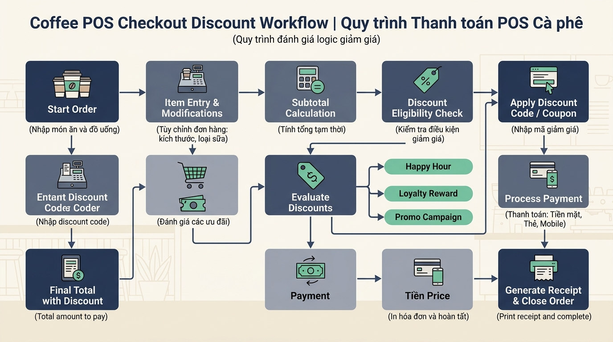

## <center>[Vận dụng cơ bản 4] Khắc phục lỗi kiểm tra điều kiện ưu đãi hóa đơn POS</center>

### **1. Mục tiêu**
*   **Kiến thức:** Vận dụng các toán tử số học (`+`, `-`, `*`), toán tử so sánh (`>=`, `==`) và toán tử logic (`and`, `or`, `not`) trong Python để đánh giá biểu thức điều kiện.
*   **Kỹ năng:** Kỹ năng phân tích vết mã nguồn (code tracing), phát hiện lỗi sai trong câu lệnh tính toán logic và hiệu chỉnh mã nguồn mà không sử dụng câu lệnh rẽ nhánh `if/else`.
*   **Mức độ chủ đạo:** Vận dụng cơ bản (Level 4 trong thang đo Bloom).

### **2. Bối cảnh & Vấn đề**
Hệ thống tính tiền POS tại Highlands Coffee đang áp dụng chính sách ưu đãi giảm giá **10%** tổng hóa đơn cho khách hàng nếu thỏa mãn **MỘT TRONG HAI** điều kiện sau:
1. Khách hàng là thành viên hạng Vàng (`is_gold == True`).
2. Tổng giá trị hóa đơn chưa giảm (`gross_total`) đạt từ **100.000 VNĐ** trở lên.

Bộ phận chăm sóc khách hàng liên tục nhận được phản ánh từ hội viên hạng Vàng. Cụ thể, khách hàng đặt 1 ly Trà Sen Vàng size S giá 45.000 VNĐ (không tăng size, không topping), mặc dù đã xác thực thẻ thành viên Vàng thành công nhưng hóa đơn xuất ra vẫn ghi nhận trạng thái giảm giá là `False` và thu đủ 45.000 VNĐ thay vì áp dụng giảm giá 10% (còn 40.500 VNĐ). Quản lý cửa hàng yêu cầu kiểm tra lại module tính hóa đơn POS để sửa lỗi này.

<p align="center">
  
</p>

### **3. Mã nguồn hiện tại**
Dưới đây là mã nguồn Python xử lý tính tiền tại quầy POS đang gặp lỗi:

```python
# Mã nguồn tính toán hóa đơn và kiểm tra ưu đãi POS
# Thu thập dữ liệu đơn hàng từ thu ngân

base_price = float(input("Nhập giá tiền ly cơ bản (VNĐ): "))
size_upcharge = float(input("Nhập phí tăng size (VNĐ): "))
topping_count = int(input("Nhập số lượng topping (8.000 VNĐ/phần): "))
is_gold_input = input("Khách hàng là thành viên Vàng (True/False)? ")

# Chuyển đổi dữ liệu chuỗi sang kiểu boolean
is_gold = is_gold_input == "True"

# Tính tổng giá trị hóa đơn chưa giảm giá
gross_total = base_price + size_upcharge + (topping_count * 8000)

# Kiểm tra điều kiện áp dụng mức giảm giá 10%
# Quy tắc: Thành viên Vàng HOẶC Tổng hóa đơn từ 100.000 VNĐ trở lên
is_eligible_discount = is_gold and (gross_total >= 100000)

# Tính số tiền giảm giá (10% tổng hóa đơn nếu đủ điều kiện)
discount_amount = gross_total * 0.10 * is_eligible_discount

# Tính số tiền thanh toán thực tế sau giảm giá
net_total = gross_total - discount_amount

# Hiển thị kết quả tính toán hóa đơn
print(f"Tổng tiền gốc: {gross_total:.0f} VNĐ")
print(f"Được áp dụng giảm giá 10%: {is_eligible_discount}")
print(f"Số tiền được giảm: {discount_amount:.0f} VNĐ")
print(f"Số tiền thực thanh toán: {net_total:.0f} VNĐ")
```

### **4. Yêu cầu bài toán**

Học viên thực hiện bài tập qua 2 phần bắt buộc sau:

#### **Phần 1: Tracing mã nguồn & Báo cáo Test Case (Lỗi Logic)**
Thực hiện chạy vết (trace) mã nguồn hiện tại, phát hiện nguyên nhân logic sai và hoàn thiện bảng Test Case bên dưới. Hàng số 1 đã được điền sẵn làm mẫu, học viên điền tiếp dữ liệu cho Hàng số 2 và Hàng số 3.

<table style="width: 100%; min-width: 100%; display: table; border-collapse: collapse;" width="100%" border="1" cellpadding="8">
  <thead>
    <tr style="background-color: #f2f2f2;">
      <th style="text-align: center;">STT</th>
      <th style="text-align: left;">Dữ liệu đầu vào (Input)</th>
      <th style="text-align: left;">Kết quả hiện tại (Buggy Output)</th>
      <th style="text-align: left;">Kết quả mong đợi (Expected Output)</th>
      <th style="text-align: left;">Ghi chú phán đoán logic</th>
    </tr>
  </thead>
  <tbody>
    <tr>
      <td style="text-align: center;">1</td>
      <td>
        base_price = 45000<br/>
        size_upcharge = 0<br/>
        topping_count = 0<br/>
        is_gold_input = "True"
      </td>
      <td>
        gross_total = 45000<br/>
        is_eligible_discount = False<br/>
        discount_amount = 0<br/>
        net_total = 45000
      </td>
      <td>
        gross_total = 45000<br/>
        is_eligible_discount = True<br/>
        discount_amount = 4500<br/>
        net_total = 40500
      </td>
      <td>Mã nguồn dùng toán tử <code>and</code> thay vì <code>or</code>, khiến hội viên Vàng mua dưới 100k bị từ chối giảm giá.</td>
    </tr>
    <tr>
      <td style="text-align: center;">2</td>
      <td>
        base_price = 55000<br/>
        size_upcharge = 10000<br/>
        topping_count = 5<br/>
        is_gold_input = "False"
      </td>
      <td>...</td>
      <td>...</td>
      <td>...</td>
    </tr>
    <tr>
      <td style="text-align: center;">3</td>
      <td>
        base_price = 39000<br/>
        size_upcharge = 6000<br/>
        topping_count = 1<br/>
        is_gold_input = "False"
      </td>
      <td>...</td>
      <td>...</td>
      <td>...</td>
    </tr>
  </tbody>
</table>

#### **Phần 2: Sửa lỗi mã nguồn (Source Code Correction)**
Sửa lại mã nguồn Python để hệ thống tính toán chính xác điều kiện giảm giá và số tiền thanh toán thực tế.
*   **Ràng buộc phạm vi:** TUYỆT ĐỐI KHÔNG sử dụng câu lệnh rẽ nhánh `if/else/elif`, không dùng vòng lặp, danh sách (`list`), hàm (`def`) hay các kiến thức nâng cao chưa học. Chỉ sử dụng toán tử số học, so sánh, logic và ép kiểu dữ liệu cơ bản.

### **5. Yêu cầu nộp bài**
Học viên cần nộp:
*   Phần phân tích/báo cáo (bảng Test Case và giải thích nguyên nhân lỗi) cùng mã nguồn đã sửa đổi.
*   Đẩy mã nguồn lên GitHub theo định dạng thư mục: `[Tên Lớp]_[Môn Học]_Session04_Ex4`.
    Ví dụ: `HNKS25CNTT1_Core_Session04_Ex4`.