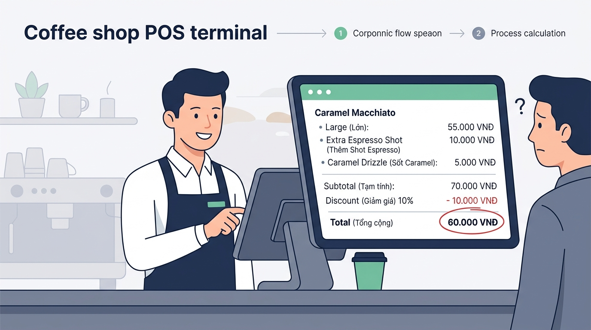

## <center>[Vận dụng cơ bản 5] Sửa lỗi tính tổng tiền hóa đơn POS Highlands Coffee</center>

### **1. Mục tiêu**
*   Phân tích và phát hiện sai sót trong biểu thức số học và thứ tự ưu tiên thực thi toán tử khi tính toán hóa đơn bán hàng.
*   Khắc phục lỗi logic trong mã nguồn phần mềm POS (Point of Sale) mà không sử dụng các cấu trúc rẽ nhánh `if/else`.
*   Thực hành vận dụng các toán tử số học (`+`, `-`, `*`, `/`), toán tử gán và ép kiểu dữ liệu trong Python.

### **2. Bối cảnh & Vấn đề**
Tại hệ thống thu ngân của quán cà phê Highlands POS, phần mềm nhận các thông tin đầu vào bao gồm: giá tiền ly nước cơ bản Size S, lựa chọn nâng cấp Size L (+10.000 VNĐ), số lượng topping chọn thêm (8.000 VNĐ/topping) và trạng thái khách hàng Vàng (được giảm 10% trên tổng giá trị hóa đơn trước giảm giá).

Bộ phận quản lý quầy nhận được phản ánh từ thu ngân: Khi khách hàng mua ly nước giá gốc Size S và không chọn nâng cấp Size L (nhập `0`), tổng tiền thanh toán hiển thị trên màn hình POS bị sai lệch nghiêm trọng so với giá trị thực tế, dẫn đến việc thu thiếu tiền của khách hàng và gây thất thoát cho cửa hàng.

Học viên được cung cấp mã nguồn hiện tại của tính năng này. Hãy thực hiện kiểm thử, chỉ ra vị trí lỗi logic và sửa lại chương trình cho đúng quy tắc nghiệp vụ.

<p align="center">
  
</p>

### **3. Mã nguồn hiện tại**

```python
# Hệ thống Quản lý Bán hàng Quán Cà phê (Highlands POS)
# Module tính tổng tiền hóa đơn thanh toán cho khách hàng

# Nhập thông tin đơn hàng từ thu ngân
base_price = float(input("Nhập giá tiền ly nước cơ bản (Size S): "))
is_size_l = int(input("Nâng cấp Size L (1: Có, 0: Không): "))
topping_count = int(input("Nhập số lượng topping chọn thêm: "))
is_gold_member = int(input("Thẻ thành viên Vàng (1: Có, 0: Không): "))

# Phụ thu Size L: 10.000 VNĐ, Topping: 8.000 VNĐ/phần
# Thành viên Vàng được giảm 10% tổng hóa đơn

# Tính tổng tiền chưa giảm giá
raw_total = (base_price + 10000) * is_size_l + topping_count * 8000

# Tính số tiền được giảm giá (10% nếu là thành viên Vàng)
discount_amount = raw_total * (is_gold_member * 0.10)

# Tính tổng tiền cuối cùng khách phải thanh toán
final_total = raw_total - discount_amount

# Xuất kết quả hóa đơn
print("=== HOÁ ĐƠN THANH TOÁN HIGHLANDS POS ===")
print("Tổng tiền chưa giảm:", raw_total, "VNĐ")
print("Giảm giá thành viên:", discount_amount, "VNĐ")
print("Tổng tiền phải thanh toán:", final_total, "VNĐ")
```

### **4. Yêu cầu bài toán**

Học viên thực hiện bài tập theo 2 phần:

#### **Phần 1: Báo cáo kiểm thử và phát hiện lỗi (Test Case Report)**
Chạy thử mã nguồn hiện tại, phân tích kết quả và điền thông tin vào bảng báo cáo dưới đây để chứng minh lỗi logic của chương trình.

<table style="width: 100%; min-width: 100%; display: table; border-collapse: collapse;" width="100%" border="1">
  <thead>
    <tr style="background-color: #f2f2f2;">
      <th style="padding: 8px; text-align: center;">STT</th>
      <th style="padding: 8px; text-align: left;">Dữ liệu đầu vào (Input)</th>
      <th style="padding: 8px; text-align: left;">Kết quả thực tế (Buggy Output)</th>
      <th style="padding: 8px; text-align: left;">Kết quả kỳ vọng (Expected Output)</th>
      <th style="padding: 8px; text-align: left;">Ghi chú phân tích lỗi (Logic Note)</th>
    </tr>
  </thead>
  <tbody>
    <tr>
      <td style="padding: 8px; text-align: center;">1</td>
      <td style="padding: 8px;">base_price = 45000<br>is_size_l = 0<br>topping_count = 2<br>is_gold_member = 1</td>
      <td style="padding: 8px;">raw_total = 16000.0<br>discount_amount = 1600.0<br>final_total = 14400.0</td>
      <td style="padding: 8px;">raw_total = 61000.0<br>discount_amount = 6100.0<br>final_total = 54900.0</td>
      <td style="padding: 8px;">Do đặt ngoặc sai ở biểu thức <code>(base_price + 10000) * is_size_l</code>, khi <code>is_size_l = 0</code> thì toàn bộ tiền nước gốc (45.000 VNĐ) bị triệt tiêu về 0.</td>
    </tr>
    <tr>
      <td style="padding: 8px; text-align: center;">2</td>
      <td style="padding: 8px;">base_price = 55000<br>is_size_l = 1<br>topping_count = 1<br>is_gold_member = 0</td>
      <td style="padding: 8px;">...</td>
      <td style="padding: 8px;">...</td>
      <td style="padding: 8px;">...</td>
    </tr>
    <tr>
      <td style="padding: 8px; text-align: center;">3</td>
      <td style="padding: 8px;">base_price = 39000<br>is_size_l = 0<br>topping_count = 0<br>is_gold_member = 0</td>
      <td style="padding: 8px;">...</td>
      <td style="padding: 8px;">...</td>
      <td style="padding: 8px;">...</td>
    </tr>
  </tbody>
</table>

#### **Phần 2: Sửa đổi mã nguồn**
*   Điều chỉnh biểu thức tính `raw_total` sao cho đúng với quy tắc số học: Giá ly cơ bản + (Phụ thu Size L * Trạng thái chọn Size L) + (Số lượng topping * 8.000).
*   Giữ nguyên phạm vi kiến thức đã học (KHÔNG sử dụng `if/else`, vòng lặp hay hàm tự định nghĩa).
*   Đảm bảo chương trình cho ra kết quả chính xác 100% đối với mọi trường hợp thử nghiệm.

### **5. Yêu cầu nộp bài**
Học viên cần nộp:
*   Phần phân tích/báo cáo và mã nguồn triển khai.
*   Đẩy mã nguồn lên GitHub theo định dạng thư mục: `[Tên Lớp]_[Môn Học]_SessionSession 04_Ex5`.
    Ví dụ: `HNKS25CNTT1_Core_Session_Session 04_Ex5`