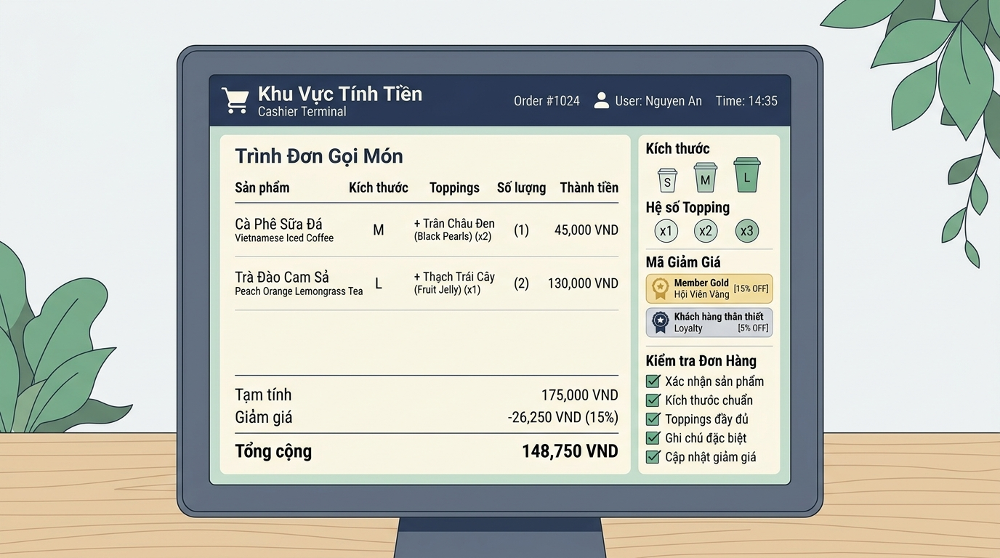

## 
[Vận dụng nâng cao 1] Tính toán hóa đơn POS và kiểm định điều kiện ưu đãi Highlands

### **1. Mục tiêu**
*   Vận dụng thành thạo các toán tử số học (`+`, `-`, `*`, `/`, `//`, `%`), toán tử so sánh (`==`, `!=`, `>`, `<`, `>=`, `<=`) và toán tử logic (`and`, `or`, `not`) trong Python để giải quyết bài toán tính hóa đơn bán hàng thực tế.
*   Thực hiện ép kiểu dữ liệu từ `input()`, tính toán giá phụ thu theo Size, chi phí Topping, chiết khấu hạng thẻ thành viên và xác định các cờ (flags) kiểm định nghiệp vụ mà **tuyệt đối không sử dụng cấu trúc rẽ nhánh (`if/else`) hay vòng lặp**.
*   Rèn luyện kỹ năng phân tích bài toán, xác định các bẫy biên (edge cases) và lập báo cáo thiết kế giải pháp kỹ thuật trước khi triển khai mã nguồn.

### **2. Bối cảnh & Vấn đề**
Tại hệ thống thu ngân của chuỗi cà phê Highlands POS, tốc độ xử lý hóa đơn là yếu tố then chốt giúp tối ưu hóa thời gian phục vụ tại quầy vào giờ cao điểm. Đối với mỗi ly nước order, thu ngân sẽ nhập giá niêm yết của ly Size S, mã size khách chọn (`"S"`, `"M"`, hoặc `"L"`), số lượng topping gọi thêm, số lượng ly và mã hạng thẻ thành viên (`"GOLD"` hoặc hạng khác).

Hệ thống POS cần tính toán chính xác tổng tiền thanh toán và đồng thời đánh giá các chỉ số kiểm định nghiệp vụ (ví dụ: điều kiện miễn phí giao hàng, hạn mức topping cho phép, điều kiện quà tặng VIP). Do module này chạy trên nền tảng tính toán hiệu năng cao ở tầng lõi, toàn bộ biểu thức nghiệp vụ phải được tối ưu hóa dưới dạng **các biểu thức đại số và logic dựa trên tính chất toán học của kiểu dữ liệu Boolean (True = 1, False = 0)**.

  

### **3. Quy tắc nghiệp vụ**
Hệ thống POS áp dụng các quy tắc đại số và điều kiện nghiệp vụ chuẩn như sau:

1.  **Quy định bù giá theo Size (Surcharge):**
    *   Size S: Phụ thu 0 VNĐ.
    *   Size M: Phụ thu **6.000 VNĐ**.
    *   Size L: Phụ thu **10.000 VNĐ**.

2.  **Quy định giá Topping:**
    *   Mỗi phần topping tính đồng giá **8.000 VNĐ**.

3.  **Chiết khấu hạng thẻ Thành viên (Membership Discount):**
    *   Khách hàng có hạng thẻ `"GOLD"` được chiết khấu **10%** (`0.10`) trên tổng giá trị đơn hàng trước giảm giá (Subtotal).
    *   Hạng thẻ khác (ví dụ `"STANDARD"`) không được giảm giá (0%).

4.  **Bảng quy định cờ kiểm định nghiệp vụ (System Verification Flags):**

<table style="width: 100%; min-width: 100%; display: table; border-collapse: collapse;" width="100%" border="1">
  <thead>
    <tr style="background-color: #f2f2f2;">
      <th style="padding: 8px; text-align: left;">Tên cờ (Flag)</th>
      <th style="padding: 8px; text-align: left;">Ý nghĩa nghiệp vụ</th>
      <th style="padding: 8px; text-align: left;">Điều kiện kích hoạt (`True`)</th>
    </tr>
  </thead>
  <tbody>
    <tr>
      <td style="padding: 8px;"><code>is_valid_topping</code></td>
      <td style="padding: 8px;">Số lượng topping hợp lệ</td>
      <td style="padding: 8px;">Số lượng topping nằm trong khoảng từ 0 đến 5 (bao gồm 0 và 5).</td>
    </tr>
    <tr>
      <td style="padding: 8px;"><code>is_eligible_freeship</code></td>
      <td style="padding: 8px;">Đủ điều kiện miễn phí giao hàng</td>
      <td style="padding: 8px;">Tổng tiền thanh toán sau giảm giá từ 100.000 VNĐ trở lên.</td>
    </tr>
    <tr>
      <td style="padding: 8px;"><code>is_vip_promotion</code></td>
      <td style="padding: 8px;">Nhận ưu đãi quà tặng VIP</td>
      <td style="padding: 8px;">Hạng thẻ là <code>"GOLD"</code> VÀ tổng tiền thanh toán từ 200.000 VNĐ trở lên.</td>
    </tr>
    <tr>
      <td style="padding: 8px;"><code>is_valid_order</code></td>
      <td style="padding: 8px;">Toàn bộ đơn hàng hợp lệ</td>
      <td style="padding: 8px;">Giá gốc Size S > 0 VÀ số lượng ly > 0 VÀ <code>is_valid_topping</code> là <code>True</code>.</td>
    </tr>
  </tbody>
</table>

### **4. Yêu cầu bài toán**
Học viên hoàn thành bài tập theo 2 phần bắt buộc:

#### **Phần 1: Báo cáo Phân tích & Thiết kế Giải pháp (Analysis & Design Report)**
*   **Phân tích I/O:** Liệt kê đầy đủ các tham số đầu vào (tên biến, kiểu dữ liệu, đơn vị) và các chỉ số đầu ra.
*   **Đề xuất giải pháp kỹ thuật:** Giải thích cơ chế dùng biểu thức toán tử so sánh (`size_code == "M"`, `member_code == "GOLD"`) kết hợp phép nhân số học để tính phụ thu và giảm giá mà **KHÔNG dùng câu lệnh rẽ nhánh `if/else`**.
*   **Thiết kế luồng xử lý:** Lập danh sách thứ tự các bước tính toán từ lúc nhận `input()` đến lúc in kết quả ra màn hình.

#### **Phần 2: Triển khai Mã nguồn Python (Implementation)**
Viết chương trình Python thực hiện các tác vụ sau:
1. Nhập liệu từ bàn phím:
   * `base_price_s`: Giá niêm yết của 1 ly Size S (VNĐ, kiểu `float` hoặc `int`).
   * `size_code`: Mã Size lựa chọn (`"S"`, `"M"`, hoặc `"L"`, kiểu `str`).
   * `topping_count`: Số phần topping chọn thêm (kiểu `int`).
   * `quantity`: Số lượng ly đặt mua (kiểu `int`).
   * `member_code`: Mã hạng thẻ thành viên (`"GOLD"` hoặc `"STANDARD"`, kiểu `str`).

2. Thực hiện tính toán bằng biểu thức:
   * Tính tiền phụ thu Size cho 1 ly.
   * Tính tiền topping cho 1 ly.
   * Tính đơn giá hoàn chỉnh cho 1 ly.
   * Tính tổng tiền tạm tính (Subtotal).
   * Tính tiền giảm giá (Discount).
   * Tính tổng tiền phải thanh toán cuối cùng (Total Payable).

3. Đánh giá 4 cờ kiểm định Boolean (`is_valid_topping`, `is_eligible_freeship`, `is_vip_promotion`, `is_valid_order`).

4. In hóa đơn bán hàng ra màn hình hiển thị rõ ràng thông tin chi tiết hóa đơn và trạng thái các cờ kiểm định.

### **5. Yêu cầu nộp bài**
Học viên cần nộp:
*   Phần phân tích/báo cáo và mã nguồn triển khai.
*   Đẩy mã nguồn lên GitHub theo định dạng thư mục: `[Tên Lớp]_[Môn Học]_SessionSession 04_Ex7`.
    Ví dụ: `HNKS25CNTT1_Core_Session_Session 04_Ex7`