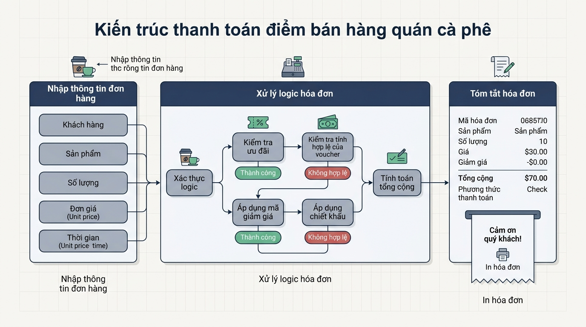

## 
[Vận dụng nâng cao 2] Hệ thống tính toán hóa đơn và xác thực ưu đãi Highlands POS

### **1. Mục tiêu**
*   **Vận dụng toán tử số học, so sánh và logic:** Sử dụng thành thạo các toán tử số học (`+`, `-`, `*`, `/`, `//`, `%`), toán tử so sánh (`==`, `!=`, `>`, `<`, `>=`, `<=`), và toán tử logic (`and`, `or`, `not`) trong Python để giải quyết bài toán thực tế.
*   **Tối ưu hóa biểu thức không dùng câu lệnh rẽ nhánh:** Xây dựng mô hình đại số Boolean và tính toán chỉ số dựa trên giá trị kiểu đúng/sai (`bool`) và ép kiểu số, hoàn toàn không sử dụng các cấu trúc rẽ nhánh `if/else`.
*   **Tư duy thiết kế và phân tích luồng:** Phân tích tham số đầu vào/đầu ra, thiết kế mô hình sơ đồ luồng (Flowchart) chuẩn kỹ thuật cho hệ thống tính tiền tự động tại quầy POS.

### **2. Bối cảnh & Vấn đề**
Chuỗi cửa hàng Highlands POS đang thực hiện nâng cấp mô-đun tính tiền tự động tại quầy (Highlands POS Checkout Engine). Trong các giờ cao điểm, việc xử lý rẽ nhánh điều kiện phức tạp có thể làm tăng độ trễ xử lý của tiến trình. Đội ngũ kiến trúc phần mềm yêu cầu triển khai một mô-đun tính hóa đơn cực nhanh, chuyển đổi toàn bộ logic ưu đãi và kiểm tra tính hợp lệ về dạng **tính toán biểu thức đại số toán tử nguyên thủy**.

Hệ thống cần tiếp nhận thông tin đơn hàng từ thiết bị đầu cuối, bao gồm: đơn giá cơ bản của đồ uống (Size S), cờ chọn size, số lượng topping, số lượng ly, trạng thái hạng thẻ hội viên và cờ áp dụng khung giờ vàng. Chương trình phải tính toán ra số tiền phải thanh toán chính xác, đồng thời xuất ra các cờ trạng thái logic kiểm định hóa đơn mà không được sử dụng câu lệnh `if/else`, vòng lặp hay hàm tự định nghĩa.

  

### **3. Quy tắc nghiệp vụ**
Hệ thống xử lý tính toán hóa đơn tuân thủ chặt chẽ các quy tắc tài chính và ưu đãi sau:

1.  **Tính giá đơn vị của đồ uống:**
    *   Giá chuẩn Size S: Bằng giá đơn giá cơ bản (`base_price`).
    *   Phụ thu Size M: Thêm `6.000` VNĐ (được kích hoạt nếu cờ `is_size_m` có giá trị `1` hoặc `True`).
    *   Phụ thu Size L: Thêm `10.000` VNĐ (được kích hoạt nếu cờ `is_size_l` có giá trị `1` hoặc `True`).
    *   Phụ thu Topping: Đồng giá `8.000` VNĐ cho mỗi loại topping (`topping_count * 8000`).
    *   *Giá 1 ly hoàn chỉnh = Giá cơ bản + (Phụ thu Size M) + (Phụ thu Size L) + (Tổng tiền topping)*.

2.  **Tính tổng giá trị hóa đơn:**
    *   *Thành tiền gốc = Giá 1 ly hoàn chỉnh * Số lượng ly (`quantity`)*.

3.  **Chính sách tính chiết khấu / giảm giá (áp dụng trực tiếp trên Thành tiền gốc):**
    *   **Giảm giá Hội viên Vàng (Gold Member):** Giảm `10%` Thành tiền gốc nếu cờ `is_gold_member` là `1` hoặc `True`.
    *   **Giảm giá Khung giờ vàng (Happy Hour):** Giảm `5%` Thành tiền gốc nếu cờ `is_happy_hour` là `1` hoặc `True`.
    *   *Tổng tiền giảm giá = Giảm giá Hội viên Vàng + Giảm giá Khung giờ vàng*.
    *   *Số tiền thanh toán cuối cùng = Thành tiền gốc - Tổng tiền giảm giá*.

4.  **Xác thực điều kiện nhận Voucher VIP (Boolean Flag):**
    *   Cờ `is_vip_voucher_eligible` trả về `True` nếu đơn hàng thỏa mãn đồng thời cả 2 điều kiện:
        *   Điều kiện 1: Thành tiền gốc đạt từ `200.000` VNĐ trở lên.
        *   Điều kiện 2: Là khách hàng Hội viên Vàng (`is_gold_member == True`) **HOẶC** số lượng ly đặt mua từ `4` ly trở lên (`quantity >= 4`).

5.  **Xác thực tính hợp lệ của đơn hàng (Valid Order Flag):**
    *   Cờ `is_valid_order` trả về `True` khi tất cả các điều kiện dữ liệu sau đều hợp lệ:
        *   Giá cơ bản > 0.
        *   Số lượng ly > 0.
        *   Số lượng topping >= 0.
        *   Không chọn đồng thời cả Size M và Size L (cờ `is_size_m` và `is_size_l` không cùng bằng `True`/`1`).

### **4. Yêu cầu bài toán**

Bài tập yêu cầu học viên thực hiện đầy đủ **2 phần bắt buộc**:

#### **Phần 1: Báo cáo Phân tích & Thiết kế (Bắt buộc)**
1.  **Phân tích Input / Output:**
    *   Liệt kê đầy đủ các tham số đầu vào (tên biến, mô tả, kiểu dữ liệu kỳ vọng).
    *   Liệt kê đầy đủ các kết quả đầu ra (tên biến, mô tả, kiểu dữ liệu kỳ vọng).
2.  **Đề xuất Giải pháp Kỹ thuật:**
    *   Giải trình phương pháp chuyển đổi các quy tắc điều kiện rẽ nhánh sang biểu thức toán học và biểu thức logic Boolean (ví dụ: chuyển đổi cờ `True`/`False` thành giá trị số để nhân với số tiền giảm giá).
3.  **Sơ đồ luồng xử lý (Mermaid Flowchart):**
    *   Vẽ sơ đồ luồng biểu diễn tiến trình xử lý từ lúc nhận dữ liệu đầu vào, thực hiện tính toán số học, kiểm tra điều kiện logic đến khi xuất hóa đơn.
    *   Bắt buộc tuân thủ đúng 5 dạng hình quy chuẩn Mermaid:
        *   Terminator (Bắt đầu / Kết thúc): `([Bắt đầu])`, `([Kết thúc])`.
        *   Input / Output (Nhập / Xuất dữ liệu): `[/Nhập dữ liệu/]` hoặc `[/In hóa đơn/]`.
        *   Process (Tính toán / Xử lý số học): `["Tính toán thành tiền"]`.
        *   Decision (Biểu thức logic so sánh): `Kiểm tra điều kiện?`.
        *   Flowline (Mũi tên điều hướng): `-->` hoặc `-->|Đúng|`.

#### **Phần 2: Triển khai Mã nguồn Python (Implementation)**
*   Viết chương trình Python nhận dữ liệu đầu vào từ bàn phím bằng hàm `input()` và thực hiện ép kiểu thích hợp (`int`, `float`).
*   Thực hiện toàn bộ phép tính giá tiền, giảm giá và kiểm tra trạng thái bằng các toán tử số học, so sánh và logic.
*   **TUYỆT ĐỐI CẤM SỬ DỤNG:** Cấu trúc rẽ nhánh `if/else/elif`, vòng lặp (`for`, `while`), cấu trúc dữ liệu nâng cao (`list`, `dict`, `tuple`, `set`), hàm tự định nghĩa (`def`), hoặc thư viện bên ngoài.
*   In kết quả hóa đơn ra màn hình CLI theo đúng định dạng mẫu bên dưới.

**Ví dụ bảng dữ liệu chạy thử (Test Cases):**

<table style="width: 100%; min-width: 100%; display: table; border-collapse: collapse;" width="100%" border="1">
  <thead>
    <tr style="background-color: #f2f2f2;">
      <th style="padding: 8px; text-align: left;">Tham số dữ liệu đầu vào</th>
      <th style="padding: 8px; text-align: left;">Giá trị mẫu 1 (Đơn chuẩn)</th>
      <th style="padding: 8px; text-align: left;">Giá trị mẫu 2 (Đơn VIP + Giờ vàng)</th>
    </tr>
  </thead>
  <tbody>
    <tr>
      <td style="padding: 8px;">Giá cơ bản Size S (base_price)</td>
      <td style="padding: 8px;">45000</td>
      <td style="padding: 8px;">50000</td>
    </tr>
    <tr>
      <td style="padding: 8px;">Chọn Size M (is_size_m: 1/0)</td>
      <td style="padding: 8px;">1</td>
      <td style="padding: 8px;">0</td>
    </tr>
    <tr>
      <td style="padding: 8px;">Chọn Size L (is_size_l: 1/0)</td>
      <td style="padding: 8px;">0</td>
      <td style="padding: 8px;">1</td>
    </tr>
    <tr>
      <td style="padding: 8px;">Số lượng topping (topping_count)</td>
      <td style="padding: 8px;">1</td>
      <td style="padding: 8px;">2</td>
    </tr>
    <tr>
      <td style="padding: 8px;">Số lượng ly (quantity)</td>
      <td style="padding: 8px;">2</td>
      <td style="padding: 8px;">4</td>
    </tr>
    <tr>
      <td style="padding: 8px;">Thẻ Hội viên Vàng (is_gold_member: 1/0)</td>
      <td style="padding: 8px;">0</td>
      <td style="padding: 8px;">1</td>
    </tr>
    <tr>
      <td style="padding: 8px;">Khung giờ vàng (is_happy_hour: 1/0)</td>
      <td style="padding: 8px;">0</td>
      <td style="padding: 8px;">1</td>
    </tr>
  </tbody>
</table>

---

### **5. Yêu cầu nộp bài**
Học viên cần nộp:
*   Phần phân tích/báo cáo và mã nguồn triển khai.
*   Đẩy mã nguồn lên GitHub theo định dạng thư mục: `[Tên Lớp]_[Môn Học]_Session 04_Ex8`.
    Ví dụ: `HNKS25CNTT1_Core_Session 04_Ex8`