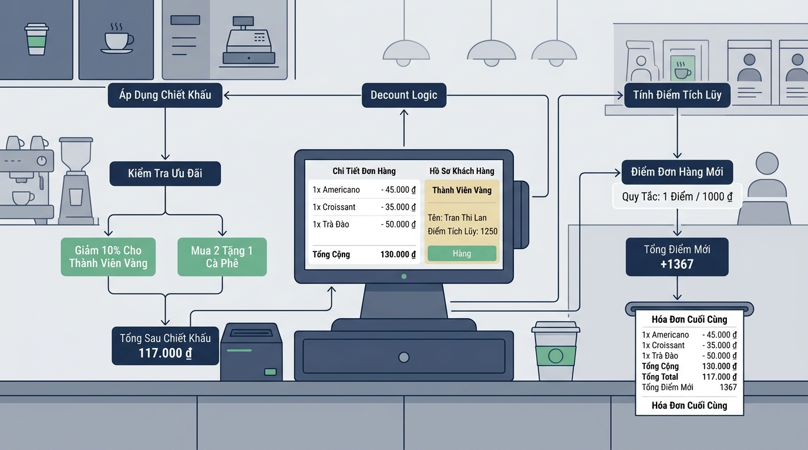

## 
[Vận dụng nâng cao 3] Tính toán hóa đơn POS và kiểm định điều kiện ưu đãi đa chỉ tiêu

### **1. Mục tiêu**
*   Vận dụng thành thạo các toán tử số học (`+`, `-`, `*`, `/`, `//`), toán tử so sánh (`==`, `>=`, `>`) và toán tử logic (`and`, `or`, `not`) trong Python để giải quyết bài toán tính tiền hóa đơn bán hàng.
*   Thực hiện phép tính ép kiểu dữ liệu và khai thác tính chất toán học của kiểu luận lý (`bool`) trong các biểu thức đại số mà tuyệt đối không sử dụng câu lệnh rẽ nhánh `if/else`.
*   Phân tích nghiệp vụ bán hàng thực tế tại quầy POS Highlands Coffee, tự thiết kế cấu trúc I/O và vẽ sơ đồ luồng dữ liệu chuẩn hóa.

### **2. Bối cảnh & Vấn đề**
Trong hệ thống quản lý bán hàng Highlands POS tại quầy trà sữa/cà phê, việc xử lý hóa đơn yêu cầu tính chính xác tuyệt đối và tốc độ phản hồi tính toán tức thì. Để tối ưu hóa hiệu năng trên các máy POS cầm tay có tài nguyên hạn chế, phần mềm cần tính toán tổng tiền thanh toán, mức chiết khấu ưu đãi, điểm thưởng tích lũy và kiểm định tính hợp lệ của đơn hàng hoàn toàn thông qua các biểu thức toán học và logic kết hợp trước khi xuất hóa đơn.

Chương trình cần tiếp nhận thông tin đơn hàng từ thu ngân, tự động tính phụ thu theo size ly, phụ thu topping, kiểm tra các tiêu chí ưu đãi phức tạp và đưa ra kết quả thanh toán cuối cùng.

  

### **3. Quy tắc nghiệp vụ**
Hệ thống tính toán tiền và kiểm tra điều kiện theo các quy tắc sau:

1.  **Tính đơn giá ly thành phẩm:**
    *   Đơn giá cơ bản (Size S): `base_price` (VNĐ, kiểu số).
    *   Phụ thu Size ly (`size_code` nhận giá trị: `0` là Size S, `1` là Size M, `2` là Size L):
        *   Size S (mã `0`): Phụ thu `0` VNĐ.
        *   Size M (mã `1`): Phụ thu `6,000` VNĐ.
        *   Size L (mã `2`): Phụ thu `10,000` VNĐ.
    *   Phụ thu Topping: Mỗi topping thêm tính đồng giá `8,000` VNĐ. Số lượng topping là `topping_count`.
    *   *Đơn giá 1 ly hoàn chỉnh* = `base_price` + Phụ thu Size + (`topping_count` * 8000).

2.  **Tính tổng tiền hàng (trước giảm giá):**
    *   `total_before_discount` = Đơn giá 1 ly hoàn chỉnh * Số lượng ly (`quantity`).

3.  **Quy tắc ưu đãi đa chỉ tiêu (Chiết khấu 10%):**
    Đơn hàng được áp dụng giảm giá 10% trên tổng tiền hàng nếu thỏa mãn **ít nhất một** trong các tiêu chí sau:
    *   *Tiêu chí A (Thẻ Vàng):* Khách hàng là thành viên thẻ Vàng (`is_gold_member` là `1` hoặc `True`).
    *   *Tiêu chí B (Đơn hàng lớn trong giờ vàng):* Mua từ 5 ly trở lên (`quantity >= 5`) **VÀ** đặt trong khung giờ vàng (`is_happy_hour` là `1` hoặc `True`).
    *   *Tiêu chí C (Khách hàng thân thiết):* Số điểm tích lũy hiện có đạt từ 100 điểm trở lên (`current_points >= 100`).

4.  **Tính tiền thanh toán và tích điểm:**
    *   `discount_amount` = `total_before_discount` * 0.10 * (Kết quả kiểm tra điều kiện ưu đãi).
    *   `final_total` = `total_before_discount` - `discount_amount`.
    *   `new_points_earned` = Số điểm thưởng tích lũy mới = `final_total // 20000` (Mỗi 20.000 VNĐ thanh toán thực tế được 1 điểm).

5.  **Kiểm định hóa đơn hợp lệ (`is_valid_order`):**
    Hóa đơn được coi là hợp lệ để ghi nhận hệ thống khi thỏa mãn đồng thời:
    *   Số lượng ly mua phải lớn hơn 0 (`quantity > 0`).
    *   Tổng tiền thanh toán cuối cùng phải đạt tối thiểu `30,000` VNĐ (`final_total >= 30000`).
    *   **KHÔNG PHẢI** là đơn hàng bất thường có tổng tiền thanh toán nhỏ hơn hoặc bằng 0 (`not (final_total <= 0)`).

### **4. Yêu cầu bài toán**

Học viên thực hiện bài nộp gồm 2 phần chính:

#### **Phần 1: Báo cáo Phân tích & Thiết kế Giải pháp (Nộp trong file báo cáo hoặc phần chú thích đầu file)**
1.  **Phân tích Input/Output:** Xác định danh sách các biến đầu vào (kèm kiểu dữ liệu ép từ `input()`) và các biến kết quả tính toán đầu ra.
2.  **Đề xuất giải pháp toán học & logic:**
    *   Giải thích phương pháp tính phụ thu Size ly và tiền chiết khấu sử dụng ép kiểu boolean/toán tử so sánh mà **không dùng câu lệnh `if/else`**.
    *   Viết biểu thức logic kiểm tra điều kiện chiết khấu 10% và biểu thức kiểm định hóa đơn hợp lệ.
3.  **Vẽ sơ đồ luồng (Mermaid Flowchart):** Thiết kế luồng xử lý từ đầu vào đến đầu ra. Sơ đồ phải tuân thủ đúng 5 dạng hình quy chuẩn:
    *   Terminator `([Bắt đầu])` / `([Kết thúc])`
    *   Input/Output `[/Nhập dữ liệu/]` / `[/Xuất hóa đơn/]`
    *   Process `["Tính toán đơn giá và tổng tiền"]`
    *   Decision `Kiểm tra điều kiện ưu đãi?`
    *   Flowline `-->`

#### **Phần 2: Triển khai Mã nguồn (Coding)**
*   Viết chương trình Python thực thi toàn bộ logic đã thiết kế.
*   Nhập đầy đủ thông tin đơn hàng từ bàn phím.
*   Sử dụng toán tử số học, so sánh, logic để tính toán các chỉ số hóa đơn.
*   Xuất ra màn hình thông tin hóa đơn chi tiết bao gồm: Tổng tiền trước giảm, Tiền giảm giá, Tổng tiền thanh toán cuối cùng, Điểm thưởng tích lũy mới, và Trạng thái đơn hàng hợp lệ (`True`/`False`).

[NOTE] **Ràng buộc kĩ thuật nghiêm ngặt:** Tuyệt đối KHÔNG sử dụng câu lệnh rẽ nhánh (`if`, `else`, `elif`), vòng lặp (`for`, `while`), cấu trúc dữ liệu nâng cao (`list`, `dict`, `tuple`, `set`), định nghĩa hàm (`def`) hoặc lớp (`class`). Tất cả xử lý phải thực hiện bằng biểu thức toán học và toán tử logic tuyến tính.

### **5. Yêu cầu nộp bài**
Học viên cần nộp:
*   Phần phân tích/báo cáo và mã nguồn triển khai trong cùng một file mã nguồn Python (`main.py`) hoặc file Báo cáo đính kèm.
*   Đẩy mã nguồn lên GitHub theo định dạng thư mục: `[Tên Lớp]_[Môn Học]_Session 04_Ex9`.
    *   Ví dụ: `HNKS25CNTT1_Core_Session 04_Ex9`