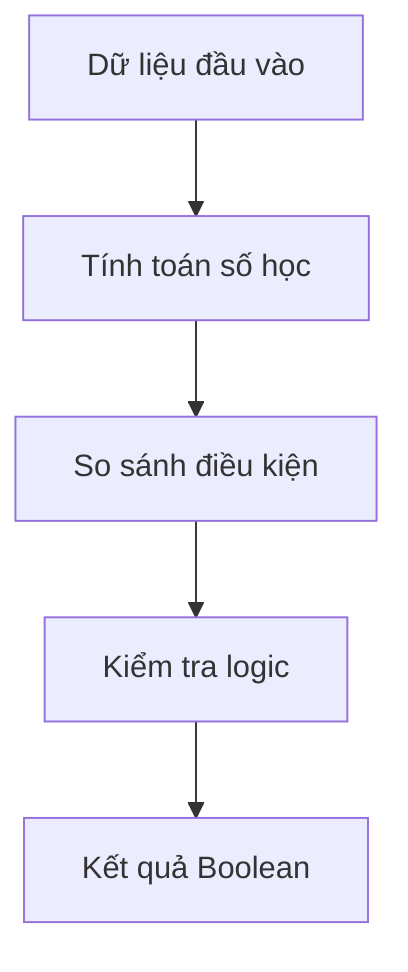

```markmap
# Toán tử và Biểu thức Logic trong Python

## 1. Mục tiêu & Ứng dụng Thực tế
- Hệ thống giỏ hàng
- Tính tiền tự động
- Xác thực đăng nhập
- Phân quyền người dùng
- Kiểm tra điều kiện

## 2. Luồng Thực thi & Biến đổi Dữ liệu (Execution Flowchart)
- Đầu vào dữ liệu
  - Biến đổi số học
  - So sánh điều kiện
  - Đánh giá logic
- Kết quả: Giá trị Boolean


## 3. Bản đồ Cú pháp & Mẫu Code (Syntax & Short Snippets)
### Toán tử số học
- Phép chia float `/`
  ```python
  x = 7 / 2
  ```
- Phép chia nguyên `//`
  ```python
  x = 7 // 2
  ```
- Phép chia dư `%`
  ```python
  x = 7 % 2
  ```
- Lũy thừa `**`
  ```python
  x = 2 ** 3
  ```
### Toán tử gán
- Gán tăng `+=`
  ```python
  count += 1
  ```
- Gán giảm `-=`
  ```python
  total -= 50
  ```
### Toán tử so sánh
- So sánh bằng `==`
  ```python
  check = a == b
  ```
- So sánh khác `!=`
  ```python
  check = a != b
  ```
### Toán tử logic
- Phép kết hợp `and`
  ```python
  valid = a > 0 and b < 10
  ```
- Phép phủ định `not`
  ```python
  flag = not True
  ```

## 4. Bảng Tra Nhanh & Mẹo Nhớ (Cheat-sheet & Memory Anchors)
### So sánh Cặp đôi Tương tự
- `=` vs `==`
  - `=`: Gán giá trị
  - `==`: So sánh bằng
- `/` vs `//`
  - `/`: Kết quả float
  - `//`: Kết quả int
- `and` vs `or`
  - `and`: Đúng tất cả
  - `or`: Đúng một phần
### Thứ tự Ưu tiên (Precedence Rules)
- Nấc 1: Ngoặc `()`
- Nấc 2: Lũy thừa `**`
- Nấc 3: Nhân chia `*`, `/`, `//`, `%`
- Nấc 4: Cộng trừ `+`, `-`
- Nấc 5: So sánh `==`, `!=`, `>`, `<`
- Nấc 6: Logic `not`, `and`, `or`

## 5. Bẫy Lỗi Thường Gặp & Ngoại lệ (Common Pitfalls & Gotchas)
- Nhầm `=` và `==` -> Dùng ngoặc kiểm tra
- Chia cho số 0 -> Lỗi ZeroDivisionError
- Chia `/` ra float -> Chuyển kiểu int()
- Ưu tiên toán tử -> Dùng cặp ngoặc `()`
- Đánh giá ngắn mạch -> Chú ý thứ tự `and`
```