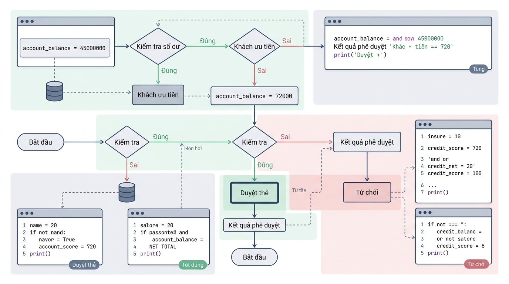

```markmap

# Toán tử Số học, Toán tử So sánh và Toán tử Logic trong Python

## Lesson 01 — Toán tử số học và Phép gán

### Khái niệm & Vai trò
- Định nghĩa ngắn gọn: Ký hiệu thực hiện phép tính toán học trên dữ liệu.
- Vai trò: Tính toán doanh thu, thuế, chia hằng số và xử lý số liệu.

### Cú pháp & Giải nghĩa
- Khai báo cú pháp chuẩn:
```

python
  total_amount = base_price * quantity + shipping_fee
  remainder = total_items % batch_size
  quotient = total_amount // divider
  power_val = base_number ** exponent

```- Giải thích thành phần:
  - `+`, `-`, `*`, `/`: Phép cộng, trừ, nhân, chia số thực float.
  - `//`, `%`: Phép chia lấy phần nguyên và phần dư int.
  - `**`: Phép tính lũy thừa mũ số học.

### Ví dụ thực hành
- Kịch bản áp dụng: Tính tổng tiền đơn hàng thương mại điện tử sau chiết khấu.
```

python
  item_price: int = 250000
  item_quantity: int = 3
  discount_rate: float = 0.1
  subtotal: float = item_price * item_quantity
  final_total: float = subtotal * (1 - discount_rate)
  print("Tổng tiền thanh toán: final_total)

```- Giải thích ví dụ: Nhân số lượng với đơn giá rồi trừ tỷ lệ chiết khấu.

### Lưu ý triển khai
- **Lỗi chia cho 0**: Phép chia cho 0 gây ra lỗi ZeroDivisionError.
- **Lưu ý định dạng**: Ép kiểu số nguyên int khi tính chỉ số phân trang.

## Lesson 02 — Toán tử so sánh

### Khái niệm & Vai trò
- Định nghĩa ngắn gọn: Ký hiệu so sánh hai giá trị, trả về boolean.
- Vai trò: Kiểm tra điều kiện nghiệp vụ như tuổi và số dư.

### Cú pháp & Giải nghĩa
- Khai báo cú pháp chuẩn:
```

python
  is_equal: bool = current_val == target_val
  is_not_equal: bool = status_code != 200
  is_greater_or_equal: bool = user_age >= 18

```- Giải thích thành phần:
  - `==`, `!=`: So sánh bằng và so sánh không bằng.
  - `>`, `<`, `>=`, `<=`: So sánh lớn hơn, nhỏ hơn, lớn hơn bằng, nhỏ hơn bằng.

### Ví dụ thực hành
- Kịch bản áp dụng: Kiểm tra độ tuổi người dùng đủ điều kiện giao dịch.
```

python
  user_age: int = 20
  required_age: int = 18
  is_adult: bool = user_age >= required_age
  print("Trạng thái đủ tuổi giao dịch: is_adult)

```- Giải thích ví dụ: So sánh tuổi người dùng với hạn mức 18 trả về boolean.

### Lưu ý triển khai
- **Nhầm lẫn giữa gán và so sánh**: Dùng `==` để so sánh, không dùng `=` phép gán.
- **Lưu ý định dạng**: Tránh so sánh trực tiếp số float do sai số làm tròn.

## Lesson 03 — Ứng dụng toán tử logic và Thứ tự ưu tiên tính toán

### Khái niệm & Vai trò
- Định nghĩa ngắn gọn: Kết hợp nhiều điều kiện và xác định thứ tự thực thi.
- Vai trò: Xây dựng bộ lọc điều kiện phức tạp trong kiểm duyệt hồ sơ.

### Cú pháp & Giải nghĩa
- Khai báo cú pháp chuẩn:
```

python
  is_valid: bool = (cond_a and cond_b) or not cond_c
  priority_result = (val_a + val_b) * val_c

```- Giải thích thành phần:
  - `and`: Trả về True khi tất cả điều kiện đều True.
  - `or`: Trả về True khi có ít nhất một điều kiện True.
  - `not`: Phủ định giá trị logic từ True thành False.
  - `()`: Cặp ngoặc đơn có độ ưu tiên cao nhất trong biểu thức.

### Ví dụ thực hành
- Kịch bản áp dụng: Phê duyệt hồ sơ phát hành thẻ tín dụng ngân hàng.
```

python
  account_balance: int = 45000000
  credit_score: int = 720
  is_priority_client: bool = True
  has_overdue_debt: bool = False

  is_eligible_group: bool = (account_balance >= 50000000) or is_priority_client
  is_score_qualified: bool = credit_score >= 700
  is_approved: bool = (is_eligible_group and is_score_qualified) and not has_overdue_debt
  print("Kết quả phê duyệt thẻ tín dụng: is_approved)

```- Giải thích ví dụ: Kết hợp điều kiện số dư, nhóm ưu tiên và lịch sử nợ.
- Min họa luồng đánh giá điều kiện:
  

### Lưu ý triển khai
- **Lỗi thiếu ngoặc đơn**: Tránh phụ thuộc vào ưu tiên mặc định gây sai logic.
- **Lưu ý định dạng**: Bao bọc dấu ngoặc đơn tường minh quanh biểu thức and/or.

## Liên kết hệ thống
- Mối quan hệ logic: Toán tử số học tính giá trị, toán tử so sánh tạo boolean, toán tử logic kết hợp boolean.
- Luồng dữ liệu xuyên suốt: Dữ liệu thô -> Phép tính số học -> Điều kiện so sánh -> Biểu thức logic -> Kết quả quyết định.
- Ứng dụng tổng hợp: Xây dựng hệ thống tự động thẩm định hồ sơ, phân loại khách hàng và tính tiền hóa đơn.
```
