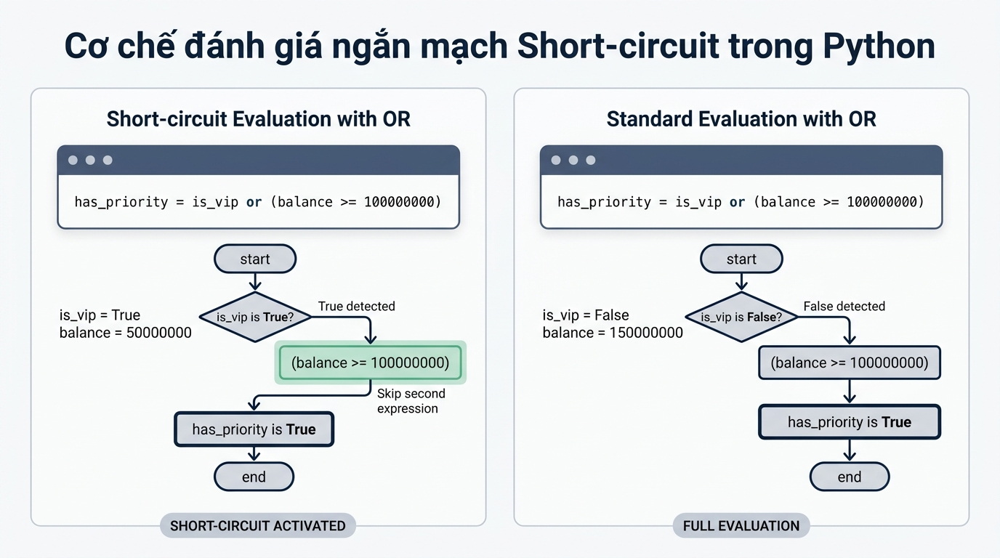

```markmap
# Toán tử số học, logic và Cấu trúc rẽ nhánh

## Mục tiêu bài học
- Vận dụng thành thạo các toán tử số học và toán tử logic trong Python.
- Thao tác thành thạo cấu trúc rẽ nhánh if, elif, else để điều hướng chương trình.
- Tối ưu hóa cấu trúc rẽ nhánh lồng nhau phức tạp thành biểu thức điều kiện gộp.
- Viết mã nguồn Python chuẩn quy cách PEP 8 về thụt lề và khoảng trắng.

## Đặt tình huống
- Xây dựng hệ thống tự động duyệt khoản vay 50,000,000 VND cho hồ sơ khách hàng.
- Cần kiểm tra đồng thời nhiều chỉ số: độ tuổi, thu nhập hàng tháng và điểm tín dụng.
- Viết điều kiện lồng nhau 4 cấp gây khó đọc, dễ phát sinh lỗi và vi phạm PEP 8.

## Toán tử số học và logic
### Toán tử số học
- Phép tính số học: cộng (+), trừ (-), nhân (*), chia (/), chia lấy nguyên (//), chia lấy dư (%), lũy thừa (**).
### Toán tử logic
- Kết hợp điều kiện: and (tất cả đúng), or (ít nhất một đúng), not (đảo ngược giá trị).
- Cơ chế Short-circuit: dừng đánh giá ngay khi kết quả biểu thức đã được xác định.

## Cấu trúc rẽ nhánh điều kiện
### Cú pháp if-elif-else
- Điều hướng luồng thực thi dựa trên kết quả của biểu thức điều kiện boolean.
  ```python
  if condition_1:
      # Thực thi khi condition_1 đúng
  elif condition_2:
      # Thực thi khi condition_2 đúng
  else:
      # Thực thi khi tất cả điều kiện sai
  ```
### Quy tắc luồng thực thi
- Kiểm tra điều kiện từ trên xuống dưới, chỉ thực thi duy nhất khối lệnh đúng đầu tiên.

## Tối ưu rẽ nhánh lồng nhau
### Bẫy lập trình rẽ nhánh sâu
- Viết điều kiện lồng nhau nhiều cấp (Pyramid of Doom) khiến mã nguồn phức tạp, khó bảo trì.
### Phương pháp gộp điều kiện
- Làm phẳng cấu trúc mã nguồn bằng cách nối các điều kiện độc lập bằng toán tử and.
  ```python
  if age >= 18 and age <= 60 and income >= 15000000 and credit_score >= 650:
      is_approved = True
  ```
### Trực quan hóa tối ưu rẽ nhánh


## Chuẩn hóa mã nguồn PEP 8
### Quy tắc thụt lề (Indentation)
- Quy chuẩn bắt buộc: Dùng đúng 4 khoảng trắng (spaces) cho mỗi cấp thụt lề, không dùng Phím Tab.
### Quy tắc khoảng trắng (Whitespace)
- Đặt 1 khoảng trắng xung quanh toán tử gán (=), so sánh (>=, <=, ==) và từ khóa logic.
### Đặt tên biến chuẩn Python
- Sử dụng quy tắc snake_case cho tên biến: age, income, credit_score, is_approved.
```