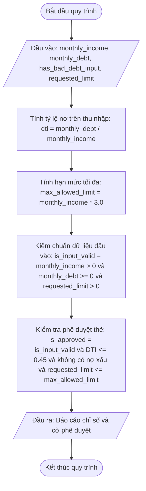

# <center>Tính toán Chỉ số và Đánh giá Hạn mức Thẻ Tín dụng</center>

### **1. Mục tiêu**
- **Kỹ năng cú pháp:** Sử dụng các kiểu dữ liệu nguyên thủy (`int`, `float`, `str`, `bool`) kết hợp Type Hints trong Python 3.12 tuân thủ chuẩn PEP 8.
- **Tư duy tính toán:** Vận dụng các toán tử số học (`+`, `-`, `*`, `/`) và toán tử logic (`and`, `or`, `not`) để tính toán chỉ số tài chính.
- **Tối ưu logic:** Thiết lập quy trình đánh giá điều kiện phê duyệt hoàn toàn bằng biểu thức Boolean và phép toán số học, tuyệt đối không sử dụng câu lệnh rẽ nhánh `if-else`.

---

### **2. Bối cảnh & Vấn đề**
Trong phân hệ thẩm định hồ sơ của ngân hàng số (Fintech Subsystem), việc đánh giá tính hợp lệ và phê duyệt hạn mức thẻ tín dụng bước đầu cần thực hiện nhanh chóng dựa trên thu nhập, nợ hiện tại và mức độ rủi ro lịch sử tín dụng.

Hệ thống cần tiếp nhận thông tin từ bàn phím, tính toán tỷ lệ nợ trên thu nhập (DTI), hạn mức tối đa cho phép, và xuất ra cờ trạng thái phê duyệt (Đúng/Sai) mà không cần rẽ nhánh thực thi mã nguồn.

#### **Sơ đồ luồng xử lý dữ liệu (Mermaid Flowchart)**



---

### **3. Yêu cầu bài toán**
Viết chương trình Python thực hiện các tác vụ sau:
1. Tạo file `credit_evaluator.py` trong môi trường ảo `virtualenv` Python 3.12.
2. Tiếp nhận dữ liệu đầu vào từ bàn phím thông qua hàm `input()` và ép kiểu dữ liệu chuẩn xác có khai báo Type Hints:
   - `monthly_income`: Thu nhập hàng tháng của khách hàng (VND - kiểu `float`).
   - `monthly_debt`: Chi phí trả nợ hàng tháng hiện tại (VND - kiểu `float`).
   - `has_bad_debt`: Trạng thái nợ xấu (nhập số nguyên: `1` là có nợ xấu, `0` là không có nợ xấu).
   - `requested_limit`: Hạn mức thẻ tín dụng mong muốn đề xuất (VND - kiểu `float`).
3. Thực hiện tính toán chỉ số tài chính và các cờ kiểm tra logic mà không sử dụng cấu trúc điều kiện `if-else`.
4. Hiển thị báo cáo chi tiết kết quả thẩm định ra màn hình console.

---

### **4. Quy tắc xử lý và Công thức**

- **Tính tỷ lệ nợ trên thu nhập DTI (`dti`):**
  `dti = monthly_debt / monthly_income`
- **Tính hạn mức tối đa cho phép (`max_allowed_limit`):**
  `max_allowed_limit = monthly_income * 3.0`
- **Kiểm chuẩn dữ liệu đầu vào (`is_input_valid`):**
  Dữ liệu hợp lệ khi thu nhập lớn hơn 0, chi phí nợ không âm và hạn mức đề xuất lớn hơn 0.
  `is_input_valid = (monthly_income > 0.0) and (monthly_debt >= 0.0) and (requested_limit > 0.0)`
- **Đánh giá phê duyệt hạn mức (`is_approved`):**
  Hồ sơ được phê duyệt khi dữ liệu hợp lệ, tỷ lệ DTI nhỏ hơn hoặc bằng 0.45 (45%), hoàn toàn không có nợ xấu (`has_bad_debt == 0`) và hạn mức mong muốn không vượt quá hạn mức tối đa cho phép.
  `is_approved = is_input_valid and (dti <= 0.45) and (has_bad_debt == 0) and (requested_limit <= max_allowed_limit)`

---

### **5. Ví dụ minh họa**

**Kịch bản 1: Hồ sơ hợp lệ và đạt điều kiện phê duyệt**
- **Đầu vào (Input):**

```text
  Nhập thu nhập hàng tháng (VND): 20000000
  Nhập chi phí trả nợ hàng tháng (VND): 5000000
  Có lịch sử nợ xấu không? (Nhập 1 nếu có, 0 nếu không): 0
  Nhập hạn mức thẻ mong muốn (VND): 45000000
```

- **Đầu ra (Output):**

```text
  === KẾT QUẢ THẨM ĐỊNH THẺ TÍN DỤNG ===
  Tỷ lệ nợ trên thu nhập (DTI): 25.00%
  Hạn mức tối đa cho phép: 60,000,000.0 VND
  Dữ liệu đầu vào hợp lệ: True
  Trạng thái phê duyệt thẻ: True
```

**Kịch bản 2: Hồ sơ bị từ chối do vượt hạn mức và có nợ xấu**
- **Đầu vào (Input):**

```text
  Nhập thu nhập hàng tháng (VND): 15000000
  Nhập chi phí trả nợ hàng tháng (VND): 8000000
  Có lịch sử nợ xấu không? (Nhập 1 nếu có, 0 nếu không): 1
  Nhập hạn mức thẻ mong muốn (VND): 50000000
```

- **Đầu ra (Output):**

```text
  === KẾT QUẢ THẨM ĐỊNH THẺ TÍN DỤNG ===
  Tỷ lệ nợ trên thu nhập (DTI): 53.33%
  Hạn mức tối đa cho phép: 45,000,000.0 VND
  Dữ liệu đầu vào hợp lệ: True
  Trạng thái phê duyệt thẻ: False
```

---

### **6. Yêu cầu nộp bài**
- Lưu toàn bộ mã nguồn xử lý vào file `credit_evaluator.py`.
- Đảm bảo mã nguồn tuân thủ PEP 8 và có đầy đủ type hints.
- Commit mã nguồn lên git:

```bash
  git add credit_evaluator.py
  git commit -m "feat: implement credit card limit evaluation without branching"
```
