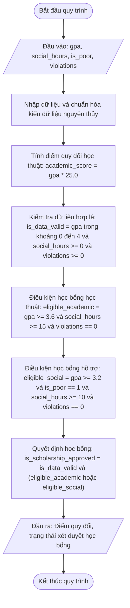

# <center>Hệ thống Đánh giá Điều kiện Học bổng Sinh viên</center>

### **1. Mục tiêu**
- **Kỹ năng cú pháp:** Sử dụng các toán tử so sánh (`>`, `<`, `>=`, `<=`, `==`) và các toán tử logic (`and`, `or`, `not`) trong Python 3.12.
- **Tư duy logic:** Rèn luyện khả năng biểu diễn các tiêu chí đánh giá phức tạp dưới dạng biểu thức Boolean đơn tuyến.
- **Ràng buộc phạm vi:** Thực hiện toàn bộ mã nguồn mà không sử dụng câu lệnh điều kiện rẽ nhánh `if-else`.

---

### **2. Bối cảnh & Vấn đề**
Phân hệ quản lý đào tạo của trường đại học cần lọc danh sách sinh viên đủ điều kiện nhận học bổng cuối kỳ. Học bổng được chia làm hai loại: Học bổng Học thuật (dành cho sinh viên xuất sắc) và Học bổng Hỗ trợ Khó khăn (dành cho sinh viên có hoàn cảnh khó khăn nhưng giữ vững học lực khá).

Chương trình cần nhận điểm trung bình tích lũy (GPA), số giờ hoạt động ngoại khóa, trạng thái gia đình nghèo và số lỗi kỷ luật từ bàn phím để tự động đánh giá quyền lợi học bổng của sinh viên.

#### **Sơ đồ luồng xử lý dữ liệu (Mermaid Flowchart)**



---

### **3. Yêu cầu bài toán**
Viết chương trình Python thực hiện các tác vụ sau:
1. Tạo file `scholarship_checker.py` trong môi trường ảo `virtualenv` Python 3.12.
2. Nhập các thông tin sau từ bàn phím:
   - `gpa`: Điểm trung bình tích lũy hệ 4.0 (`float`).
   - `social_hours`: Số giờ tham gia hoạt động ngoại khóa/tình nguyện (`int`).
   - `is_poor`: Xác nhận hộ nghèo/cận nghèo (nhập số nguyên: `1` nếu thuộc hộ nghèo, `0` nếu không).
   - `violations`: Số lần vi phạm quy chế hoặc bị kỷ luật (`int`).
3. Chuyển đổi và tính toán các cờ trạng thái logic, tuyệt đối không dùng lệnh `if-else`.
4. In ra báo cáo học bổng chi tiết.

---

### **4. Quy tắc xử lý và Công thức**

- **Tính điểm học thuật quy đổi hệ 100 (`academic_score`):**
  `academic_score = gpa * 25.0`
- **Kiểm chuẩn dữ liệu đầu vào (`is_data_valid`):**
  Dữ liệu hợp lệ khi GPA nằm trong khoảng từ 0.0 đến 4.0, số giờ hoạt động ngoại khóa không âm, số lần vi phạm không âm.
  `is_data_valid = (gpa >= 0.0) and (gpa <= 4.0) and (social_hours >= 0) and (violations >= 0)`
- **Đánh giá Học bổng Học thuật (`eligible_academic`):**
  GPA đạt từ 3.6 trở lên, số giờ hoạt động ngoại khóa đạt từ 15 giờ trở lên và hoàn toàn không vi phạm kỷ luật (`violations == 0`).
  `eligible_academic = (gpa >= 3.6) and (social_hours >= 15) and (violations == 0)`
- **Đánh giá Học bổng Hỗ trợ Khó khăn (`eligible_social`):**
  GPA đạt từ 3.2 trở lên, thuộc diện hộ nghèo (`is_poor == 1`), hoạt động ngoại khóa đạt từ 10 giờ trở lên và không vi phạm kỷ luật (`violations == 0`).
  `eligible_social = (gpa >= 3.2) and (is_poor == 1) and (social_hours >= 10) and (violations == 0)`
- **Quyết định cấp học bổng chung (`is_scholarship_approved`):**
  Sinh viên được nhận học bổng khi dữ liệu đầu vào hợp lệ và thỏa mãn ít nhất một trong hai loại học bổng trên.
  `is_scholarship_approved = is_data_valid and (eligible_academic or eligible_social)`

---

### **5. Ví dụ minh họa**

**Kịch bản 1: Sinh viên đạt học bổng học thuật**
- **Đầu vào (Input):**

```text
  Nhập điểm GPA (hệ 4.0): 3.8
  Nhập số giờ hoạt động tình nguyện: 18
  Gia đình có thuộc hộ nghèo? (Nhập 1 nếu đúng, 0 nếu không): 0
  Nhập số lần vi phạm kỷ luật: 0
```

- **Đầu ra (Output):**

```text
  === KẾT QUẢ XẾT DUYỆT HỌC BỔNG SINH VIÊN ===
  Điểm học thuật quy đổi: 95.0
  Đạt điều kiện học bổng học thuật: True
  Đạt điều kiện học bổng hỗ trợ khó khăn: False
  Đạt tiêu chuẩn nhận học bổng chung: True
```

**Kịch bản 2: Sinh viên không đạt học bổng do vi phạm kỷ luật**
- **Đầu vào (Input):**

```text
  Nhập điểm GPA (hệ 4.0): 3.9
  Nhập số giờ hoạt động tình nguyện: 20
  Gia đình có thuộc hộ nghèo? (Nhập 1 nếu đúng, 0 nếu không): 0
  Nhập số lần vi phạm kỷ luật: 1
```

- **Đầu ra (Output):**

```text
  === KẾT QUẢ XẾT DUYỆT HỌC BỔNG SINH VIÊN ===
  Điểm học thuật quy đổi: 97.5
  Đạt điều kiện học bổng học thuật: False
  Đạt điều kiện học bổng hỗ trợ khó khăn: False
  Đạt tiêu chuẩn nhận học bổng chung: False
```

---

### **6. Yêu cầu nộp bài**
- Lưu mã nguồn vào file `scholarship_checker.py`.
- Tuân thủ PEP 8 và đầy đủ type hints.
- Thực hiện git commit:

```bash
  git add scholarship_checker.py
  git commit -m "feat: implement scholarship evaluation system"
```
