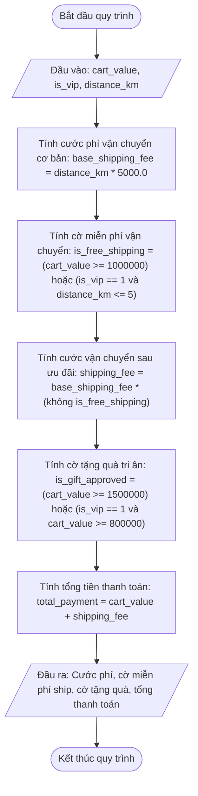

# <center>Đánh giá Điều kiện và Ưu đãi Đơn hàng E-Commerce</center>

### **1. Mục tiêu**
- **Toán tử so sánh & logic:** Áp dụng các toán tử so sánh và toán tử logic để kiểm tra các ngưỡng dữ liệu.
- **Lập trình phi rẽ nhánh:** Sử dụng toán tử logic để miễn trừ và giảm trừ phí giao hàng mà không cần câu lệnh `if-else`.
- **Thực hành PEP 8:** Viết mã nguồn sạch, tối ưu các biểu thức toán học.

---

### **2. Bối cảnh & Vấn đề**
Phân hệ thanh toán của sàn thương mại điện tử cần tính toán nhanh giá trị đơn hàng, kiểm tra điều kiện miễn phí vận chuyển (Free Shipping), kiểm tra điều kiện tặng quà tri ân (Gift Voucher) và áp dụng phí vận chuyển sau ưu đãi. 

Toàn bộ logic này cần được tích hợp trong một script xử lý tuần tự không sử dụng câu lệnh `if-else` để tối ưu tốc độ tính toán.

#### **Sơ đồ luồng xử lý dữ liệu (Mermaid Flowchart)**



---

### **3. Yêu cầu bài toán**
Viết chương trình Python thực hiện các tác vụ sau:
1. Tạo file `order_reward.py` trong môi trường ảo `virtualenv` Python 3.12.
2. Nhập các thông tin sau từ bàn phím:
   - `cart_value`: Tổng giá trị giỏ hàng trước chiết khấu (VND - `float`).
   - `is_vip`: Trạng thái VIP (nhập số nguyên: `1` nếu là VIP, `0` nếu là khách hàng thường).
   - `distance_km`: Khoảng cách giao hàng tính bằng ki-lô-mét (`float`).
3. Thực hiện tính toán các chỉ số và cờ ưu đãi mà không sử dụng câu lệnh điều kiện `if-else`.
4. In hóa đơn chi tiết hiển thị kết quả.

---

### **4. Quy tắc xử lý và Công thức**

- **Tính cước phí vận chuyển cơ bản (`base_shipping_fee`):**
  `base_shipping_fee = distance_km * 5000.0`
- **Đánh giá miễn phí vận chuyển (`is_free_shipping`):**
  Khách hàng được miễn phí giao hàng khi tổng giỏ hàng từ 1,000,000 VND trở lên, HOẶC khách hàng là VIP (`is_vip == 1`) và khoảng cách giao hàng nhỏ hơn hoặc bằng 5 km.
  `is_free_shipping = (cart_value >= 1000000.0) or ((is_vip == 1) and (distance_km <= 5.0))`
- **Tính cước phí vận chuyển thực tế sau ưu đãi (`shipping_fee`):**
  Nếu `is_free_shipping` là `True`, phí vận chuyển bằng 0. Ngược lại, phí vận chuyển bằng `base_shipping_fee`.
  *Công thức tính toán không dùng if-else:*
  `shipping_fee = base_shipping_fee * (not is_free_shipping)`
  *(Trong Python, biểu thức logic nhân với số thực sẽ tự động chuyển đổi: True thành 1.0 và False thành 0.0).*
- **Đánh giá tặng voucher quà tặng (`is_gift_approved`):**
  Khách hàng được tặng quà tri ân khi tổng giỏ hàng từ 1,500,000 VND trở lên, HOẶC khách hàng là VIP (`is_vip == 1`) và tổng giỏ hàng đạt từ 800,000 VND trở lên.
  `is_gift_approved = (cart_value >= 1500000.0) or ((is_vip == 1) and (cart_value >= 800000.0))`
- **Tính toán tổng tiền thanh toán (`total_payment`):**
  `total_payment = cart_value + shipping_fee`

---

### **5. Ví dụ minh họa**

**Kịch bản 1: Khách hàng VIP được ưu đãi vận chuyển**
- **Đầu vào (Input):**

```text
  Nhập tổng giá trị giỏ hàng (VND): 900000
  Khách hàng có phải VIP? (Nhập 1 nếu đúng, 0 nếu không): 1
  Nhập khoảng cách giao hàng (km): 4.5
```

- **Đầu ra (Output):**

```text
  === HÓA ĐƠN ƯU ĐÃI ĐƠN HÀNG E-COMMERCE ===
  Cước phí vận chuyển cơ bản: 22,500.0 VND
  Miễn phí vận chuyển: True
  Cước phí vận chuyển thực tế: 0.0 VND
  Được nhận quà tặng tri ân: True
  -----------------------------------------
  TỔNG TIỀN THANH TOÁN: 900,000.0 VND
```

**Kịch bản 2: Khách hàng thường mua đơn hàng nhỏ**
- **Đầu vào (Input):**

```text
  Nhập tổng giá trị giỏ hàng (VND): 450000
  Khách hàng có phải VIP? (Nhập 1 nếu đúng, 0 nếu không): 0
  Nhập khoảng cách giao hàng (km): 3.0
```

- **Đầu ra (Output):**

```text
  === HÓA ĐƠN ƯU ĐÃI ĐƠN HÀNG E-COMMERCE ===
  Cước phí vận chuyển cơ bản: 15,000.0 VND
  Miễn phí vận chuyển: False
  Cước phí vận chuyển thực tế: 15,000.0 VND
  Được nhận quà tặng tri ân: False
  -----------------------------------------
  TỔNG TIỀN THANH TOÁN: 465,000.0 VND
```

---

### **6. Yêu cầu nộp bài**
- Lưu mã nguồn vào file `order_reward.py`.
- Tuân thủ PEP 8 và khai báo đầy đủ type hints.
- Thực hiện git commit:

```bash
  git add order_reward.py
  git commit -m "feat: implement ecommerce reward calculator"
```
