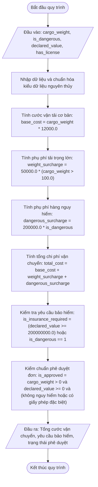

## <center>Thẩm định Hợp lệ và Đánh giá Rủi ro Vận chuyển Logistics</center>

### **1. Mục tiêu**
- **Toán tử logic & Số học:** Kết hợp các toán tử so sánh, logic và toán tử số học để giải quyết bài toán kiểm chuẩn đầu vào và tính toán chi phí vận chuyển hàng hóa.
- **Tư duy biên dịch logic:** Chuyển đổi các phát biểu nghiệp vụ có tính điều kiện thành các biểu thức số học không dùng nhánh điều kiện rẽ nhánh `if-else`.
- **Tiêu chuẩn mã nguồn:** Sử dụng Type Hints đầy đủ cho kiểu dữ liệu nguyên thủy, tuân thủ PEP 8.

---

### **2. Vấn đề**
Một đơn vị vận tải logistics cần đánh giá nhanh tính hợp lệ của kiện hàng gửi, tự động xác định yêu cầu mua bảo hiểm hàng hóa, tính toán tổng chi phí vận tải cơ bản kèm phụ phí trọng lượng và phụ phí hàng hóa nguy hiểm để đưa ra trạng thái phê duyệt vận chuyển.

Toàn bộ quy trình tính toán và kiểm tra này cần được triển khai bằng các biểu thức đơn tuyến tuần tự để đảm bảo hiệu suất tính toán.

#### **Sơ đồ luồng xử lý dữ liệu (Mermaid Flowchart)**



---

### **3. Yêu cầu bài toán**
Viết chương trình Python thực hiện các tác vụ sau:
1. Tạo file `cargo_evaluator.py` trong môi trường ảo `virtualenv` Python 3.12.
2. Nhập các tham số kiện hàng từ bàn phím:
   - `cargo_weight`: Trọng lượng hàng hóa tính bằng kg (`float`).
   - `is_dangerous`: Xác nhận hàng nguy hiểm/hóa chất (nhập số nguyên: `1` nếu nguy hiểm, `0` nếu an toàn).
   - `declared_value`: Giá trị khai báo hàng hóa (VND - `float`).
   - `has_license`: Xác nhận có giấy phép vận chuyển đặc biệt (nhập số nguyên: `1` nếu có, `0` nếu không).
3. Triển khai logic tính toán chi phí và cờ phê duyệt mà không sử dụng câu lệnh rẽ nhánh `if-else`.
4. Xuất kết quả chi tiết hóa đơn và thẩm định ra màn hình console.

---

### **4. Quy tắc xử lý và Công thức**

- **Tính toán chi phí vận chuyển:**
  - Cước cơ bản: `base_cost = cargo_weight * 12000.0`
  - Phụ phí trọng lượng lớn (nếu trọng lượng > 100 kg thì phụ thu cố định 50,000 VND, ngược lại phụ thu bằng 0):
    `weight_surcharge = 50000.0 * (cargo_weight > 100.0)`
  - Phụ phí hàng nguy hiểm (nếu hàng nguy hiểm thì phụ thu cố định 200,000 VND, ngược lại phụ thu bằng 0):
    `dangerous_surcharge = 200000.0 * (is_dangerous == 1)`
  - Tổng chi phí vận chuyển:
    `total_cost = base_cost + weight_surcharge + dangerous_surcharge`
- **Đánh giá yêu cầu bắt buộc mua bảo hiểm (`is_insurance_required`):**
  Yêu cầu mua bảo hiểm khi hàng hóa là hàng nguy hiểm (`is_dangerous == 1`) HOẶC giá trị khai báo từ 200,000,000 VND trở lên.
  `is_insurance_required = (declared_value >= 200000000.0) or (is_dangerous == 1)`
- **Kiểm chuẩn phê duyệt vận chuyển (`is_approved`):**
  Đơn hàng được phê duyệt vận chuyển khi trọng lượng lớn hơn 0, giá trị khai báo không âm và thỏa mãn: hàng hóa không phải là hàng nguy hiểm (`is_dangerous == 0`), HOẶC nếu là hàng nguy hiểm thì bắt buộc phải có giấy phép vận chuyển đặc biệt (`has_license == 1`).
  `is_approved = (cargo_weight > 0.0) and (declared_value >= 0.0) and ((is_dangerous == 0) or (has_license == 1))`

---

### **5. Ví dụ minh họa**

**Kịch bản 1: Hàng nguy hiểm có đầy đủ giấy phép vận chuyển**
- **Đầu vào (Input):**
  ```text
  Nhập trọng lượng hàng hóa (kg): 80
  Hàng hóa có nguy hiểm/dễ cháy không? (Nhập 1 nếu đúng, 0 nếu không): 1
  Nhập giá trị khai báo (VND): 150000000
  Có giấy phép vận chuyển đặc biệt không? (Nhập 1 nếu đúng, 0 nếu không): 1
  ```
- **Đầu ra (Output):**
  ```text
  === KẾT QUẢ ĐÁNH GIÁ VẬN CHUYỂN LOGISTICS ===
  Cước phí vận chuyển cơ bản: 960,000.0 VND
  Phụ phí trọng lượng lớn: 0.0 VND
  Phụ phí hàng hóa nguy hiểm: 200,000.0 VND
  -------------------------------------------
  TỔNG CHI PHÍ VẬN CHUYỂN: 1,160,000.0 VND
  Yêu cầu bắt buộc mua bảo hiểm: True
  Trạng thái phê duyệt vận chuyển: True
  ```

**Kịch bản 2: Hàng nguy hiểm bị từ chối do thiếu giấy phép vận chuyển**
- **Đầu vào (Input):**
  ```text
  Nhập trọng lượng hàng hóa (kg): 120
  Hàng hóa có nguy hiểm/dễ cháy không? (Nhập 1 nếu đúng, 0 nếu không): 1
  Nhập giá trị khai báo (VND): 200000000
  Có giấy phép vận chuyển đặc biệt không? (Nhập 1 nếu đúng, 0 nếu không): 0
  ```
- **Đầu ra (Output):**
  ```text
  === KẾT QUẢ ĐÁNH GIÁ VẬN CHUYỂN LOGISTICS ===
  Cước phí vận chuyển cơ bản: 1,440,000.0 VND
  Phụ phí trọng lượng lớn: 50,000.0 VND
  Phụ phí hàng hóa nguy hiểm: 200,000.0 VND
  -------------------------------------------
  TỔNG CHI PHÍ VẬN CHUYỂN: 1,690,000.0 VND
  Yêu cầu bắt buộc mua bảo hiểm: True
  Trạng thái phê duyệt vận chuyển: False
  ```

---

### **6. Yêu cầu nộp bài**
- Lưu mã nguồn vào file `cargo_evaluator.py`.
- Tuân thủ PEP 8 và khai báo đầy đủ type hints.
- Thực hiện git commit:
  ```bash
  git add cargo_evaluator.py
  git commit -m "feat: implement cargo risk and shipping cost evaluator"
  ```
