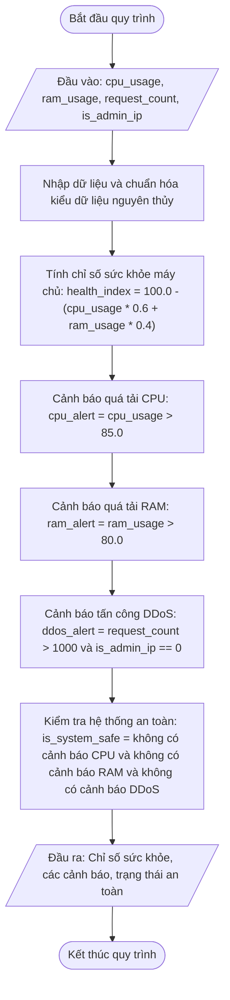

# <center>Mô phỏng Điểm An toàn Hệ thống và Kích hoạt Cảnh báo</center>

### **1. Mục tiêu**
- **Toán tử logic & So sánh:** Vận dụng thành thạo toán tử so sánh (`>`) và toán tử logic (`and`, `not`) để phát hiện các bất thường hệ thống.
- **Biểu thức số học phức tạp:** Sử dụng các phép toán số học trọng số để tính toán chỉ số hiệu năng tổng hợp.
- **Kiến thức phi rẽ nhánh:** Tính toán cờ an toàn tổng thể hoàn toàn bằng logic Boolean, không sử dụng cấu trúc `if-else`.

---

### **2. Bối cảnh & Vấn đề**
Trong phân hệ giám sát hạ tầng máy chủ (System Monitoring Subsystem), hệ thống cần liên tục kiểm chuẩn các chỉ số tải phần cứng bao gồm: tỷ lệ sử dụng CPU, tỷ lệ sử dụng RAM và tần suất số lượng yêu cầu truy cập (Request Rate) trong 1 giây nhằm phát hiện sớm nguy cơ quá tải hoặc các cuộc tấn công từ chối dịch vụ (DDoS).

Chương trình cần tiếp nhận các tham số phần cứng từ bàn phím, tính toán chỉ số sức khỏe của máy chủ, kiểm tra các điều kiện cảnh báo, và xuất ra cờ báo động an toàn máy chủ mà không rẽ nhánh thực thi.

#### **Sơ đồ luồng xử lý dữ liệu (Mermaid Flowchart)**



---

### **3. Yêu cầu bài toán**
Viết chương trình Python thực hiện các tác vụ sau:
1. Tạo file `system_guard.py` trong môi trường ảo `virtualenv` Python 3.12.
2. Nhập các tham số tài nguyên từ bàn phím:
   - `cpu_usage`: Tỷ lệ sử dụng CPU từ 0 đến 100% (`float`).
   - `ram_usage`: Tỷ lệ sử dụng RAM từ 0 đến 100% (`float`).
   - `request_count`: Số lượng request gửi đến máy chủ trong 1 giây (`int`).
   - `is_admin_ip`: Xác nhận IP của quản trị viên hệ thống (nhập số nguyên: `1` nếu đúng là IP quản trị, `0` nếu là IP công cộng).
3. Triển khai logic tính toán chỉ số sức khỏe máy chủ và các cờ cảnh báo an toàn mà không sử dụng câu lệnh rẽ nhánh `if-else`.
4. In báo cáo giám sát chi tiết hệ thống ra màn hình console.

---

### **4. Quy tắc xử lý và Công thức**

- **Tính chỉ số sức khỏe máy chủ (`health_index`):**
  Công thức tính chỉ số sức khỏe (phần trăm khả dụng):
  `health_index = 100.0 - (cpu_usage * 0.6 + ram_usage * 0.4)`
- **Đánh giá các cờ cảnh báo rủi ro:**
  - Cảnh báo quá tải CPU (`cpu_alert`): `True` khi CPU sử dụng lớn hơn 85%, ngược lại `False`.
    `cpu_alert = cpu_usage > 85.0`
  - Cảnh báo quá tải RAM (`ram_alert`): `True` khi RAM sử dụng lớn hơn 80%, ngược lại `False`.
    `ram_alert = ram_usage > 80.0`
  - Nghi ngờ tấn công DDoS (`ddos_alert`): `True` khi số lượng request trong 1 giây lớn hơn 1000 request và IP gửi yêu cầu không phải là IP của quản trị viên hệ thống (`is_admin_ip == 0`).
    `ddos_alert = (request_count > 1000) and (is_admin_ip == 0)`
- **Đánh giá trạng thái an toàn của máy chủ (`is_system_safe`):**
  Máy chủ được đánh giá là an toàn (`True`) khi đồng thời: không xảy ra cảnh báo quá tải CPU, không xảy ra cảnh báo quá tải RAM và không bị cảnh báo tấn công DDoS.
  `is_system_safe = (not cpu_alert) and (not ram_alert) and (not ddos_alert)`

---

### **5. Ví dụ minh họa**

**Kịch bản 1: Hệ thống hoạt động bình thường, an toàn**
- **Đầu vào (Input):**

```text
  Nhập tỷ lệ sử dụng CPU (%): 45.5
  Nhập tỷ lệ sử dụng RAM (%): 60.0
  Nhập số lượng request/giây: 150
  Có phải truy cập từ IP quản trị? (Nhập 1 nếu đúng, 0 nếu không): 0
```

- **Đầu ra (Output):**

```text
  === HỆ THỐNG GIÁM SÁT MÁY CHỦ AUTO-GUARD ===
  Chỉ số sức khỏe máy chủ (Health Index): 48.70%
  Cảnh báo quá tải CPU: False
  Cảnh báo quá tải RAM: False
  Nghi ngờ tấn công DDoS: False
  Trạng thái hệ thống AN TOÀN: True
```

**Kịch bản 2: Hệ thống quá tải RAM và nghi ngờ có tấn công DDoS**
- **Đầu vào (Input):**

```text
  Nhập tỷ lệ sử dụng CPU (%): 75.0
  Nhập tỷ lệ sử dụng RAM (%): 88.0
  Nhập số lượng request/giây: 1200
  Có phải truy cập từ IP quản trị? (Nhập 1 nếu đúng, 0 nếu không): 0
```

- **Đầu ra (Output):**

```text
  === HỆ THỐNG GIÁM SÁT MÁY CHỦ AUTO-GUARD ===
  Chỉ số sức khỏe máy chủ (Health Index): 19.80%
  Cảnh báo quá tải CPU: False
  Cảnh báo quá tải RAM: True
  Nghi ngờ tấn công DDoS: True
  Trạng thái hệ thống AN TOÀN: False
```

---

### **6. Yêu cầu nộp bài**
- Lưu mã nguồn vào file `system_guard.py`.
- Tuân thủ PEP 8 và khai báo đầy đủ type hints.
- Thực hiện git commit:

```bash
  git add system_guard.py
  git commit -m "feat: implement system security health monitor"
```
