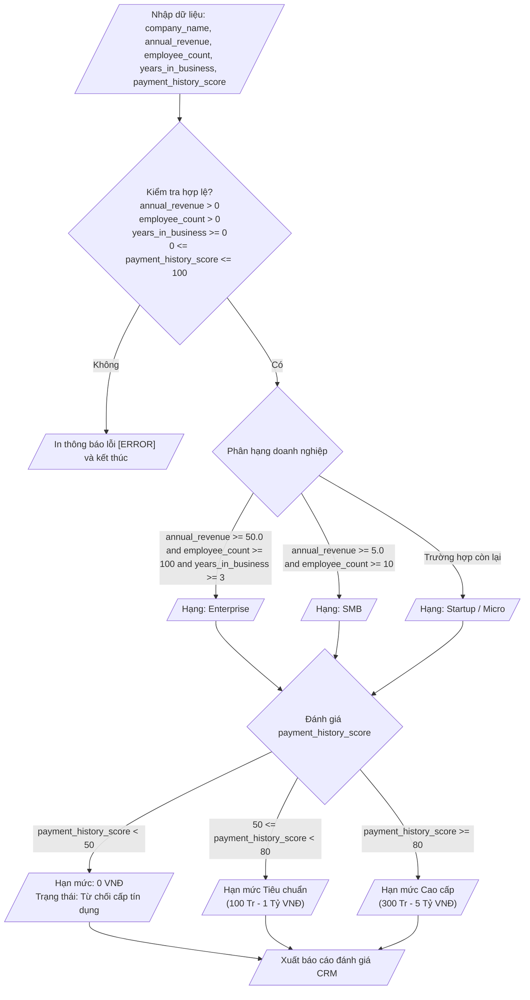

## <center>Xây dựng Module Phân loại và Đánh giá Hạn mức Tín dụng Khách hàng CRM</center>

### **1. Mục tiêu**
- **Kiến thức**: Hiểu và vận dụng thành thạo cấu trúc rẽ nhánh nhị phân `if-else`, rẽ nhánh nhiều trường hợp `if-elif-else` và rẽ nhánh lồng nhau trong Python 3.12.
- **Kỹ năng**: Thực hành nhận dữ liệu từ bàn phím bằng `input()`, thực hiện ép kiểu dữ liệu ép buộc (`float()`, `int()`), và kết hợp các toán tử logic (`and`, `or`, `not`) để kiểm chuẩn dữ liệu đầu vào.
- **Nghiệp vụ CRM**: Xây dựng thuật toán phân loại quy mô doanh nghiệp và xác định hạn mức tín dụng tự động cho phân hệ Quản lý Khách hàng Doanh nghiệp (CRM Management Subsystem).

### **2. Vấn đề**
Trong các hệ thống CRM quản lý khách hàng B2B, việc tự động hóa quá trình đánh giá năng lực tài chính và phân cấp hạn mức tín dụng giúp doanh nghiệp giảm thiểu rủi ro vận hành. Nhân viên kinh doanh cần nhập thông tin của doanh nghiệp đối tác gồm: tên doanh nghiệp, doanh thu hàng năm (tỷ VNĐ), số lượng nhân sự, số năm hoạt động và điểm lịch sử thanh toán.

Chương trình cần kiểm tra tính hợp lệ của dữ liệu đầu vào, thực hiện phân hạng doanh nghiệp (`Enterprise`, `SMB`, `Startup / Micro`) và tính toán hạn mức tín dụng được phê duyệt dựa trên các quy tắc rẽ nhánh nghiệp vụ.

Sơ đồ luồng xử lý dữ liệu của hệ thống được thể hiện như sau:



### **3. Yêu cầu bài toán**
Viết chương trình Python trong file `main.py` thực hiện các yêu cầu sau:

1. Khởi tạo và nhận thông tin đầu vào từ console cho 5 tham số được mô tả chi tiết trong bảng dưới đây:

<table width="100%">
    <thead>
        <tr>
            <th width="20%">Tên biến</th>
            <th width="20%">Kiểu dữ liệu</th>
            <th width="60%">Mô tả chi tiết</th>
        </tr>
    </thead>
    <tbody>
        <tr>
            <td><code>company_name</code></td>
            <td><code>str</code></td>
            <td>Tên công ty hoặc tổ chức khách hàng trong hệ thống CRM</td>
        </tr>
        <tr>
            <td><code>annual_revenue</code></td>
            <td><code>float</code></td>
            <td>Doanh thu hàng năm của doanh nghiệp (đơn vị: Tỷ VNĐ)</td>
        </tr>
        <tr>
            <td><code>employee_count</code></td>
            <td><code>int</code></td>
            <td>Tổng số lượng nhân viên hợp đồng chính thức</td>
        </tr>
        <tr>
            <td><code>years_in_business</code></td>
            <td><code>float</code></td>
            <td>Số năm doanh nghiệp đã đăng ký hoạt động chính thức</td>
        </tr>
        <tr>
            <td><code>payment_history_score</code></td>
            <td><code>int</code></td>
            <td>Điểm đánh giá lịch sử thanh toán (thang điểm từ 0 đến 100)</td>
        </tr>
    </tbody>
</table>

2. **Kịch bản ví dụ minh họa (Sample Input / Output)**:

**Kịch bản 1: Nhập dữ liệu hợp lệ - Khách hàng đạt xếp hạng Enterprise**
```text
=== CRM BUSINESS EVALUATION SYSTEM ===
Nhập tên doanh nghiệp: Cong ty Co phan Cong nghe ABC
Nhập doanh thu hàng năm (tỷ VNĐ): 75.5
Nhập số lượng nhân viên: 150
Nhập số năm hoạt động: 5
Nhập điểm lịch sử thanh toán (0-100): 85

----------------------------------------
[BÁO CÁO ĐÁNH GIÁ TÍN DỤNG KHÁCH HÀNG CRM]
Tên doanh nghiệp       : Cong ty Co phan Cong nghe ABC
Phân hạng Khách hàng   : Enterprise
Điểm lịch sử thanh toán: 85/100
Hạn mức tín dụng       : 5,000,000,000 VNĐ
Trạng thái phê duyệt   : Phê duyệt Tín dụng Cao cấp
----------------------------------------
```

**Kịch bản 2: Nhập dữ liệu không hợp lệ (Doanh thu không thỏa mãn điều kiện)**
```text
=== CRM BUSINESS EVALUATION SYSTEM ===
Nhập tên doanh nghiệp: Cong ty TNHH Giai phap XYZ
Nhập doanh thu hàng năm (tỷ VNĐ): -10.0
Nhập số lượng nhân viên: 20
Nhập số năm hoạt động: 2
Nhập điểm lịch sử thanh toán (0-100): 70

[ERROR] Doanh thu hàng năm phải lớn hơn 0 tỷ VNĐ. Chương trình dừng xử lý!
```

### **4. Quy tắc xử lý**

Yêu cầu 1: Kiểm chuẩn dữ liệu đầu vào (Data Validation)
- Điều kiện hợp lệ:
  - `annual_revenue > 0`
  - `employee_count > 0`
  - `years_in_business >= 0`
  - `0 <= payment_history_score <= 100`
- Nếu phát hiện bất kỳ thông số nào vi phạm quy tắc trên, chương trình phải in thông báo lỗi tương ứng có tiền tố `[ERROR]` và dừng toàn bộ luồng tính toán phía sau.

Yêu cầu 2: Quy tắc Phân hạng Doanh nghiệp (Business Tier Classification)
- **Hạng Enterprise**: Khi thỏa mãn đồng thời `annual_revenue >= 50.0`, `employee_count >= 100` và `years_in_business >= 3.0`.
- **Hạng SMB (Small & Medium Business)**: Không đạt hạng `Enterprise`, nhưng thỏa mãn đồng thời `annual_revenue >= 5.0` và `employee_count >= 10`.
- **Hạng Startup / Micro**: Tất cả các trường hợp dữ liệu hợp lệ còn lại.

Yêu cầu 3: Quy tắc Đánh giá Trạng thái & Hạn mức Tín dụng (Credit Scoring)
- Nếu `payment_history_score < 50`:
  - Hạn mức tín dụng: `0` VNĐ.
  - Trạng thái phê duyệt: `"Từ chối cấp tín dụng (Rủi ro thanh toán cao)"`.
- Nếu `50 <= payment_history_score < 80`:
  - Hạng `Enterprise`: Hạn mức tín dụng = `1000000000` VNĐ (1 Tỷ VNĐ), Trạng thái = `"Phê duyệt Tín dụng Tiêu chuẩn"`.
  - Hạng `SMB`: Hạn mức tín dụng = `500000000` VNĐ (500 Triệu VNĐ), Trạng thái = `"Phê duyệt Tín dụng Tiêu chuẩn"`.
  - Hạng `Startup / Micro`: Hạn mức tín dụng = `100000000` VNĐ (100 Triệu VNĐ), Trạng thái = `"Phê duyệt Tín dụng Hạn chế"`.
- Nếu `payment_history_score >= 80`:
  - Hạng `Enterprise`: Hạn mức tín dụng = `5000000000` VNĐ (5 Tỷ VNĐ), Trạng thái = `"Phê duyệt Tín dụng Cao cấp"`.
  - Hạng `SMB`: Hạn mức tín dụng = `2000000000` VNĐ (2 Tỷ VNĐ), Trạng thái = `"Phê duyệt Tín dụng Mở rộng"`.
  - Hạng `Startup / Micro`: Hạn mức tín dụng = `300000000` VNĐ (300 Triệu VNĐ), Trạng thái = `"Phê duyệt Tín dụng Tiêu chuẩn"`.

Yêu cầu 4: Định dạng hiển thị và Chuẩn mực mã nguồn PEP 8
- Tên biến tuân thủ đúng chuẩn `snake_case`.
- Thụt lề chuẩn 4 khoảng trắng cho các khối lệnh bên trong cấu trúc `if-elif-else`.
- Kết hợp hợp lý các toán tử logic `and`, `or`, `not` để tối ưu hóa điều kiện rẽ nhánh.

### **5. Yêu cầu nộp bài**
- Cấu trúc thư mục bài nộp trên repository Git:
  ```text
  crm_lead_evaluator/
  └── main.py
  ```
- Chạy kiểm thử chương trình qua Terminal:
  ```bash
  python main.py
  ```
- Đẩy toàn bộ mã nguồn lên repository cá nhân và nộp liên kết theo hướng dẫn.