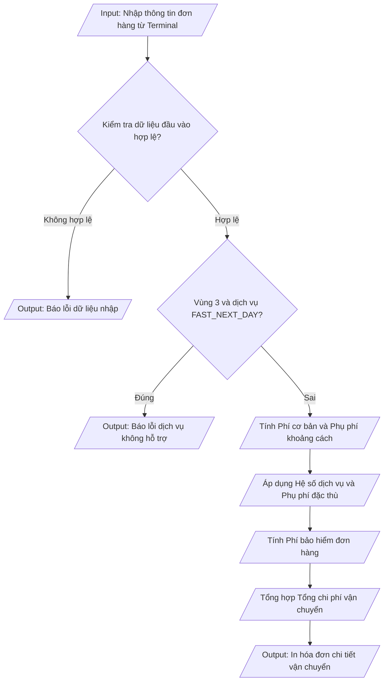

## <center>Tính Phí Vận Chuyển và Xử Lý Logic Đơn Hàng Logistics</center>

### **1. Mục tiêu**
- Hiểu và áp dụng thành thạo cấu trúc rẽ nhánh `if`, `elif`, `else` và rẽ nhánh lồng nhau trong Python 3.12.
- Kết hợp linh hoạt các toán tử so sánh (`>`, `<`, `>=`, `<=`, `==`, `!=`) và toán tử logic (`and`, `or`, `not`) để giải quyết các điều kiện kinh doanh thực tế.
- Thực hiện kiểm chuẩn dữ liệu đầu vào (Data Validation) nhận từ bàn phím bằng hàm `input()` và thực hiện ép kiểu bắt buộc (`float()`, `int()`, `str()`).
- Tuân thủ chuẩn định dạng mã nguồn PEP 8 về quy tắc đặt tên biến (`snake_case`), thụt lề (indentation) và tổ chức mã nguồn sạch.

### **2. Vấn đề**
Bộ phận Vận hành của công ty Logistics LogiFast đang cần triển khai một công cụ tính cước phí tự động và kiểm soát điều kiện tuyến đường trước khi lập hóa đơn cho khách hàng. Hệ thống cần xử lý các thông số của kiện hàng bao gồm: trọng lượng, khoảng cách vận chuyển, loại hình dịch vụ, khu vực địa lý, tính chất hàng hóa dễ vỡ và giá trị niêm yết của đơn hàng.

Quy trình tính toán và kiểm duyệt logic được mô tả sơ đồ dữ liệu sau:



### **3. Yêu cầu bài toán**
Xây dựng một chương trình Python thực thi trên Terminal/Console để tính toán cước phí vận chuyển cho một đơn hàng dựa trên các thông số đầu vào được cung cấp bởi người dùng.

Bảng các thông số đầu vào cần thu thập từ bàn phím:

<table width="100%">
  <thead>
    <tr>
      <th width="20%">Tên biến</th>
      <th width="15%">Kiểu dữ liệu</th>
      <th width="45%">Mô tả chi tiết</th>
      <th width="20%">Ví dụ đầu vào</th>
    </tr>
  </thead>
  <tbody>
    <tr>
      <td><code>trong_luong</code></td>
      <td><code>float</code></td>
      <td>Trọng lượng của kiện hàng (đơn vị: kg)</td>
      <td><code>3.5</code></td>
    </tr>
    <tr>
      <td><code>khoang_cach</code></td>
      <td><code>float</code></td>
      <td>Khoảng cách giao hàng từ kho tới đích (đơn vị: km)</td>
      <td><code>25.0</code></td>
    </tr>
    <tr>
      <td><code>loai_dich_vu</code></td>
      <td><code>str</code></td>
      <td>Gói dịch vụ chọn: <code>STANDARD</code>, <code>EXPRESS</code>, <code>FAST_NEXT_DAY</code></td>
      <td><code>EXPRESS</code></td>
    </tr>
    <tr>
      <td><code>vung_giao_hang</code></td>
      <td><code>int</code></td>
      <td>Mã vùng địa lý (<code>1</code>: Nội thành, <code>2</code>: Ngoại thành, <code>3</code>: Hải đảo/Vùng sâu)</td>
      <td><code>2</code></td>
    </tr>
    <tr>
      <td><code>hang_de_vo</code></td>
      <td><code>str</code></td>
      <td>Trạng thái hàng dễ vỡ (<code>Y</code>: Có, <code>N</code>: Không)</td>
      <td><code>Y</code></td>
    </tr>
    <tr>
      <td><code>gia_tri_hang</code></td>
      <td><code>float</code></td>
      <td>Giá trị niêm yết của đơn hàng (đơn vị: VNĐ)</td>
      <td><code>4500000.0</code></td>
    </tr>
  </tbody>
</table>

### **4. Quy tắc xử lý**

Chương trình cần thực hiện tính toán và kiểm tra dữ liệu qua từng yêu cầu cụ thể như sau:

Yêu cầu 1: Kiểm chuẩn dữ liệu đầu vào (Data Validation)
- `trong_luong` phải lớn hơn 0.
- `khoang_cach` phải lớn hơn 0.
- `gia_tri_hang` phải lớn hơn hoặc bằng 0.
- `vung_giao_hang` phải là một trong các số `1`, `2`, hoặc `3`.
- `loai_dich_vu` phải là một trong các chuỗi `"STANDARD"`, `"EXPRESS"`, hoặc `"FAST_NEXT_DAY"`.
- Nếu bất kỳ điều kiện nào bị vi phạm, chương trình in thông báo lỗi: `[ERROR] Dữ liệu đầu vào không hợp lệ! Vui lòng kiểm tra lại số liệu.` và dừng thực thi các bước sau.

Yêu cầu 2: Ràng buộc logic nghiệp vụ đặc thù
- Khu vực Hải đảo/Vùng sâu (`vung_giao_hang == 3`) hiện chưa hỗ trợ giao hàng hỏa tốc trong ngày (`loai_dich_vu == "FAST_NEXT_DAY"`).
- Nếu phát hiện trường hợp này, chương trình in thông báo lỗi: `[ERROR] Dịch vụ FAST_NEXT_DAY không áp dụng cho khu vực Hải đảo / Vùng sâu (Vùng 3)!` và dừng thực thi.

Yêu cầu 3: Tính Phí cơ bản (`phi_co_ban`)
- Trọng lượng `<= 2.0 kg`: `phi_co_ban = 15000.0` VNĐ.
- Trọng lượng `> 2.0 kg` và `<= 5.0 kg`: `phi_co_ban = 15000.0 + (trong_luong - 2.0) * 5000.0` VNĐ.
- Trọng lượng `> 5.0 kg`: `phi_co_ban = 30000.0 + (trong_luong - 5.0) * 8000.0` VNĐ.

Yêu cầu 4: Tính Phụ phí khoảng cách (`phi_khoang_cach`)
- Khoảng cách `<= 10.0 km`: `phi_khoang_cach = 0.0` VNĐ.
- Khoảng cách `> 10.0 km` và `<= 50.0 km`: `phi_khoang_cach = (khoang_cach - 10.0) * 1200.0` VNĐ.
- Khoảng cách `> 50.0 km`: `phi_khoang_cach = 48000.0 + (khoang_cach - 50.0) * 1000.0` VNĐ.

Yêu cầu 5: Tính Phụ phí dịch vụ và phụ phí đặc thù
- Hệ số dịch vụ (`he_so_dich_vu`):
  + `"STANDARD"`: `1.0`
  + `"EXPRESS"`: `1.4`
  + `"FAST_NEXT_DAY"`: `1.8`
- Cước vận chuyển chính (`cuoc_chinh`): `cuoc_chinh = (phi_co_ban + phi_khoang_cach) * he_so_dich_vu`
- Phụ phí vùng địa lý (`phi_vung`):
  + Vùng `1`: `0.0` VNĐ
  + Vùng `2`: `15000.0` VNĐ
  + Vùng `3`: `45000.0` VNĐ
- Phụ phí hàng dễ vỡ (`phi_de_vo`):
  + Nếu `hang_de_vo` là `"Y"` hoặc `"y"`: `phi_de_vo` bằng giá trị lớn nhất giữa `20000.0` VNĐ và `5%` của `phi_co_ban` (tức `0.05 * phi_co_ban`).
  + Ngược lại: `phi_de_vo = 0.0` VNĐ.

Yêu cầu 6: Tính Phí bảo hiểm (`phi_bao_hiem`) và Tổng chi phí (`tong_phi`)
- Phí bảo hiểm đơn hàng (`phi_bao_hiem`):
  + Nếu `gia_tri_hang > 3000000.0` VNĐ: `phi_bao_hiem = 0.01 * gia_tri_hang` (1% giá trị đơn hàng).
  + Ngược lại: `phi_bao_hiem = 0.0` VNĐ.
- Tổng chi phí vận chuyển (`tong_phi`): `tong_phi = cuoc_chinh + phi_vung + phi_de_vo + phi_bao_hiem`

Yêu cầu 7: Định dạng đầu ra
- In toàn bộ hóa đơn chi tiết ra console với định dạng rõ ràng, căn chỉnh đầy đủ thông tin các khoản phí phụ thu.

[NOTE] Học viên không sử dụng vòng lặp (`for`, `while`) hoặc định nghĩa hàm phức tạp (`def`). Tất cả logic chỉ viết bằng các câu lệnh điều khiển `if`, `elif`, `else` tuần tự và lồng nhau.

#### **Ví dụ minh họa chạy chương trình**

**Kịch bản 1: Đơn hàng hợp lệ thành công**
```text
Nhập trọng lượng (kg): 3.5
Nhập khoảng cách (km): 25.0
Nhập loại dịch vụ (STANDARD / EXPRESS / FAST_NEXT_DAY): EXPRESS
Nhập mã vùng giao hàng (1: Nội thành, 2: Ngoại thành, 3: Hải đảo): 2
Hàng dễ vỡ? (Y/N): Y
Nhập giá trị hàng hóa (VNĐ): 4500000

=== HÓA ĐƠN VẬN CHUYỂN LOGISTICS ===
- Trọng lượng kiện hàng: 3.5 kg
- Khoảng cách giao hàng: 25.0 km
- Phí cơ bản: 22,500.0 VNĐ
- Phụ phí khoảng cách: 18,000.0 VNĐ
- Hệ số dịch vụ (EXPRESS): 1.4
- Cước vận chuyển chính: 56,700.0 VNĐ
- Phụ phí vùng địa lý (Vùng 2): 15,000.0 VNĐ
- Phụ phí hàng dễ vỡ: 20,000.0 VNĐ
- Phí bảo hiểm hàng hóa: 45,000.0 VNĐ
------------------------------------
TỔNG PHÍ VẬN CHUYỂN: 136,700.0 VNĐ
====================================
```

**Kịch bản 2: Vi phạm ràng buộc tuyến đường và dịch vụ**
```text
Nhập trọng lượng (kg): 1.5
Nhập khoảng cách (km): 120.0
Nhập loại dịch vụ (STANDARD / EXPRESS / FAST_NEXT_DAY): FAST_NEXT_DAY
Nhập mã vùng giao hàng (1: Nội thành, 2: Ngoại thành, 3: Hải đảo): 3
Hàng dễ vỡ? (Y/N): N
Nhập giá trị hàng hóa (VNĐ): 1000000

[ERROR] Dịch vụ FAST_NEXT_DAY không áp dụng cho khu vực Hải đảo / Vùng sâu (Vùng 3)!
```

**Kịch bản 3: Dữ liệu nhập vào sai số liệu**
```text
Nhập trọng lượng (kg): -2.0
Nhập khoảng cách (km): 50.0
Nhập loại dịch vụ (STANDARD / EXPRESS / FAST_NEXT_DAY): STANDARD
Nhập mã vùng giao hàng (1: Nội thành, 2: Ngoại thành, 3: Hải đảo): 1
Hàng dễ vỡ? (Y/N): N
Nhập giá trị hàng hóa (VNĐ): 500000

[ERROR] Dữ liệu đầu vào không hợp lệ! Vui lòng kiểm tra lại số liệu.
```

### **5. Yêu cầu nộp bài**
- Tạo một file mã nguồn duy nhất đặt tên là `logistics_calculator.py`.
- Viết mã nguồn hoàn chỉnh có ghi chú (comments) giải thích các đoạn xử lý rẽ nhánh quan trọng.
- Tiến hành đẩy mã nguồn lên kho lưu trữ Git (GitHub / GitLab) cá nhân và nộp liên kết commit bài làm.