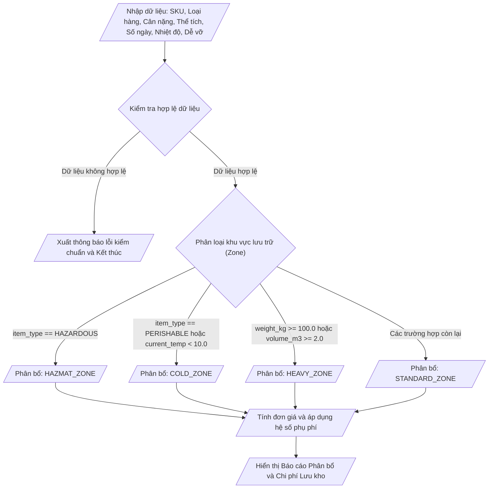

## <center>Xây dựng Module Phân loại Tồn kho và Tính Phí Lưu Kho Tự động</center>

### **1. Mục tiêu**
- Áp dụng thành thạo cấu trúc rẽ nhánh `if-elif-else` và kỹ thuật rẽ nhánh lồng nhau trong Python 3.12.
- Kết hợp linh hoạt các toán tử so sánh (`==`, `!=`, `>`, `<`, `>=`, `<=`) và toán tử logic (`and`, `or`, `not`) để giải quyết bài toán đánh giá nhiều điều kiện phức tạp.
- Thực hiện ép kiểu dữ liệu (`int()`, `float()`, `str()`) và xử lý kiểm chuẩn đầu vào theo nguyên lý đánh giá ngắn mạch (Short-circuit Evaluation).
- Rèn luyện kỹ năng định dạng mã nguồn chuẩn PEP 8 và xuất dữ liệu báo cáo dạng văn bản rõ ràng.

### **2. Vấn đề**
Trong phân hệ Quản lý Kho hàng (Warehouse Management Subsystem - WMS) của một công ty logistics, các lô hàng mới nhập cần được tự động phân bổ vào khu vực lưu giữ phù hợp và tính toán chi phí lưu kho dự kiến. 

Hệ thống yêu cầu nhận thông tin chi tiết của từng lô hàng thông qua giao diện dòng lệnh (CLI). Chương trình phải kiểm tra tính hợp lệ của dữ liệu, xác định chính xác khu vực lưu trữ (`HAZMAT_ZONE`, `COLD_ZONE`, `HEAVY_ZONE`, `STANDARD_ZONE`) dựa trên các đặc tính vật lý, và tính toán tổng chi phí lưu kho dựa trên đơn giá khu vực cùng các hệ số phụ phí (lưu kho dài hạn, phí bảo hiểm hàng dễ vỡ).

Sơ đồ luồng xử lý dữ liệu của hệ thống:



### **3. Yêu cầu bài toán**
Viết chương trình Python thực hiện các tác vụ sau:
1. Cho phép người dùng nhập thông tin lô hàng từ bàn phím.
2. Kiểm tra tính hợp lệ của dữ liệu đầu vào. Nếu có lỗi, in thông báo cụ thể [ERROR] và dừng xử lý.
3. Nếu dữ liệu hợp lệ, xác định Khu vực lưu giữ phù hợp theo thứ tự ưu tiên nghiệp vụ.
4. Tính toán tổng chi phí lưu kho theo công thức nghiệp vụ được quy định.
5. In kết quả tổng hợp ra màn hình dưới dạng Báo cáo Phân bổ Kho.

### **4. Quy tắc xử lý**

<table width="100%">
  <thead>
    <tr>
      <th>Tên tham số</th>
      <th>Kiểu dữ liệu</th>
      <th>Mô tả &amp; Quy tắc hợp lệ</th>
    </tr>
  </thead>
  <tbody>
    <tr>
      <td><code>sku</code></td>
      <td><code>str</code></td>
      <td>Mã lô hàng. Bắt buộc không được để rỗng (sau khi xóa khoảng trắng đầu cuối).</td>
    </tr>
    <tr>
      <td><code>item_type</code></td>
      <td><code>str</code></td>
      <td>Loại hàng hóa. Chỉ chấp nhận các giá trị: <code>PERISHABLE</code>, <code>HAZARDOUS</code>, <code>STANDARD</code> (không phân biệt hoa thường).</td>
    </tr>
    <tr>
      <td><code>weight_kg</code></td>
      <td><code>float</code></td>
      <td>Trọng lượng lô hàng (kg). Bắt buộc <code>weight_kg > 0</code>.</td>
    </tr>
    <tr>
      <td><code>volume_m3</code></td>
      <td><code>float</code></td>
      <td>Thể tích chiếm dụng (m³). Bắt buộc <code>volume_m3 > 0</code>.</td>
    </tr>
    <tr>
      <td><code>storage_days</code></td>
      <td><code>int</code></td>
      <td>Số ngày đăng ký lưu kho. Bắt buộc <code>storage_days >= 1</code>.</td>
    </tr>
    <tr>
      <td><code>current_temp</code></td>
      <td><code>float</code></td>
      <td>Nhiệt độ yêu cầu bảo quản (°C). Độ dài số thực hợp lệ.</td>
    </tr>
    <tr>
      <td><code>is_fragile_input</code></td>
      <td><code>str</code></td>
      <td>Độ dễ vỡ. Nhận giá trị <code>YES</code> hoặc <code>NO</code> (không phân biệt hoa thường). Chuyển thành boolean <code>is_fragile</code>.</td>
    </tr>
  </tbody>
</table>

#### **Yêu cầu 1: Kiểm chuẩn dữ liệu đầu vào (Validation)**
- Tiến hành loại bỏ khoảng trắng đầu cuối chuỗi bằng `.strip()`.
- Chuyển `item_type` và `is_fragile_input` về dạng chữ hoa bằng `.upper()`.
- Kiểm tra các điều kiện vi phạm:
  - Nếu `sku` rỗng: In `[ERROR] Mã SKU không được để trống.`
  - Nếu `item_type` không thuộc 3 loại quy định: In `[ERROR] Loại hàng hóa không hợp lệ.`
  - Nếu `weight_kg <= 0`: In `[ERROR] Trọng lượng phải lớn hơn 0 kg.`
  - Nếu `volume_m3 <= 0`: In `[ERROR] Thể tích phải lớn hơn 0 m3.`
  - Nếu `storage_days < 1`: In `[ERROR] Số ngày lưu kho phải từ 1 ngày trở lên.`
  - Nếu `is_fragile_input` không phải `YES` và cũng không phải `NO`: In `[ERROR] Xac nhan hang de vo phai la YES hoac NO.`

#### **Yêu cầu 2: Quy tắc Phân loại Khu vực Lưu trữ (Zone Assignment)**
Xác định khu vực lưu trữ theo thứ tự ưu tiên giảm dần từ trên xuống dưới:
- **Ưu tiên 1 (Kho Hóa chất / Nguy hiểm - `HAZMAT_ZONE`)**: Khi `item_type` bằng `HAZARDOUS`.
- **Ưu tiên 2 (Kho Lạnh - `COLD_ZONE`)**: Khi `item_type` bằng `PERISHABLE` **HOẶC** `current_temp < 10.0`.
- **Ưu tiên 3 (Kho Hàng nặng & Kềnh - `HEAVY_ZONE`)**: Khi `weight_kg >= 100.0` **HOẶC** `volume_m3 >= 2.0`.
- **Ưu tiên 4 (Kho Tiêu chuẩn - `STANDARD_ZONE`)**: Các trường hợp hợp lệ còn lại.

#### **Yêu cầu 3: Quy tắc Tính toán Phí Lưu Kho**
- Đơn giá lưu kho cơ bản theo ngày cho mỗi m³ (`unit_price`):
  - `HAZMAT_ZONE`: 80,000 VNĐ / m³ / ngày
  - `COLD_ZONE`: 50,000 VNĐ / m³ / ngày
  - `HEAVY_ZONE`: 35,000 VNĐ / m³ / ngày
  - `STANDARD_ZONE`: 20,000 VNĐ / m³ / ngày
- Hệ số phụ phí thời gian lưu giữ (`time_factor`):
  - Nếu `storage_days > 30`: `time_factor = 1.2` (Phụ thu 20% cho việc lưu kho dài hạn).
  - Ngược lại: `time_factor = 1.0`.
- Hệ số phụ phí hàng dễ vỡ (`fragility_factor`):
  - Nếu `is_fragile` bằng `True` (người dùng nhập `YES`): `fragility_factor = 1.15` (Phụ thu 15% phí bảo hiểm & quản lý đặc biệt).
  - Ngược lại: `fragility_factor = 1.0`.
- Công thức tính toán tổng phí:
  - `daily_base_fee = volume_m3 * unit_price`
  - `total_fee = daily_base_fee * storage_days * time_factor * fragility_factor`

#### **Yêu cầu 4: Đánh giá Mức độ Ưu tiên Vận chuyển (Priority Status)**
- Nếu `item_type == 'HAZARDOUS'` hoặc (`item_type == 'PERISHABLE'` và `storage_days > 15`): Trạng thái là `HIGH_PRIORITY`.
- Ngược lại: Trạng thái là `NORMAL_PRIORITY`.

#### **Ví dụ minh họa luồng thực thi**

**Trường hợp 1: Dữ liệu hợp lệ**
```text
=== KHỞI TẠO THÔNG TIN LÔ HÀNG WMS ===
Nhập mã SKU: LOT-8892
Nhập loại hàng (PERISHABLE/HAZARDOUS/STANDARD): perishable
Nhập trọng lượng (kg): 45.5
Nhập thể tích (m3): 1.5
Nhập số ngày lưu kho: 40
Nhập nhiệt độ bảo quản (deg C): 4.5
Hàng dễ vỡ? (YES/NO): yes

=== BÁO CÁO PHÂN BỔ KHO VÀ CHI PHÍ ===
- Mã lô hàng (SKU): LOT-8892
- Khu vực phân bổ: COLD_ZONE
- Đơn giá cơ bản: 50,000 VNĐ/m3/ngày
- Hệ số phụ phí thời gian (>30 ngày): 1.2
- Hệ số phụ phí dễ vỡ: 1.15
- Trạng thái xử lý: HIGH_PRIORITY
----------------------------------------
- TỔNG CHI PHÍ LƯU KHO DỰ KIẾN: 4,140,000.0 VNĐ
```

**Trường hợp 2: Dữ liệu không hợp lệ**
```text
=== KHỞI TẠO THÔNG TIN LÔ HÀNG WMS ===
Nhập mã SKU: LOT-102
Nhập loại hàng (PERISHABLE/HAZARDOUS/STANDARD): STANDARD
Nhập trọng lượng (kg): -5
Nhập thể tích (m3): 0.8
Nhập số ngày lưu kho: 10
Nhập nhiệt độ bảo quản (deg C): 25.0
Hàng dễ vỡ? (YES/NO): NO

=== KẾT QUẢ KIỂM CHUẨN ===
[ERROR] Trọng lượng phải lớn hơn 0 kg.
```

### **5. Yêu cầu nộp bài**
- Mẫu mã nguồn phải được viết trong 1 file Python duy nhất có tên `phanchiatonkho_tinhphi.py`.
- Sử dụng đầy đủ ghi chú (comment) ngắn gọn giải thích logic xử lý tại các đoạn câu lệnh `if-elif-else`.
- Đảm bảo đặt tên biến theo chuẩn `snake_case` tuân thủ PEP 8.
- Chạy và kiểm thử mã nguồn trực tiếp bằng Terminal với lệnh:
  `python phanchiatonkho_tinhphi.py`