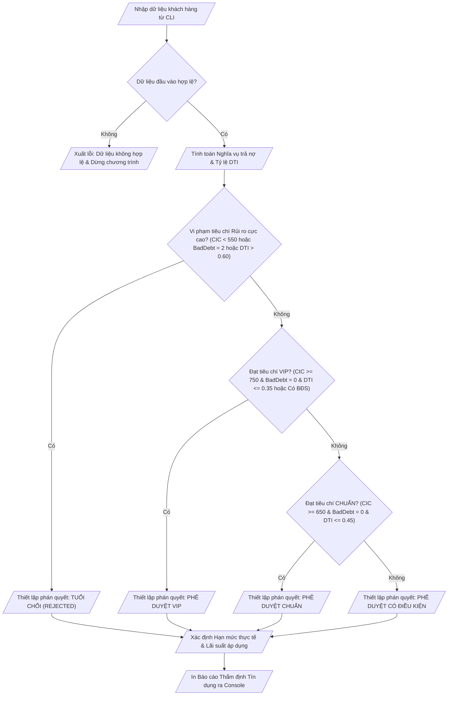

## <center>Thẩm Định Tín Dụng và Phê Duyệt Hạn Mức Vay Tự Động Trong Hệ Thống Fintech</center>

### **1. Mục tiêu**
- **Kỹ năng cú pháp & Logic**: Áp dụng thành thạo cấu trúc rẽ nhánh `if-elif-else` lồng nhau đa tầng kết hợp các toán tử logic (`and`, `or`, `not`) để hiện thực hóa quy trình nghiệp vụ thẩm định tín dụng phức tạp.
- **Tối ưu hóa điều kiện**: Vận dụng cơ chế Short-circuit Evaluation và toán tử so sánh để xây dựng cây quyết định (Decision Tree) tối ưu, giảm thiểu số lần tính toán không cần thiết.
- **Chuyển đổi kiểu & Kiểm chuẩn dữ liệu**: Thực hiện nhận dữ liệu đầu vào qua CLI, ép kiểu ép buộc (`int()`, `float()`, `str()`) và kiểm tra điều kiện biên chặt chẽ trước khi tính toán.
- **Chuẩn hóa mã nguồn**: Viết mã nguồn Python 3.12 tuân thủ nghiêm ngặt chuẩn PEP 8 về đặt tên biến (`snake_case`), thụt lề (Indentation) và định dạng xuất dữ liệu qua console.

### **2. Vấn đề**
Trong phân hệ quản trị của các công ty công nghệ tài chính (Fintech Platform), việc tự động hóa khâu thẩm định và cấp hạn mức vay tín chấp/thế chấp đóng vai trò cốt lõi nhằm giảm thời gian xử lý hồ sơ từ vài ngày xuống còn vài giây. 

Bạn được giao nhiệm vụ phát triển module lõi bằng Python để tiếp nhận thông tin hồ sơ vay của khách hàng, kiểm tra tính hợp lệ của dữ liệu, tính toán các chỉ số rủi ro tài chính bao gồm **Tỷ lệ nghĩa vụ nợ trên thu nhập (DTI - Debt-to-Income Ratio)**, phân loại nhóm rủi ro tín dụng và xuất báo cáo phán quyết phê duyệt khoản vay cùng hạn mức và lãi suất áp dụng.

Dưới đây là sơ đồ luồng xử lý dữ liệu của hệ thống:



### **3. Yêu cầu bài toán**
Chương trình cần tiếp nhận 9 thông số đầu vào từ bàn phím thông qua hàm `input()` và ép kiểu tương ứng theo bảng dưới đây:

<table width="100%">
  <thead>
    <tr>
      <th width="20%">Tên biến</th>
      <th width="15%">Kiểu dữ liệu</th>
      <th width="40%">Mô tả nghiệp vụ</th>
      <th width="25%">Miền giá trị hợp lệ</th>
    </tr>
  </thead>
  <tbody>
    <tr>
      <td><code>customer_name</code></td>
      <td><code>str</code></td>
      <td>Họ và tên khách hàng đăng ký vay</td>
      <td>Chuỗi không được rỗng</td>
    </tr>
    <tr>
      <td><code>age</code></td>
      <td><code>int</code></td>
      <td>Tuổi của khách hàng</td>
      <td>Từ 18 đến 65 tuổi</td>
    </tr>
    <tr>
      <td><code>monthly_income</code></td>
      <td><code>float</code></td>
      <td>Thu nhập bình quân tháng (VND)</td>
      <td>Lớn hơn 0</td>
    </tr>
    <tr>
      <td><code>cic_score</code></td>
      <td><code>int</code></td>
      <td>Điểm tín dụng CIC quốc gia</td>
      <td>Từ 300 đến 850</td>
    </tr>
    <tr>
      <td><code>current_debt</code></td>
      <td><code>float</code></td>
      <td>Tổng dư nợ đang vay tại các TCTD (VND)</td>
      <td>Lớn hơn hoặc bằng 0</td>
    </tr>
    <tr>
      <td><code>bad_debt_group</code></td>
      <td><code>int</code></td>
      <td>Nhóm nợ xấu ghi nhận trong 12 tháng qua</td>
      <td>0: Không có, 1: Nợ nhóm 2, 2: Nợ xấu (Nhóm 3-5)</td>
    </tr>
    <tr>
      <td><code>requested_loan</code></td>
      <td><code>float</code></td>
      <td>Số tiền khách hàng đề nghị vay (VND)</td>
      <td>Lớn hơn 0</td>
    </tr>
    <tr>
      <td><code>loan_term_months</code></td>
      <td><code>int</code></td>
      <td>Thời hạn vay đề xuất (tháng)</td>
      <td>Từ 6 đến 60 tháng</td>
    </tr>
    <tr>
      <td><code>collateral_type</code></td>
      <td><code>int</code></td>
      <td>Loại tài sản thế chấp bổ sung</td>
      <td>0: Không có, 1: Bất động sản, 2: Ô tô / Giấy tờ có giá</td>
    </tr>
  </tbody>
</table>

### **4. Quy tắc xử lý**

Yêu cầu 1: Kiểm tra tính hợp lệ của dữ liệu (Data Validation)
Chương trình phải kiểm tra toàn bộ 9 thông số đầu vào ngay sau khi nhập. Nếu phát hiện bất kỳ thông số nào vi phạm miền giá trị hợp lệ (theo bảng trên), chương trình lập tức in ra thông báo lỗi chi tiết theo định dạng `[ERROR] Tham số <tên_biến> không hợp lệ!` và kết thúc xử lý (không thực hiện các bước tính toán tiếp theo).

Yêu cầu 2: Công thức tính toán chỉ số tài chính
- Lãi suất cơ sở năm chuẩn: `base_annual_rate = 0.10` (tương ứng 10.0%/năm).
- Nghĩa vụ trả nợ hàng tháng cho khoản dư nợ hiện tại (ước tính 5% dư nợ):
  `monthly_current_debt_service = current_debt * 0.05`
- Nghĩa vụ trả nợ hàng tháng cho khoản vay mới đề xuất (tính theo lãi suất cơ sở):
  `monthly_new_loan_service = requested_loan * (1 + base_annual_rate) / loan_term_months`
- Tỷ lệ nghĩa vụ nợ trên thu nhập (DTI Ratio):
  `dti_ratio = (monthly_current_debt_service + monthly_new_loan_service) / monthly_income`

Yêu cầu 3: Cây quyết định phán quyết tín dụng (Credit Decision Logic)
Phán quyết được xác định dựa trên thứ tự ưu tiên rẽ nhánh như sau:

- Trường hợp 1: TỪ CHỐI HỒ SƠ (`status = "REJECTED"`)
  - Điều kiện: `bad_debt_group == 2` HOẶC `cic_score < 550` HOẶC `dti_ratio > 0.60`
  - Quyền hạn: Hạn mức tối đa được phê duyệt `max_approved_loan = 0.0`, Lãi suất áp dụng `applied_annual_rate = 0.0`.

- Trường hợp 2: PHÊ DUYỆT VIP (`status = "APPROVED_VIP"`)
  - Điều kiện: Không thuộc trường hợp TỪ CHỐI VÀ (`cic_score >= 750` VÀ `bad_debt_group == 0` VÀ (`dti_ratio <= 0.35` HOẶC `collateral_type == 1`)).
  - Quyền hạn: Hạn mức tối đa = `monthly_income * 18`, Lãi suất áp dụng = `base_annual_rate - 0.02` (tức 8.0%/năm).

- Trường hợp 3: PHÊ DUYỆT CHUẨN (`status = "APPROVED_STANDARD"`)
  - Điều kiện: Không thuộc TỪ CHỐI, Không thuộc VIP VÀ (`cic_score >= 650` VÀ `bad_debt_group == 0` VÀ `dti_ratio <= 0.45`).
  - Quyền hạn: Hạn mức tối đa = `monthly_income * 10`, Lãi suất áp dụng = `base_annual_rate` (tức 10.0%/năm).

- Trường hợp 4: PHÊ DUYỆT CÓ ĐIỀU KIỆN (`status = "APPROVED_CONDITIONAL"`)
  - Điều kiện: Các trường hợp đủ điều kiện còn lại (bao gồm khách hàng có `bad_debt_group == 1` hoặc `cic_score` từ 550 đến 649 hoặc `dti_ratio` từ 0.45 đến 0.60).
  - Quyền hạn: Hạn mức tối đa = `monthly_income * 5`, Lãi suất áp dụng = `base_annual_rate + 0.03` (tức 13.0%/năm).

Yêu cầu 4: Xác định hạn mức phê duyệt thực tế (Actual Approved Amount)
- Nếu `status == "REJECTED"`: `actual_approved_loan = 0.0`
- Ngược lại: `actual_approved_loan` là giá trị nhỏ hơn giữa `requested_loan` và `max_approved_loan`.

Yêu cầu 5: Hiển thị báo cáo kết quả thẩm định
Chương trình phải in ra báo cáo tổng hợp chi tiết trên Console với đầy đủ thông tin: Tên khách hàng, Tỷ lệ DTI (định dạng phần trăm), Phán quyết hệ thống, Hạn mức đề nghị, Hạn mức phê duyệt thực tế, Lãi suất áp dụng.

---

**Ví dụ minh họa 1 (Hồ sơ đủ điều kiện VIP):**

Input từ Console:
```text
Nhap ho ten khach hang: Nguyen Van A
Nhap tuoi: 35
Nhap thu nhap hang thang (VND): 45000000
Nhap diem tin dung CIC (300-850): 780
Nhap tong du no hien tai (VND): 20000000
Nhap nhom no xau (0: Khong, 1: Nhom 2, 2: Nhom 3-5): 0
Nhap so tien de nghi vay (VND): 300000000
Nhap thoi han vay (thang): 24
Nhap loai tai san the chap (0: Khong, 1: BDS, 2: O to): 1
```

Output hiển thị:
```text
==================================================
           BAO CAO THAM DINH TIN DUNG AUTOMATED   
==================================================
Khach hang: Nguyen Van A
Tuoi: 35 | Diem CIC: 780 | Nhom no xau: 0
Thu nhap hang thang: 45,000,000.0 VND
Tong du no hien tai: 20,000,000.0 VND
--------------------------------------------------
Ty le DTI uoc tinh: 32.71%
Phan quyet he thong: APPROVED_VIP
Han muc vay de nghi: 300,000,000.0 VND
Han muc duoc phe duyet toi da: 810,000,000.0 VND
Han muc phe duyet thuc te: 300,000,000.0 VND
Lai suat nam ap dung: 8.00%/nam
==================================================
```

---

**Ví dụ minh họa 2 (Hồ sơ bị từ chối do DTI cao và rủi ro):**

Input từ Console:
```text
Nhap ho ten khach hang: Tran Van B
Nhap tuoi: 28
Nhap thu nhap hang thang (VND): 15000000
Nhap diem tin dung CIC (300-850): 520
Nhap tong du no hien tai (VND): 80000000
Nhap nhom no xau (0: Khong, 1: Nhom 2, 2: Nhom 3-5): 1
Nhap so tien de nghi vay (VND): 200000000
Nhap thoi han vay (thang): 12
Nhap loai tai san the chap (0: Khong, 1: BDS, 2: O to): 0
```

Output hiển thị:
```text
==================================================
           BAO CAO THAM DINH TIN DUNG AUTOMATED   
==================================================
Khach hang: Tran Van B
Tuoi: 28 | Diem CIC: 520 | Nhom no xau: 1
Thu nhap hang thang: 15,000,000.0 VND
Tong du no hien tai: 80,000,000.0 VND
--------------------------------------------------
Ty le DTI uoc tinh: 148.89%
Phan quyet he thong: REJECTED
Han muc vay de nghi: 200,000,000.0 VND
Han muc duoc phe duyet toi da: 0.0 VND
Han muc phe duyet thuc te: 0.0 VND
Lai suat nam ap dung: 0.00%/nam
==================================================
```

---

### **5. Yêu cầu nộp bài**
- Nộp duy nhất 01 file mã nguồn Python với tên file: `fintech_credit_evaluator.py`.
- Mã nguồn phải chứa đầy đủ phần nhận dữ liệu đầu vào, xử lý rẽ nhánh và in báo cáo output.
- Không sử dụng các khái niệm nâng cao chưa học như hàm tự định nghĩa (`def`), vòng lặp (`while`, `for`), danh sách/tập hợp (`list`, `dict`, `tuple`), ngoại lệ (`try-except`) hay thư viện ngoài. Toàn bộ logic phải xử lý thuần túy bằng cấu trúc rẽ nhánh và các toán tử logic cơ bản.