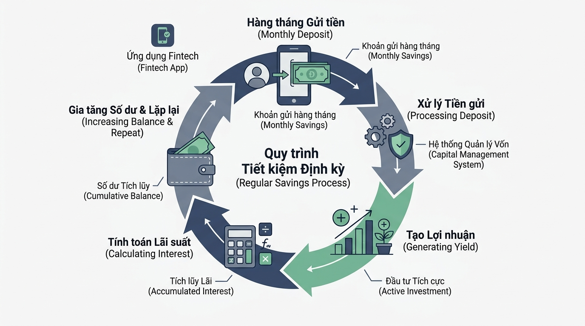

## <center>[Vận dụng cơ bản 1] Sửa lỗi hệ thống tính toán số dư tiết kiệm FinTech</center>

### **1. Mục tiêu**
*   **Kiến thức:** Củng cố cú pháp và cơ chế hoạt động của vòng lặp `for`, hàm tạo dãy số `range()`, và câu lệnh điều khiển luồng `continue` trong Python core.
*   **Kỹ năng:** Nâng cao năng lực phân tích mã nguồn legacy, phát hiện lỗi biên (Off-by-one error), sửa lỗi logic luồng điều khiển lặp, và thực thi kiểm chuẩn dữ liệu đầu vào bằng ngoại lệ chuẩn `ValueError`.
*   **Thực tiễn:** Áp dụng mô hình xử lý tính toán số dư tích lũy tiền gửi tiết kiệm trong hệ thống ứng dụng ngân hàng số / FinTech.

### **2. Bối cảnh & Vấn đề**
Một ứng dụng FinTech đang vận hành mô-đun tính toán tiền lãi tích lũy hàng tháng cho các tài khoản tiết kiệm linh hoạt. Bộ phận kiểm thử QA vừa báo cáo hệ thống xuất kết quả tính toán sai lệch so với hợp đồng cam kết với khách hàng:
1. Kỳ hạn 6 tháng chỉ được tính lãi 5 tháng.
2. Tháng thứ 3 bị mất hẳn tiền lãi do xử lý sai logic bỏ qua phí quản lý tài khoản.
3. Hệ thống bị lỗi luồng khi nhận số tiền gửi hoặc số tháng kỳ hạn là giá trị không hợp lệ (số âm hoặc bằng 0).

Học viên được giao nhiệm vụ tiếp nhận mã nguồn hiện tại, thực hiện phân tích lỗi logic, lập bảng báo cáo test case chứng minh lỗi và tiến hành tối ưu, sửa lỗi mã nguồn theo các quy tắc nghiệp vụ FinTech.


<p align="center">
  
</p>


### **3. Mã nguồn hiện tại**

```python
def process_monthly_savings(
    initial_balance: float,
    monthly_rate: float,
    total_months: int
) -> float:
    """
    Tính toán số dư tích lũy hàng tháng cho gói tiết kiệm linh hoạt.
    """
    current_balance = initial_balance

    # Lỗi logic 1: Không kiểm tra điều kiện đầu vào hợp lệ
    # Lỗi logic 2: Sử dụng range(1, total_months) khiến thiếu mất tháng cuối
    for month in range(1, total_months):
        # Mục tiêu: Tháng 3 được miễn phí dịch vụ 50,000 VNĐ
        # Lỗi logic 3: Dùng continue sai vị trí làm mất luôn tiền lãi tháng 3
        if month == 3:
            continue

        interest = current_balance * monthly_rate
        service_fee = 50000.0
        current_balance = current_balance + interest - service_fee
        print(
            f"Tháng {month}: Lãi = {interest:,.0f} VNĐ | "
            f"Phí = {service_fee:,.0f} VNĐ | Số dư = {current_balance:,.0f} VNĐ"
        )

    return current_balance


# Chạy thử nghiệm với số tiền 10,000,000 VNĐ, lãi suất 0.5%/tháng, kỳ hạn 6 tháng
balance_end = process_monthly_savings(10000000.0, 0.005, 6)
print(f"Tổng số dư cuối kỳ: {balance_end:,.0f} VNĐ")
```

### **4. Yêu cầu bài toán**

**Phần 1: Báo cáo phân tích & lập bảng Test Case**
1. Chỉ ra chính xác các dòng mã nguồn chứa lỗi logic trong đoạn code legacy trên.
2. Lập bảng báo cáo ít nhất 3 Test Case mô tả chi tiết: Dữ liệu đầu vào (Input), Kết quả đầu ra thực tế bị lỗi (Actual Buggy Output), và Kết quả mong đợi chính xác (Expected Correct Output).
   Dùng bảng HTML theo mẫu sau:

<table style="width: 100%; min-width: 100%; display: table; border-collapse: collapse;" width="100%">
  <thead>
    <tr style="background-color: #f2f2f2;">
      <th style="border: 1px solid #dddddd; padding: 8px; text-align: center;">Mã Test Case</th>
      <th style="border: 1px solid #dddddd; padding: 8px;">Dữ liệu đầu vào (Input)</th>
      <th style="border: 1px solid #dddddd; padding: 8px;">Kết quả lỗi thực tế (Actual Buggy Output)</th>
      <th style="border: 1px solid #dddddd; padding: 8px;">Kết quả mong đợi chuẩn (Expected Correct Output)</th>
    </tr>
  </thead>
  <tbody>
    <tr>
      <td style="border: 1px solid #dddddd; padding: 8px; text-align: center;">TC01</td>
      <td style="border: 1px solid #dddddd; padding: 8px;">initial_balance = 10,000,000, monthly_rate = 0.005, total_months = 6</td>
      <td style="border: 1px solid #dddddd; padding: 8px;">Vòng lặp chỉ chạy 5 tháng (từ tháng 1 đến tháng 5)</td>
      <td style="border: 1px solid #dddddd; padding: 8px;">Vòng lặp chạy đủ 6 tháng (từ tháng 1 đến tháng 6)</td>
    </tr>
    <tr>
      <td style="border: 1px solid #dddddd; padding: 8px; text-align: center;">TC02</td>
      <td style="border: 1px solid #dddddd; padding: 8px;">Chạy qua tháng 3 trong kỳ hạn</td>
      <td style="border: 1px solid #dddddd; padding: 8px;">Lệnh continue làm bỏ qua hoàn toàn tháng 3 (không cộng lãi)</td>
      <td style="border: 1px solid #dddddd; padding: 8px;">Tháng 3 vẫn được cộng tiền lãi nhưng bỏ qua việc trừ phí 50,000 VNĐ</td>
    </tr>
    <tr>
      <td style="border: 1px solid #dddddd; padding: 8px; text-align: center;">TC03</td>
      <td style="border: 1px solid #dddddd; padding: 8px;">initial_balance = -5,000,000 hoặc total_months = 0</td>
      <td style="border: 1px solid #dddddd; padding: 8px;">Hệ thống vẫn thực thi hoặc trả về kết quả sai lệch không báo lỗi</td>
      <td style="border: 1px solid #dddddd; padding: 8px;">Ném ngoại lệ ValueError("Dữ liệu đầu vào không hợp lệ.")</td>
    </tr>
  </tbody>
</table>

**Phần 2: Sửa lỗi mã nguồn (Refactoring & Implementation)**
Viết lại hàm `process_monthly_savings` tuân thủ các quy tắc nghiệp vụ sau:
1. **Kiểm chuẩn đầu vào:**
   - Nếu `initial_balance <= 0` hoặc `monthly_rate <= 0` hoặc `total_months < 1`, lập tức `raise ValueError("Dữ liệu đầu vào không hợp lệ.")`.
2. **Đảm bảo số lần lặp:**
   - Sử dụng hàm `range()` đúng phạm vi để vòng lặp thực thi đầy đủ từ tháng 1 đến tháng `total_months`.
3. **Xử lý phí và lãi suất:**
   - Mỗi tháng, số dư được cộng thêm tiền lãi: `interest = current_balance * monthly_rate`.
   - Phí quản lý tài khoản chuẩn mỗi tháng là 50,000 VNĐ.
   - Ngoại lệ: Nếu là tháng 3, hệ thống áp dụng ưu đãi miễn phí dịch vụ. Học viên cần tính tiền lãi trước, sau đó dùng câu lệnh `continue` hợp lý để bỏ qua bước trừ phí 50,000 VNĐ mà vẫn in được báo cáo số dư đã cộng lãi cho tháng 3.
4. **Cấu trúc & Quy chuẩn mã nguồn:**
   - Thêm Type Hints đầy đủ cho tham số và giá trị trả về.
   - Tuân thủ chuẩn PEP 8 (đặt tên `snake_case`, thụt lề 4 khoảng trắng).
   - TUYỆT ĐỐI KHÔNG sử dụng vòng lặp `while` và câu lệnh `break`.

### **5. Yêu cầu nộp bài**
Học viên cần nộp:
*   Phần phân tích/báo cáo và mã nguồn triển khai.
*   Đẩy mã nguồn lên GitHub theo định dạng thư mục: `[Tên Lớp]_[Môn Học]_Session06_Ex01`.
    Ví dụ: `HNKS25CNTT1_Core_Session06_Ex01`