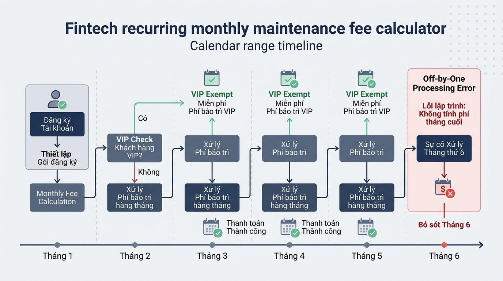

## <center>[Vận dụng cơ bản 2] Sửa Lỗi Logic Vòng Lặp Tính Phí Duy Trì Tài Khoản Fintech</center>

### **1. Mục tiêu**
*   Hiểu và vận dụng thành thạo vòng lặp `for` kết hợp với hàm `range()` trong Python Core.
*   Nhận biết, phân tích và khắc phục lỗi kinh điển Off-by-one (lỗi thiếu lượt lặp cuối) trong luồng xử lý dữ liệu tài chính.
*   Sử dụng từ khóa `continue` để bỏ qua các lượt xử lý không đáp ứng điều kiện theo quy tắc nghiệp vụ Fintech.
*   Áp dụng Type Hints và kiểm soát ngoại lệ `ValueError` để đảm bảo tính an toàn dữ liệu và tuân thủ chuẩn mã nguồn sản xuất.

### **2. Bối cảnh & Vấn đề**
Một ứng dụng ví điện tử Fintech đang triển khai tiến trình tự động tính toán và quyết toán phí duy trì tài khoản doanh nghiệp định kỳ theo chu kỳ nhiều tháng. Theo hợp đồng dịch vụ, mỗi tháng tài khoản doanh nghiệp chịu một mức phí cố định `monthly_fee`. Nếu tháng đó tài khoản đạt điều kiện ưu đãi (có tên trong danh sách `vip_months`), khách hàng sẽ được miễn phí duy trì cho tháng đó.

Tuy nhiên, bộ phận kế toán vừa phát hiện một lỗi nghiêm trọng trên hệ thống: Đối với tất cả các hợp đồng đăng ký chu kỳ 6 tháng hoặc 12 tháng, tổng tiền phí thu được cuối kỳ luôn ít hơn so me với thực tế. Qua kiểm tra sơ bộ, hệ thống đã hoàn toàn bỏ qua tháng cuối cùng trong chu kỳ thanh toán. Đồng thời, hàm xử lý tính toán hiện tại không có cơ chế chặn các dữ liệu đầu vào bất thường (như số tiền phí bị âm hoặc số tháng nhỏ hơn hoặc bằng 0), dẫn đến rủi ro sai lệch báo cáo tài chính.


<p align="center">
  
</p>


### **3. Mã nguồn hiện tại**
Dưới đây là mã nguồn xử lý tính phí duy trì tài khoản do lập trình viên tiền nhiệm để lại:

```python
def calculate_total_maintenance_fee(
    monthly_fee: float,
    total_months: int,
    vip_months: list[int]
) -> float:
    """
    Tính tổng phí duy trì tài khoản Fintech qua các tháng.
    Miễn phí đối với các tháng thuộc danh sách VIP.
    """
    total_fee: float = 0.0

    # Duyệt qua các tháng trong chu kỳ thanh toán
    for month in range(1, total_months):
        if month in vip_months:
            print(f"Tháng {month}: Miễn phí duy trì (Tài khoản VIP)")
            continue

        total_fee += monthly_fee
        print(f"Tháng {month}: Đã thu phí {monthly_fee:,.0f} VNĐ")

    return total_fee


if __name__ == "__main__":
    fee_per_month = 50000.0
    months_count = 6
    vip_list = [2, 5]

    print("=== TIẾN TRÌNH TÍNH PHÍ QUẢN LÝ TÀI KHOẢN FINTECH ===")
    result = calculate_total_maintenance_fee(fee_per_month, months_count, vip_list)
    print(f"Tổng phí thu được: {result:,.0f} VNĐ")
```

### **4. Yêu cầu bài toán**

#### **Phần 1: Báo cáo phân tích và bảng Test Case (Phân tích lỗi)**
1.  Xác định chính xác vị trí dòng mã nguồn chứa lỗi logic làm bỏ sót tháng cuối cùng trong chu kỳ.
2.  Lập bảng báo cáo Test Case chứng minh sai sót của chương trình hiện tại (tối thiểu 3 test cases) sử dụng bảng HTML theo định dạng sau:

<table style="width: 100%; min-width: 100%; display: table; border-collapse: collapse;" width="100%" border="1">
  <thead>
    <tr>
      <th style="padding: 8px; text-align: center;">STT</th>
      <th style="padding: 8px; text-align: left;">Dữ liệu đầu vào (Input)</th>
      <th style="padding: 8px; text-align: left;">Kết quả thực tế từ mã lỗi (Actual Output)</th>
      <th style="padding: 8px; text-align: left;">Kết quả kỳ vọng đúng (Expected Output)</th>
    </tr>
  </thead>
  <tbody>
    <tr>
      <td style="padding: 8px; text-align: center;">1</td>
      <td style="padding: 8px;">monthly_fee = 50000.0, total_months = 6, vip_months = [2, 5]</td>
      <td style="padding: 8px;">150,000 VNĐ (Chỉ tính các tháng 1, 3, 4)</td>
      <td style="padding: 8px;">200,000 VNĐ (Phải tính đầy đủ các tháng 1, 3, 4, 6)</td>
    </tr>
    <tr>
      <td style="padding: 8px; text-align: center;">2</td>
      <td style="padding: 8px;">...</td>
      <td style="padding: 8px;">...</td>
      <td style="padding: 8px;">...</td>
    </tr>
    <tr>
      <td style="padding: 8px; text-align: center;">3</td>
      <td style="padding: 8px;">...</td>
      <td style="padding: 8px;">...</td>
      <td style="padding: 8px;">...</td>
    </tr>
  </tbody>
</table>

#### **Phần 2: Sửa lỗi và hoàn thiện mã nguồn (Refactoring Code)**
Học viên tiến hành chỉnh sửa file mã nguồn `fintech_fee_calculator.py` đáp ứng đầy đủ các quy tắc sau:
1.  **Sửa lỗi phạm vi lặp**: Điều chỉnh hàm `range()` trong vòng lặp `for` để đảm bảo hệ thống duyệt đầy đủ từ tháng `1` đến hết tháng `total_months`.
2.  **Kiểm chuẩn dữ liệu đầu vào (Input Validation)**:
    *   Nếu `monthly_fee < 0` hoặc `total_months <= 0`, hàm phải phát ra ngoại lệ `ValueError` kèm thông báo lỗi rõ ràng bằng tiếng Việt.
3.  **Duy trì logic miễn phí**: Giữ nguyên cơ chế dùng từ khóa `continue` để bỏ qua việc cộng phí đối với các tháng có trong `vip_months`.
4.  **Chuẩn hóa mã nguồn**:
    *   Giữ nguyên Type Hints chuẩn Python 3.10+ (`float`, `int`, `list[int]`).
    *   TUYỆT ĐỐI KHÔNG sử dụng vòng lặp `while` hoặc câu lệnh `break` (tuân thủ đúng phạm vi kiến thức được phép).

### **5. Yêu cầu nộp bài**
Học viên cần nộp:
*   Phần phân tích/báo cáo và mã nguồn triển khai.
*   Đẩy mã nguồn lên GitHub theo định dạng thư mục: `[Tên Lớp]_[Môn Học]_Session06_Ex02`.
    Ví dụ: `HNKS25CNTT1_Core_Session06_Ex02`