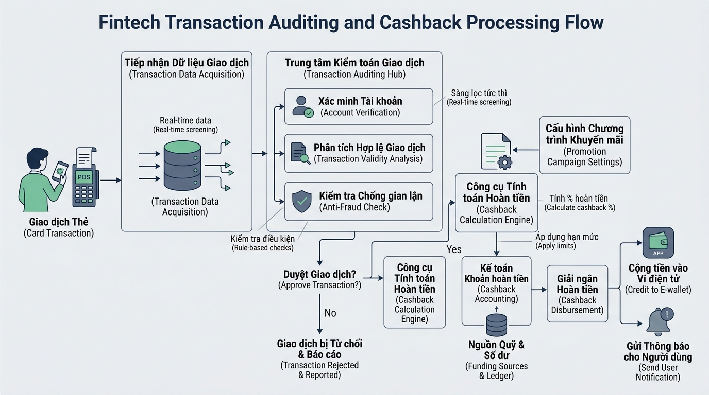

## <center>[Vận dụng chuyên sâu] Kiểm Toán Lô Giao Dịch Và Tính Thưởng Tích Lũy Fintech</center>

### **1. Mục tiêu**
*   **Tư duy phân tích & Thiết kế hệ thống:** Xây dựng báo cáo thiết kế luồng dữ liệu đầu vào/đầu ra (Input/Output Schema) và mã giả (Pseudocode) cho bài toán kiểm toán lô giao dịch tài chính.
*   **Kỹ năng lập trình nâng cao:** Áp dụng vòng lặp `for`, câu lệnh rẽ nhánh điều khiển `continue` và khối `for...else` để xử lý tập hợp dữ liệu giao dịch phức tạp mà không vi phạm nguyên tắc tối ưu.
*   **Quy chuẩn chất lượng mã nguồn:** Thực thi định dạng dữ liệu chuẩn Python 3.10+, Type Hints đầy đủ, tuân thủ PEP 8 và xử lý ngoại lệ chủ động cho hệ thống Fintech.

---

### **2. Bối cảnh & Vấn đề**
Trong các hệ thống trung gian thanh toán Fintech, hàng ngày máy chủ đối soát phải tiếp nhận hàng ngàn lô giao dịch (batch transactions) gửi về từ các điểm bán hàng (Merchants). Một lô giao dịch chứa danh sách nhiều bản ghi giao dịch thanh toán khác nhau.

Tuy nhiên, dữ liệu thô đầu vào thường chứa các giao dịch lỗi (số tiền không hợp lệ, bị hủy ngang, hoặc sai định dạng). Hệ thống cần duyệt qua toàn bộ lô giao dịch, tự động bỏ qua các bản ghi lỗi mà không làm gián đoạn tiến trình (không dừng đột ngột), tính toán tiền hoàn thưởng (cashback) theo cơ chế phân tầng cho các giao dịch hợp lệ, và tổng hợp báo cáo đối soát cuối cùng.


<p align="center">
  
</p>


---

### **3. Quy tắc nghiệp vụ**

#### **3.1. Quy tắc lọc và bỏ qua giao dịch (Skip Logic)**
Trong quá trình duyệt lô dữ liệu bằng vòng lặp `for`, hệ thống phải **bỏ qua ngay lập tức** giao dịch hiện tại (chuyển sang giao dịch tiếp theo) nếu vi phạm một trong các điều kiện sau:
1.  Giao dịch có trạng thái `status` khác `"SUCCESS"` (ví dụ: `"CANCELLED"`, `"PENDING"`, `"FAILED"`).
2.  Giao dịch có giá trị `amount` nhỏ hơn hoặc bằng 0 (`amount <= 0`).

#### **3.2. Quy tắc tính toán hoàn tiền tích lũy (Cashback Tier)**
Đối với các giao dịch hợp lệ, hệ thống thực hiện tính tiền hoàn thưởng (cashback) dựa trên giá trị giao dịch (`amount`) theo bảng phân tầng sau:

<table style="width: 100%; min-width: 100%; display: table; border-collapse: collapse;" width="100%" border="1">
<thead>
  <tr>
    <th style="padding: 8px; text-align: left;">Hạng giao dịch</th>
    <th style="padding: 8px; text-align: left;">Điều kiện giá trị (VNĐ)</th>
    <th style="padding: 8px; text-align: left;">Tỷ lệ Cashback</th>
    <th style="padding: 8px; text-align: left;">Giới hạn Cashback / Giao dịch</th>
  </tr>
</thead>
<tbody>
  <tr>
    <td style="padding: 8px;">Đồng (Bronze)</td>
    <td style="padding: 8px;">Dưới 2,000,000 VNĐ</td>
    <td style="padding: 8px;">1.0%</td>
    <td style="padding: 8px;">Không giới hạn</td>
  </tr>
  <tr>
    <td style="padding: 8px;">Bạc (Silver)</td>
    <td style="padding: 8px;">Từ 2,000,000 VNĐ đến dưới 5,000,000 VNĐ</td>
    <td style="padding: 8px;">2.0%</td>
    <td style="padding: 8px;">Không giới hạn</td>
  </tr>
  <tr>
    <td style="padding: 8px;">Vàng (Gold)</td>
    <td style="padding: 8px;">Từ 5,000,000 VNĐ trở lên</td>
    <td style="padding: 8px;">3.0%</td>
    <td style="padding: 8px;">Tối đa 300,000 VNĐ / giao dịch</td>
  </tr>
</tbody>
</table>

#### **3.3. Ràng buộc an toàn & Giới hạn hệ thống**
1.  **Chặn dữ liệu rỗng:** Nếu danh sách giao dịch đầu vào rỗng (`len == 0`), hệ thống phải kích hoạt ngoại lệ `ValueError("Danh sách giao dịch không được để rỗng")`.
2.  **Giới hạn ngân sách Cashback lô:** Nếu tổng tiền cashback tích lũy của cả lô vượt quá ngân sách cho phép là **2,000,000 VNĐ**, hệ thống phải chủ động ném ngoại lệ `ValueError("Tổng tiền cashback vượt quá hạn mức ngân sách lô")`.
3.  **[CẤM SỬ DỤNG]:** TUYỆT ĐỐI KHÔNG sử dụng vòng lặp `while` và KHÔNG sử dụng câu lệnh `break`. Bắt buộc phải duy trì việc duyệt trọn vẹn dữ liệu bằng `for` kết hợp `continue`.

---

### **4. Yêu cầu bài toán**

#### **Phần 1: Phân tích & Thiết kế Giải pháp (Báo cáo Markdown)**
Học viên cần trình bày báo cáo phân tích trước khi viết mã nguồn:
1.  **Định nghĩa Schema I/O:** Liệt kê tên trường, kiểu dữ liệu (`int`, `float`, `str`, `dict`, `list`) cho đầu vào và đầu ra.
2.  **Thiết kế giải thuật:** Mô tả bằng mã giả (Pseudocode) hoặc lưu đồ thuật toán chi tiết luồng xử lý kiểm toán lô giao dịch.

#### **Phần 2: Cài đặt Chương trình (Python Implementation)**
Học viên tự thiết kế cấu trúc dữ liệu và cài đặt các chức năng từ đầu (không có code khung sẵn):
1.  Tạo hàm xử lý chính có kiểm thử Type Hints rõ ràng.
2.  Thực hiện vòng lặp duyệt qua danh sách các `dict` giao dịch.
3.  Sử dụng `continue` đúng vị trí để loại bỏ các bản ghi không hợp lệ.
4.  Tính toán tổng số giao dịch tiếp nhận, số giao dịch hợp lệ, số giao dịch bị bỏ qua, tổng tiền giao dịch hợp lệ và tổng cashback tích lũy.

#### **Ví dụ minh họa cấu trúc dữ liệu (Visual Data Specification):**

```text
--- DỮ LIỆU ĐẦU VÀO MẪU (INPUT SAMPLE) ---
[
    {"trans_id": "TXN1001", "amount": 1500000.0, "status": "SUCCESS"},
    {"trans_id": "TXN1002", "amount": -500000.0, "status": "SUCCESS"},   # Bỏ qua: amount <= 0
    {"trans_id": "TXN1003", "amount": 3000000.0, "status": "CANCELLED"}, # Bỏ qua: status CANCELLED
    {"trans_id": "TXN1004", "amount": 6000000.0, "status": "SUCCESS"},   # Gold: 6,000,000 * 3% = 180,000
    {"trans_id": "TXN1005", "amount": 2500000.0, "status": "SUCCESS"}    # Silver: 2,500,000 * 2% = 50,000
]

--- KẾT QUẢ ĐẦU RA MẪU (OUTPUT SAMPLE) ---
{
    "total_processed": 5,
    "valid_count": 3,
    "skipped_count": 2,
    "total_valid_amount": 10000000.0,
    "total_cashback": 245000.0
}
```

---

### **5. Yêu cầu nộp bài**
Học viên cần nộp:
*   Phần phân tích/báo cáo và mã nguồn triển khai.
*   Đẩy mã nguồn lên GitHub theo định dạng thư mục: `[Tên Lớp]_[Môn Học]_Session06_Ex03`.
    Ví dụ: `HNKS25CNTT1_Core_Session06_Ex03`