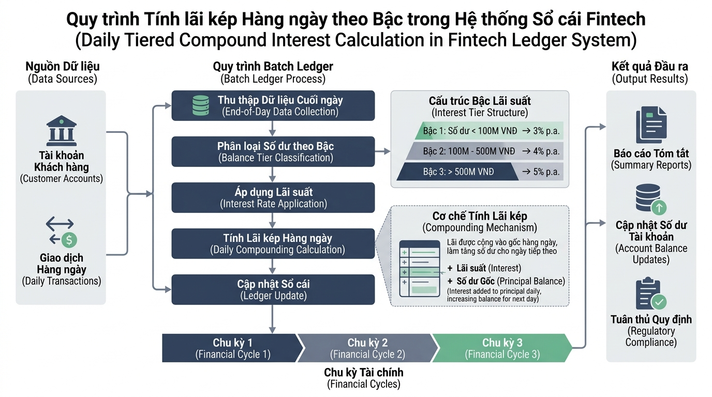

## 
[Phân tích] Phân tích giải pháp đối soát và tính lãi suất tích lũy đa tầng

### **1. Mục tiêu**
*   **Phân tích & Đánh giá thuật toán**: So sánh hai phương án thiết kế luồng xử lý dữ liệu tích lũy tài chính (sử dụng vòng lặp `for`) về mặt hiệu năng, độ phức tạp mã nguồn và tính dễ bảo trì.
*   **Tối ưu hóa cấu trúc điều khiển**: Áp dụng kỹ thuật phân nhánh phẳng (Flat code structure) kết hợp từ khóa `continue` để loại bỏ sớm các giao dịch không hợp lệ mà không làm tăng độ sâu lồng ghép (nesting depth).
*   **Nắm vững quy tắc kiểm soát luồng**: Đảm bảo giải quyết bài toán tài chính phức tạp trong phạm vi kiến thức cho phép, tuân thủ nghiêm ngặt các hạn chế kỹ thuật.

### **2. Bối cảnh & Vấn đề**
Công ty Fintech **FinCorp** vận hành hệ thống sản phẩm "Tiết kiệm tích lũy linh hoạt". Mỗi tài khoản gửi tiết kiệm sẽ trải qua một chuỗi các chu kỳ tính toán (theo từng ngày trong tháng). Trong mỗi chu kỳ, hệ thống tiến hành kiểm tra trạng thái hoạt động của tài khoản, tính toán tiền nạp thêm và cập nhật tiền lãi tích lũy theo cơ chế lãi suất bậc thang dựa trên tổng số dư hiện tại.

Hiện tại, đội ngũ kỹ thuật đang gặp phải rắc rối khi mã nguồn xử lý lô (batch processing) đối soát lãi suất cuối ngày chứa quá nhiều câu lệnh `if-else` lồng ghép nhiều tầng. Điều này khiến việc đọc hiểu mã nguồn trở nên khó khăn, dễ phát sinh lỗi khi cập nhật công thức tính lãi mới, và làm giảm tốc độ xử lý khi phải duyệt qua hàng trăm nghìn chu kỳ tài chính của khách hàng.

  

### **3. Quy tắc nghiệp vụ**
Hệ thống cần duyệt qua danh sách các chu kỳ đối soát (được biểu diễn bằng số nguyên đại diện cho từng ngày từ `1` đến `N`).

1.  **Dữ liệu đầu vào của mỗi chu kỳ**:
    *   `status` (Trạng thái chu kỳ): Chuỗi kí tự đại diện cho trạng thái, nhận một trong hai giá trị `"ACTIVE"` (Tài khoản hoạt động) hoặc `"SUSPENDED"` (Tài khoản bị tạm ngưng/bỏ qua).
    *   `deposit` (Số tiền nạp thêm): Số thực lớn hơn hoặc bằng `0`.

2.  **Quy tắc xử lý trong vòng lặp**:
    *   Nếu `status` là `"SUSPENDED"`, hệ thống lập tức bỏ qua toàn bộ các bước tính toán của chu kỳ đó, không cộng tiền nạp và không phát sinh tiền lãi.
    *   Nếu `status` là `"ACTIVE"`, tiến hành cập nhật số dư và tính lãi theo các bước sau:
        *   Cập nhật số dư trước tính lãi: `Số dư mới = Số dư cũ + deposit`.
        *   Xác định tỷ lệ lãi suất ngày (Daily Rate) dựa trên `Số dư mới`:
            *   Mức 1 (Dưới 50,000,000 VNĐ): Lãi suất `0.01%` / ngày (`0.0001`).
            *   Mức 2 (Từ 50,000,000 VNĐ đến dưới 200,000,000 VNĐ): Lãi suất `0.015%` / ngày (`0.00015`).
            *   Mức 3 (Từ 200,000,000 VNĐ trở lên): Lãi suất `0.02%` / ngày (`0.0002`).
        *   Tính tiền lãi phát sinh trong chu kỳ: `Tiền lãi = Số dư mới * Lãi suất ngày`.
        *   Cập nhật tổng số dư cuối chu kỳ: `Số dư cuối chu kỳ = Số dư mới + Tiền lãi`.

3.  **Ràng buộc phạm vi kỹ thuật (CẤM CÁC TỪ KHÓA SAU)**:
    *   [WARNING] TUYỆT ĐỐI CẤM sử dụng vòng lặp `while`.
    *   [WARNING] TUYỆT ĐỐI CẤM sử dụng câu lệnh `break`.
    *   Chỉ sử dụng vòng lặp `for`, các hàm chuẩn như `range()`, từ khóa `continue` và các câu lệnh điều kiện `if/elif/else`.

### **4. Yêu cầu bài toán**

Học viên đóng vai trò Kỹ sư Phần mềm Chuyên sâu (Senior Software Engineer) thực hiện báo cáo phân tích và triển khai giải pháp theo 3 phần bắt buộc:

#### **Phần 1: Báo cáo Phân tích & So sánh Trade-off (Bảng so sánh)**
Nghiên cứu và đề xuất 2 phương án kỹ thuật xử lý bài toán đối soát tài chính:
*   **Phương án A (Lồng ghép điều kiện sâu - Nested If/Else)**: Duyệt vòng lặp `for`, kiểm tra điều kiện `status == "ACTIVE"` rồi lồng tiếp các tầng `if/elif/else` bên trong để xử lý tính lãi và nạp tiền.
*   **Phương án B (Vòng lặp phẳng với Guard Clause - Continue)**: Duyệt vòng lặp `for`, sử dụng kỹ thuật Guard Clause kiểm tra `status == "SUSPENDED"` để gọi `continue` bỏ qua sớm chu kỳ, giữ khối lệnh tính toán lãi suất ở mức thụt lề phẳng (single-level indentation).

Lập bảng so sánh Trade-off trực quan giữa 2 phương án dựa trên 5 tiêu chí bắt buộc theo định dạng HTML sau:

<table border="1" style="width: 100%; min-width: 100%; display: table; border-collapse: collapse;" width="100%">
  <thead>
    <tr>
      <th style="padding: 8px; text-align: left;">Tiêu chí đánh giá</th>
      <th style="padding: 8px; text-align: left;">Phương án A (Nested If/Else)</th>
      <th style="padding: 8px; text-align: left;">Phương án B (Guard Clause & Continue)</th>
    </tr>
  </thead>
  <tbody>
    <tr>
      <td style="padding: 8px;">1. Độ phức tạp thời gian (Time Complexity)</td>
      <td style="padding: 8px;">...</td>
      <td style="padding: 8px;">...</td>
    </tr>
    <tr>
      <td style="padding: 8px;">2. Tiêu tốn bộ nhớ (Space Complexity)</td>
      <td style="padding: 8px;">...</td>
      <td style="padding: 8px;">...</td>
    </tr>
    <tr>
      <td style="padding: 8px;">3. Độ đọc hiểu & Độ sạch mã nguồn (Readability)</td>
      <td style="padding: 8px;">...</td>
      <td style="padding: 8px;">...</td>
    </tr>
    <tr>
      <td style="padding: 8px;">4. Khả năng bảo trì & Mở rộng (Maintainability)</td>
      <td style="padding: 8px;">...</td>
      <td style="padding: 8px;">...</td>
    </tr>
    <tr>
      <td style="padding: 8px;">5. Bối cảnh áp dụng tối ưu (Use Case)</td>
      <td style="padding: 8px;">...</td>
      <td style="padding: 8px;">...</td>
    </tr>
  </tbody>
</table>

#### **Phần 2: Lựa chọn giải pháp & Thiết kế Mã giả (Pseudocode)**
*   Lý giải nguyên nhân khoa học lựa chọn giải pháp tối ưu nhất cho hệ thống Fintech FinCorp.
*   Viết mã giả (Pseudocode) hoặc vẽ lưu đồ thuật toán (Flowchart) mô tả chi tiết logic của phương án tối ưu được chọn.

#### **Phần 3: Triển khai Mã nguồn Python (Implementation)**
*   Hiện thực hóa phương án tối ưu đã chọn bằng Python.
*   Định dạng mã nguồn tuân thủ nghiêm ngặt chuẩn PEP 8:
    *   Tên biến, tên hàm 100% bằng tiếng Anh (snake_case).
    *   Sử dụng Type Hints chuẩn Python 3.10+ (ví dụ: `int | float`, `list[dict[str, str | float]]`).
    *   Viết chú thích thích hợp giải thích logic nghiệp vụ bằng Tiếng Việt có dấu.
*   Xử lý kiểm tra và bảo vệ dữ liệu đầu vào (Edge cases: số tiền nạp nhỏ hơn 0, số dư âm).

### **5. Yêu cầu nộp bài**
Học viên cần nộp:
*   Phần phân tích/báo cáo và mã nguồn triển khai.
*   Đẩy mã nguồn lên GitHub theo định dạng thư mục: `[Tên Lớp]_[Môn Học]_Session06_Ex04`.
    Ví dụ: `HNKS25CNTT1_Core_Session06_Ex04`