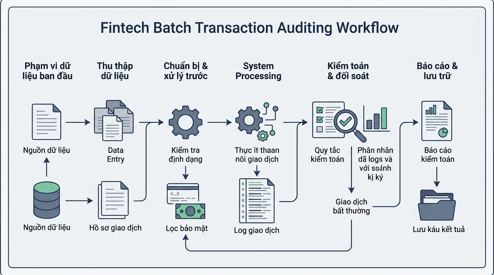

## 
[Sáng tạo] Thiết kế hệ thống đối soát giao dịch thanh toán và cảnh báo rủi ro Fintech

### **1. Mục tiêu**
*   Vận dụng sáng tạo tư duy thuật toán, vòng lặp `for`, hàm `range()`, câu lệnh điều khiển luồng `continue` và khối `else` của vòng lặp trong Python để giải quyết bài toán nghiệp vụ đối soát tài chính thực tế.
*   Rèn luyện khả năng chủ động phân tích bài toán, tự định nghĩa cấu trúc dữ liệu đầu vào/đầu ra (I/O Schema) và phát hiện các bẫy dữ liệu biên (Edge Cases) trong hệ thống Fintech.
*   Xây dựng sơ đồ luồng dữ liệu (Data Flow Diagram) bằng cú pháp Mermaid để cụ thể hóa kiến trúc xử lý giao dịch.
*   Thực hành viết mã nguồn chất lượng cao, chuẩn PEP 8, có Type Hints đầy đủ và đặt tên biến/hàm theo đúng chuẩn công nghiệp.

### **2. Vấn đề**
Trong các hệ thống cổng thanh toán điện tử (Payment Gateway) và ví điện tử, hàng ngày có hàng triệu giao dịch phát sinh từ nhiều kênh khác nhau. Để đảm bảo tính minh bạch tài chính, hệ thống đối soát (Settlement Engine) cần chạy các tiến trình xử lý đợt (batch processing) nhằm rà soát toàn bộ danh sách giao dịch trong từng chu kỳ.

Trong quá trình đối soát đợt, hệ thống sẽ gặp phải nhiều loại giao dịch không đủ điều kiện xử lý (ví dụ: giao dịch bị nghi ngờ gian lận, giao dịch chưa hoàn tất xác thực, hoặc giao dịch có số tiền bất thường). Hệ thống cần bỏ qua các giao dịch lỗi này một cách an toàn để tiếp tục rà soát các giao dịch hợp lệ còn lại. Khi vòng lặp duyệt hết toàn bộ danh sách đợt giao dịch mà không xảy ra sự cố dừng đột ngột, hệ thống phải phát xuất báo cáo chốt sổ đợt đối soát hoàn tất thành công.

Hiện tại, tổ chức của bạn chưa có mô-đun đối soát giao dịch tự động này. Với vai trò là Kỹ sư phần mềm Backend Fintech, bạn được giao nhiệm vụ tự phân tích, thiết kế kiến trúc dữ liệu và hiện thực hóa mô-đun đối soát đợt từ con số 0.

  

### **3. Quy tắc nghiệp vụ**
1.  **Duyệt đợt giao dịch**: Hệ thống phải duyệt qua danh sách các giao dịch trong một đợt bằng vòng lặp `for` (có thể kết hợp với hàm `range()` hoặc duyệt trực tiếp cấu trúc danh sách).
2.  **Lọc dữ liệu bất thường**: Sử dụng câu lệnh `continue` để chủ động bỏ qua các giao dịch không hợp lệ (ví dụ: trạng thái bị khóa, số tiền không hợp lệ, hoặc mã rủi ro cao) mà không làm gián đoạn việc kiểm tra các giao dịch tiếp theo.
3.  **Xác nhận chốt đợt đối soát**: Sử dụng khối `else` đi kèm với vòng lặp `for` để thực hiện hành động ghi nhận báo cáo chốt sổ tự động sau khi đã duyệt qua toàn bộ danh sách giao dịch.
4.  **[CẤM SỬ DỤNG]**: Nhằm đảm bảo tính chính xác cho bài luyện tập này, tuyệt đối **KHÔNG** sử dụng vòng lặp `while` và câu lệnh `break` trong toàn bộ mã nguồn.

### **4. Yêu cầu bài toán**

#### **Phần 1 - Tự thiết kế I/O Schema (Input/Output Structure)**
Học viên tự định nghĩa chi tiết cấu trúc dữ liệu đầu vào và đầu ra cho mô-đun đối soát:
*   **Request Data Schema**: Định nghĩa cấu trúc dữ liệu lưu trữ danh sách giao dịch đợt (mã giao dịch, số tiền, loại giao dịch, trạng thái, mức độ rủi ro...).
*   **Response Data Schema**: Định nghĩa cấu trúc dữ liệu báo cáo đối soát (tổng số giao dịch đã duyệt, tổng số giao dịch hợp lệ, tổng số giao dịch bị bỏ qua, tổng giá trị thanh toán thực tế...).

#### **Phần 2 - Chủ động phát hiện bẫy dữ liệu (Edge Cases)**
Liệt kê tối thiểu 3 kịch bản dữ liệu bất thường hoặc trạng thái lỗi có thể xảy ra trong thực tế đối soát Fintech và nêu giải pháp xử lý tương ứng trong mã nguồn.

#### **Phần 3 - Thiết kế Sơ đồ luồng dữ liệu (Mermaid Data Flow Diagram)**
Vẽ sơ đồ di chuyển và xử lý dữ liệu từ lúc nhận danh sách thô, qua các bước kiểm tra điều kiện (`continue`), cho đến khi kích hoạt khối chốt sổ (`for...else`).

#### **Phần 4 - Triển khai mã nguồn Python chuẩn hóa**
Viết chương trình Python hoàn chỉnh đáp ứng các thiết kế trên:
*   Mã nguồn tuân thủ nghiêm ngặt chuẩn PEP 8.
*   Có đầy đủ Type Hints cho các khai báo hàm và biến.
*   Tên hàm, tên biến 100% bằng tiếng Anh chuẩn chuyên ngành Fintech.
*   Chú thích giải thích logic nghiệp vụ bằng tiếng Việt có dấu.

### **5. Yêu cầu nộp bài**
Học viên cần nộp:
*   Phần phân tích/báo cáo (I/O Schema, Edge Cases, Sơ đồ Mermaid) và mã nguồn triển khai.
*   Đẩy mã nguồn lên GitHub theo định dạng thư mục: `[Tên Lớp]_[Môn Học]_Session06_Ex05`.
    Ví dụ: `HNKS25CNTT1_Core_Session06_Ex05`