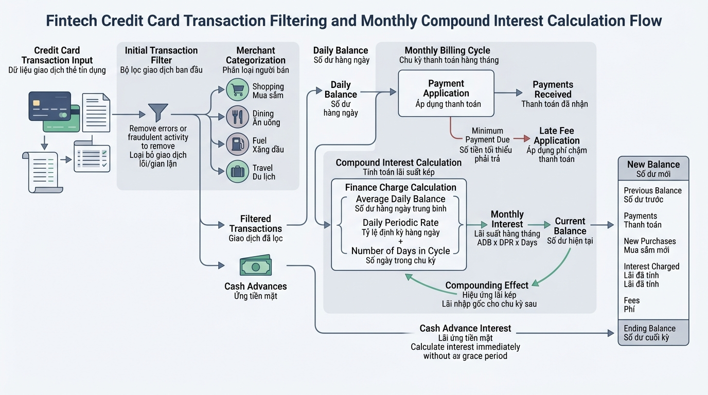

## <center>[Bài tập tổng hợp] Hệ thống tính toán lãi suất dư nợ và lọc giao dịch tín dụng Fintech</center>

### **1. Mục tiêu**
*   **Vận dụng vòng lặp `for` và hàm `range()`**: Duyệt qua danh sách dữ liệu giao dịch và tính toán số dư tích lũy theo từng kỳ hạn tháng trong lĩnh vực tài chính.
*   **Sử dụng câu lệnh `continue`**: Bỏ qua các bản ghi giao dịch bất hợp lệ hoặc vượt hạn mức mà không làm ngắt quãng tiến trình xử lý toàn bộ dữ liệu.
*   **Tổ chức mã nguồn chuẩn nghiệp vụ Fintech**: Xây dựng các hàm xử lý dữ liệu in-memory có Type Hints, tuân thủ chuẩn PEP 8 và nguyên tắc lập trình an toàn.

### **2. Bối cảnh & Vấn đề**
Trong một hệ thống ngân hàng số (Fintech), bộ phận quản lý rủi ro tín dụng cần một công cụ xử lý sao kê giao dịch thẻ tín dụng cuối kỳ của khách hàng. Mỗi giao dịch phát sinh được ghi nhận dưới dạng một danh sách các số tiền. Tuy nhiên, dữ liệu thô đầu vào thường chứa các giao dịch lỗi (số tiền âm, bằng 0) hoặc giao dịch vượt quá hạn mức duyệt tự động (cần bỏ qua để chuyển sang quy trình thẩm định riêng).

Sau khi hoàn tất lọc danh sách giao dịch hợp lệ, hệ thống cần tính toán số tiền lãi phát sinh và tổng dư nợ tích lũy trong vòng $N$ tháng tiếp theo nếu khách hàng lựa chọn thanh toán tối thiểu theo phương thức trả góp.


<p align="center">
  
</p>


### **3. Quy tắc nghiệp vụ**

#### **Quy tắc 1: Lọc giao dịch tín dụng hợp lệ**
Hệ thống nhận vào một danh sách các số tiền giao dịch (`transaction_amounts: list[float]`).
*   Sử dụng vòng lặp `for` duyệt qua từng giao dịch.
*   Sử dụng câu lệnh `continue` để bỏ qua giao dịch nếu:
    *   Số tiền giao dịch $\le 0$ (giao dịch lỗi hoặc không hợp lệ).
    *   Số tiền giao dịch $> 50,000,000$ VNĐ (vượt hạn mức duyệt tự động single-transaction).
*   Các giao dịch hợp lệ sẽ được cộng dồn vào tổng dư nợ gốc ban đầu (`initial_balance`).

#### **Quy tắc 2: Tính toán tích lũy dư nợ và tiền lãi theo kỳ hạn**
Từ tổng dư nợ gốc hợp lệ (`initial_balance`), lãi suất tháng (`monthly_rate`, ví dụ: `0.015` tương đương `1.5%/tháng`), và số tháng trả góp (`months: int`):
*   Sử dụng vòng lặp `for` với `range(1, months + 1)` để mô phỏng từng tháng.
*   Tiền lãi phát sinh của mỗi tháng được tính bằng: $\text{Lãi tháng} = \text{Dư nợ hiện tại} \times \text{Lãi suất tháng}$.
*   Cập nhật dư nợ mới = $\text{Dư nợ hiện tại} + \text{Lãi tháng}$.
*   Tính tổng số tiền lãi tích lũy qua toàn bộ $N$ tháng.

#### **Quy tắc 3: Đóng gói báo cáo tổng hợp**
Trả về kết quả dưới dạng một Dictionary thông tin tổng hợp với cấu trúc:
*   `total_raw_transactions`: Tổng số lượng giao dịch thô đầu vào.
*   `valid_transactions_count`: Số lượng giao dịch hợp lệ được chấp nhận.
*   `initial_principal`: Tổng dư nợ gốc hợp lệ ban đầu.
*   `total_interest`: Tổng tiền lãi phát sinh sau $N$ tháng (làm tròn 2 chữ số thập phân).
*   `final_balance`: Tổng dư nợ cuối kỳ phải trả (làm tròn 2 chữ số thập phân).

### **4. Yêu cầu bài toán**

Học viên tự thiết kế và triển khai hoàn chỉnh mã nguồn Python đáp ứng các yêu cầu sau:

1.  Viết hàm `filter_and_calculate_principal(transactions: list[float]) -> tuple[int, float]` nhận vào danh sách giao dịch, sử dụng vòng lặp `for` và `continue` để lọc và trả về: `(số_giao_dịch_hợp_lệ, tổng_nợ_gốc)`.
2.  Viết hàm `calculate_installment_schedule(principal: float, monthly_rate: float, months: int) -> tuple[float, float]` sử dụng vòng lặp `for` với `range()` để tính toán và trả về: `(tổng_tiền_lãi, dư_nợ_cuối_kỳ)`.
3.  Viết hàm `process_credit_statement(transactions: list[float], monthly_rate: float, months: int) -> dict[str, float | int]` kết hợp các hàm trên để đóng gói dữ liệu kết quả theo Quy tắc 3.
4.  Viết đoạn chương trình kiểm thử thực thi mô phỏng với dữ liệu mẫu và in báo cáo ra màn hình Console.

#### **Dữ liệu mẫu kiểm thử (Test Case):**
*   Danh sách giao dịch đầu vào: `[1500000.0, -500000.0, 12000000.0, 0.0, 60000000.0, 3500000.0]`
*   Lãi suất tháng: `0.015` (1.5%)
*   Số tháng trả góp: `6`

#### **Kết quả mong đợi hiển thị trên Console:**
```text
=== HỆ THỐNG XỬ LÝ SAO KÊ VÀ LÃI SUẤT TÍN DỤNG ===
Số lượng giao dịch thô: 6
Số lượng giao dịch hợp lệ: 3
Tổng dư nợ gốc ban đầu: 17,000,000.00 VNĐ
--- BÁO CÁO TÍCH LŨY TRẢ GÓP (6 THÁNG) ---
Tổng tiền lãi phát sinh: 1,605,532.53 VNĐ
Tổng dư nợ cuối kỳ: 18,605,532.53 VNĐ
=== HOÀN THÀNH TIẾN TRÌNH ===
```

### **5. Yêu cầu nộp bài**
Học viên cần nộp:
*   Phần phân tích/báo cáo và mã nguồn triển khai.
*   Đẩy mã nguồn lên GitHub theo định dạng thư mục: `[Tên Lớp]_[Môn Học]_Session06_Ex06`.
    Ví dụ: `HNKS25CNTT1_Core_Session06_Ex06`